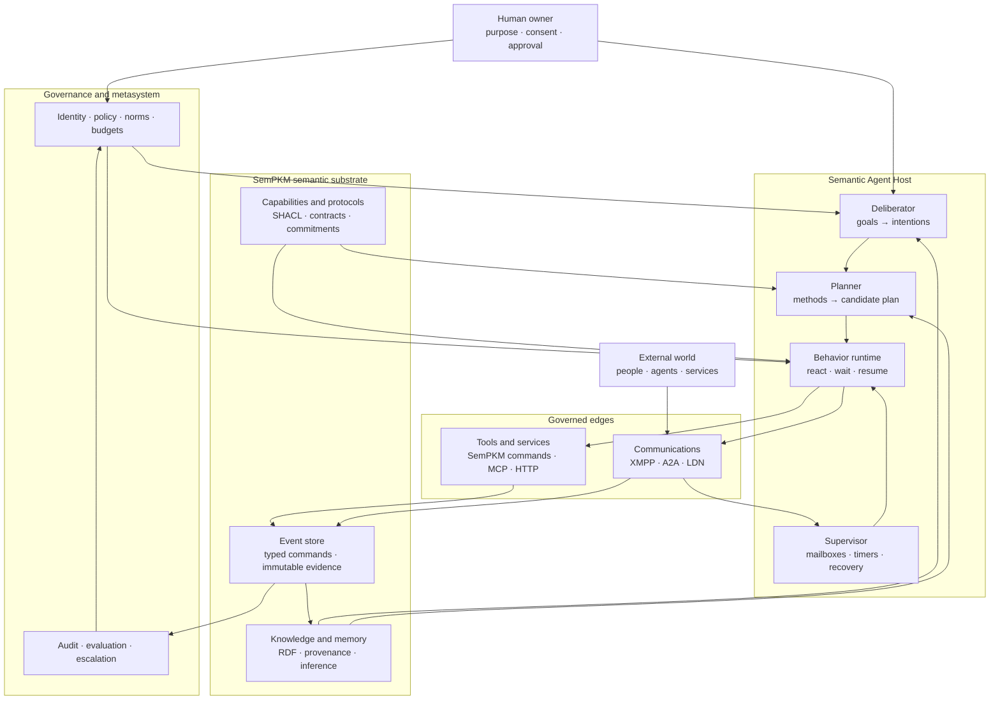
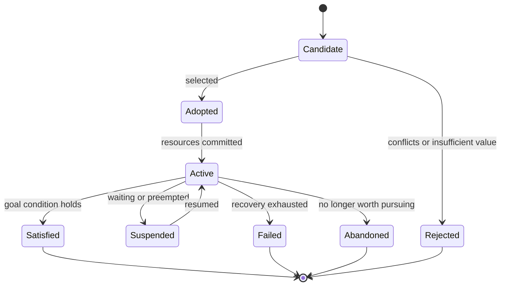
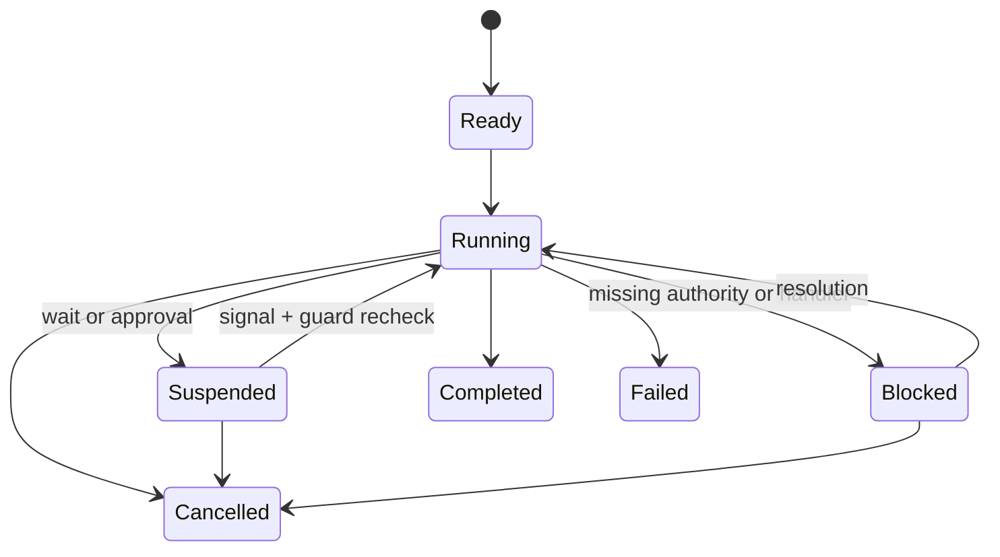
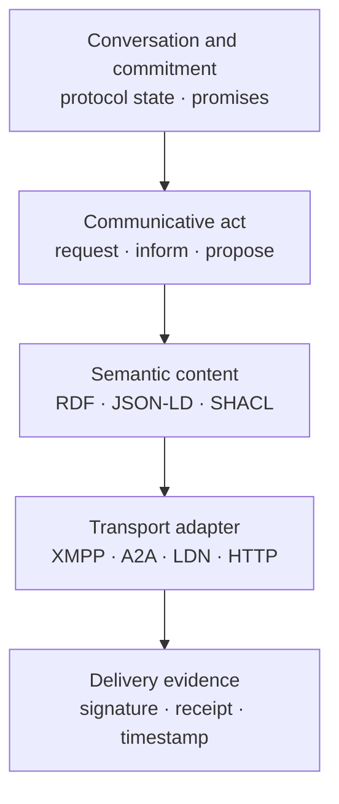
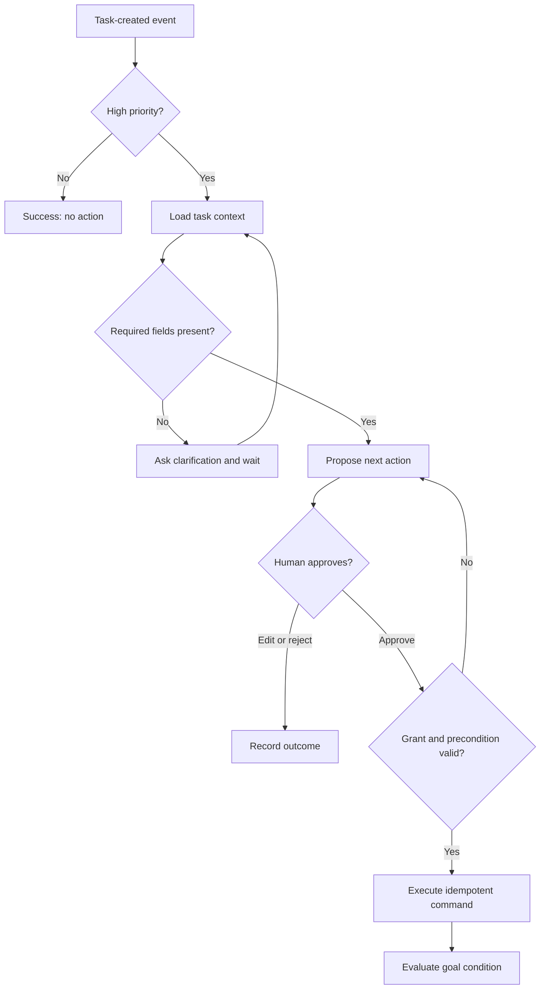

# Semantic Agent Platform for SemPKM

## Program Architecture and Master Epic

**Status:** Version 2 — reviewed program architecture  
**Working title:** SemPKM Semantic Agent Platform  
**Target:** SemPKM post-v2 agent platform  
**Primary architectural precedent:** AJAN  
**Related traditions:** Semantic Web agents, BDI, HTN planning, FIPA ACL, Promise Theory, behavior trees, blackboard systems, actor supervision, durable workflows, VSM, cybernetics

This document is the architectural north star and master requirements catalog for a program of work. It is intentionally broader than a single implementation milestone. Delivery is divided into three subordinate epics:

- **Epic A — Durable Governed Automation:** platform prerequisites, minimal semantic agent model, sequential durable runtime, approvals, one vertical slice, and run inspection.
- **Epic B — Agent Authoring and Deliberation:** graphical authoring, goals and intentions, impasses, method selection, and LLM-assisted behavior drafts.
- **Epic C — Social Agency and Governance:** semantic messages, protocols, commitments, external transports, capability interoperation, VSM channels, and longitudinal governance.

---

## 1. Executive summary

SemPKM provides several unusually strong ingredients for a persistent personal agent system: an RDF knowledge graph, OWL and SHACL Mental Models, immutable event graphs with current-state materialization, typed commands, inference, resident application processes, scheduling, WebID identity, federation, graph visualization, and an LLM copilot. These ingredients are not yet an agent substrate by themselves. Durable subscriptions, idempotent commands, agent principals, server-enforced constrained grants, general-purpose approvals, and a recorded structured LLM activity interface are platform prerequisites in Epic A.

This epic proposes a native semantic agent platform inspired most directly by AJAN, the Accessible Java Agent Nucleus. AJAN demonstrates that an agent's knowledge, goals, events, actions, and behavior can be represented in RDF and executed through SPARQL-extended behavior trees. SemPKM should adopt that architectural commitment without embedding AJAN itself and without treating behavior trees as a complete theory of agency.

The proposed platform separates five concerns:

1. **Semantic state:** What does the agent know, believe, infer, hypothesize, prefer, and remember?
2. **Deliberation:** Which candidate goals should it adopt, and which adopted goals become active intentions?
3. **Planning and execution:** How is an intention decomposed into a plan, and how is that plan reactively executed?
4. **Social agency:** What has the agent informed, requested, proposed, accepted, rejected, or promised—and what commitments result?
5. **Operational survival:** How do behaviors persist through waiting, duplicate delivery, process restarts, network failures, cancellation, and human intervention?

The architectural thesis is:

> **Use the LLM for semantic fluency and open-ended judgment; use RDF for explicit state and meaning; use behavior trees and planners for control; use typed commands and gates for authority; use durable execution for persistence; use protocols and commitments for social agency.**

This is not an attempt to simulate a human mind. It is an attempt to build an inspectable, governable, long-lived software agent that inhabits a personal knowledge environment, acts only through declared capabilities, communicates through typed semantic messages, records its uncertainty, and remains understandable to its human owner.

---

## 2. Motivation

### 2.1 From chatbot to resident agent

SemPKM's current copilot is conversational and request-driven. It can answer questions about the graph, generate SPARQL, and help a user work with knowledge. It does not yet have a continuing operational existence of its own.

A resident agent should be able to:

- remain active when no chat window is open;
- notice events in the knowledge graph and external environment;
- maintain multiple ongoing goals and commitments;
- wait for hours or weeks without losing its place;
- ask for clarification or approval when required;
- communicate with people and other agents;
- perform structured work through governed capabilities;
- distinguish facts from observations, inferences, hypotheses, and preferences;
- explain why it acted and what evidence it used;
- report consequential uncertainty rather than hiding it behind apparent completion;
- survive failures, upgrades, retries, and duplicate messages;
- retain a recognizable identity while allowing its behavior definitions to evolve.

The desired experience is closer to a quiet, persistent companion—or a semantic "Tamagotchi"—than to a chat session. It has a life cycle, an agenda, a memory, relationships, pending work, and an observable health state. This personality and continuity should emerge from explicit state and recurring interaction, not from pretending that a prompt is a soul.

### 2.2 Why SemPKM is a credible substrate

SemPKM already includes:

- RDF4J-backed named graphs and SPARQL;
- pluggable OWL/SHACL Mental Models;
- immutable event graphs with current-state materialization;
- a single typed command path for authoritative mutation;
- background SHACL validation and OWL RL inference;
- application subprocesses, manifests, client-side command restrictions, scheduling, health checks, and restart handling;
- a Cytoscape-based graph interface and Dockview workspace;
- WebID, linked-data notifications, signed federation messages, and shared graphs;
- an LLM integration with SPARQL validation, correction, and a useful approve/reject/edit/retry interaction for read-only queries;
- provenance and an inspectable event history.

These are not peripheral conveniences. They are precisely the components that many contemporary agent frameworks have to add after their initial prompt-and-tools prototype becomes unreliable. They should nevertheless be described accurately:

- webhook delivery is currently fire-and-forget, not a durable event subscription service;
- timestamp pagination is not a safe consumer cursor when events share a timestamp;
- commands do not yet accept or enforce idempotency keys;
- app command restrictions are not yet sufficient server-side authority controls;
- events do not yet distinguish an agent principal from the owner on whose behalf it acts;
- the copilot query-approval interaction is not a durable approval substrate for proposed mutations;
- `WorkflowSpec` is a guided UI stepper, not an executable workflow engine;
- the deployed platform is single-node and should remain so for Epic A.

### 2.3 The core problem

Most LLM agent implementations compress the agent into an unstable mixture of system prompt, chat history, retrieved documents, model weights, and tool descriptions. That representation is difficult to query, validate, version, compare, govern, or resume.

SemPKM Agents should externalize the agent:

- identity as RDF;
- goals and intentions as RDF;
- capability descriptions as RDF;
- behavior definitions as versioned RDF graphs;
- protocol and commitment state as RDF;
- authoritative effects as SemPKM events;
- operational checkpoints in durable runtime storage;
- LLM invocations as traceable, replaceable reasoning steps.

The model may be uncertain. The system should not be structurally vague.

---

## 3. Design principles

### 3.1 LLM as fluency, not sovereignty

The LLM interprets language, proposes plans, resolves ambiguity, summarizes evidence, and handles genuinely open-ended cases. It does not possess implicit authority merely because it produced an answer.

### 3.2 The agent is larger than the model

An agent consists of identity, memory, goals, intentions, capabilities, behavior, relationships, commitments, policies, budgets, and execution history. The language model is one replaceable component.

### 3.3 Behavior trees execute intentions; they do not choose the entire agenda

Behavior trees provide modular, reactive execution. A separate deliberative layer chooses which goals become intentions and may invoke a planner to construct or select an executable behavior.

### 3.4 All authoritative writes remain event-sourced commands

AJAN permits SPARQL UPDATE nodes. SemPKM Agents must not. SPARQL may observe state, test conditions, and construct candidate payloads, but authoritative mutations must pass through SemPKM's command API and event store.

### 3.5 Messages are actions

An `inform`, `request`, `propose`, and `accept` are not interchangeable chat utterances. Messages have typed pragmatic force, content semantics, authority, protocol position, provenance, and consequences. In v1, an accepted proposal creates a durable commitment; a separate `promise` act is reserved for later protocol work.

### 3.6 Promises describe voluntary behavior

An agent may state what it will do and what it is willing to accept. It cannot make a promise on behalf of another autonomous agent. Trust is based on observed promise-keeping, not on access to another agent's purported inner state.

### 3.7 Waiting is normal

Long-running work must suspend durably, release its worker, and resume from an event. Timers, approvals, replies, retries, and restarts are ordinary lifecycle events.

### 3.8 Uncertainty is a signal

Agents must report decisions made under uncertainty, their alternatives, evidence, consequences if wrong, and recommended escalation. An impasse is an inspectable system state, not an invitation to bluff.

### 3.9 Definitions and executions are versioned separately

A running behavior is pinned to the version with which it started. Updating a BehaviorSpec does not silently rewrite the history or semantics of an in-flight execution.

### 3.10 The human must retain an adequate model of the agent

The system must remain legible at the level of goals, commitments, behavior shape, significant decisions, and effects. The human need not read every trace token, but must be able to understand and steer the regulator acting on their behalf.

### 3.11 Start with a closed feedback loop

The first implementation should be a thin, end-to-end vertical slice with an observable outcome. It should not build every ontology class, editor feature, or transport adapter horizontally before anything can run.

### 3.12 Use the simplest control structure that closes the loop

Many useful automations need only an event, condition, optional interpretation step, approval gate, and typed command. They should not be inflated into elaborate behavior trees. Behavior trees and intentions earn their complexity when work spans time, branches on changing conditions, retries or falls back, requests clarification, coordinates several activities, or must remain inspectable while suspended. Existing SHACL rules remain the preferred declarative mechanism for monotonic inference and local graph transformation; the agent runtime orchestrates stateful, temporal, governed activity around them.

### 3.13 Shadow before effect

A new behavior version must produce evidence without effects before it receives live authority. The deployment gate may be satisfied by representative recorded-event fixtures, a configured amount of live shadow observation, or an explicit privileged override with rationale. Shadow execution never manufactures an action grant.

---

## 4. Architectural lineage and prior art

This design deliberately combines mechanisms from several intellectual and engineering traditions. No single precedent supplies the whole architecture.

### 4.1 The original Semantic Web agent vision

The early Semantic Web vision was not merely searchable linked documents. It anticipated software agents that could interpret heterogeneous information, discover services, combine data under shared ontologies, act for users, and exchange proofs and provenance.

SemPKM already supplies the semantic environment that this vision assumed. The missing step is to make the agent a durable first-class resident of that environment.

### 4.2 AJAN: semantic agent model plus executable behavior

AJAN is the closest direct architectural precedent. It represents agent templates, knowledge, goals, events, endpoints, actions, and SPARQL Behavior Trees in RDF. Its service creates and runs agents; its editor constructs and monitors them.

What SemPKM should adopt:

- explicit RDF agent models;
- RDF behavior definitions;
- behavior trees extended with semantic query nodes;
- reusable sub-behaviors;
- semantic preconditions and postconditions;
- design-time and runtime use of the same visual model;
- live node status, breakpoints, and knowledge inspection;
- an LLM that proposes editable behavior rather than replacing the runtime.

What SemPKM should change:

- commands instead of unrestricted SPARQL mutation;
- event-sourced evidence for effects;
- durable suspension and resumption;
- explicit goal adoption and intention management;
- stronger capability authority and human approval;
- explicit speech acts, protocol state, and commitments;
- progressive disclosure rather than raw RDF-first editing;
- native integration with SemPKM Mental Models, apps, UI, identity, and federation.

### 4.3 Behavior trees: reactive execution

A behavior tree is an executable hierarchy repeatedly evaluated from its root. Each node returns `success`, `failure`, or `running`.

Core control nodes include:

- **Sequence:** run children in order; fail when one fails;
- **Fallback/Selector:** try children in order until one succeeds;
- **Parallel:** run multiple branches under a completion policy;
- **Decorator:** retry, timeout, invert, repeat, rate-limit, or guard a child;
- **Condition:** observe without producing an authoritative effect;
- **Action:** attempt an effect or initiate an external operation;
- **Subtree:** invoke a reusable behavior definition.

Behavior trees are attractive because their execution state is naturally visualizable, their branches are modular, and their fallback structure supports reactive recovery. They are not sufficient for choosing among a changing portfolio of goals or synthesizing novel plans.

### 4.4 BDI and AgentSpeak/Jason: beliefs, desires, intentions, and plans

BDI systems contribute the missing intentional architecture:

- beliefs represent the agent's current informational state;
- desires or goals represent states it might seek;
- intentions represent goals it has committed to pursue;
- plans represent known procedures for responding to events or achieving goals.

Jason also treats belief provenance, plan failure, meta-events, suspended goals, and multiple concurrent intentions as first-class concepts. SemPKM does not need to implement AgentSpeak, but it should preserve these distinctions.

### 4.5 HTN planning: constrained plan construction

Hierarchical Task Network planning decomposes an abstract task into increasingly concrete subtasks until executable primitive actions remain. Domain methods constrain the legal decompositions.

For SemPKM, HTN provides a possible middle layer between a goal and a behavior tree:

1. An intention identifies an outcome to pursue.
2. A planner selects decomposition methods based on semantic state.
3. The result becomes a candidate PlanSpec or BehaviorSpec.
4. SHACL, authority, and policy gates validate it.
5. The behavior runtime executes and monitors it.

Initially, an LLM may propose the decomposition using the same typed methods and capabilities. A later deterministic HTN planner could use the identical interface.

### 4.6 Soar: memory separation, operators, and impasses

Soar separates working memory, procedural memory, semantic memory, and episodic memory. Its deliberation repeatedly proposes and selects operators for a represented state. When adequate knowledge is unavailable, an impasse produces a subgoal rather than forcing an arbitrary action.

SemPKM should borrow:

- explicit separation of memory kinds;
- operator/action selection against current state;
- impasses as first-class objects;
- explanation of which knowledge supported an operator;
- learning from resolved cases without silently rewriting policy.

### 4.7 Blackboard systems and stigmergy

In a blackboard architecture, specialized components cooperate by observing and modifying a shared problem representation. They do not need to address each other directly. Stigmergic coordination similarly emerges through changes to a shared environment.

The SemPKM graph can serve as a semantic blackboard:

- a source-discovery agent posts candidates;
- an extraction agent posts claims;
- a contradiction agent posts findings;
- a human validates significant claims;
- a writing agent consumes validated material.

Both direct messages and graph-mediated coordination should be supported. Agent chatter should not be required where a shared semantic artifact is the clearer coordination medium.

### 4.8 FIPA ACL and KQML: communicative acts and protocols

FIPA formalized agent messages around speech-act theory. An ACL message may identify its performative, sender, receivers, content, language, ontology, protocol, conversation, reply correlation, and reply deadline.

FIPA interaction protocols define legal message sequences for requesting, proposing, subscribing, querying, brokering, recruiting, auctions, and contract nets.

SemPKM should not copy the entire FIPA stack. It should recover the central insight that communication has a pragmatic type and protocol context.

Initial communicative acts:

- `inform`
- `query`
- `request`
- `propose`
- `accept`
- `reject`
- `promise`
- `cancel`
- `report-success`
- `report-failure`
- `not-understood`
- `clarify`

### 4.9 Promise Theory: autonomy, offers, acceptance, and trust

Promise Theory models a system as autonomous agents making observable promises about their own behavior. A service promise and a corresponding acceptance promise are distinct. No autonomous agent can make a promise for another.

This gives SemPKM a disciplined way to model:

- advertised capabilities;
- willingness to accept requests;
- commitments resulting from accepted proposals;
- assessments of whether promises were kept;
- trust derived from observed history;
- roles as recurring patterns of promises;
- boundaries and dependencies without pretending to command remote agents.

Promise Theory complements FIPA. A speech act describes what a message does in a conversation; a promise describes the durable behavioral commitment that may result.

### 4.10 OWL-S and WSMO: semantic capability descriptions

OWL-S divides a service description into:

- **Profile:** what the service does and for whom;
- **Process model:** its inputs, outputs, preconditions, effects, and composition;
- **Grounding:** how to invoke it through a concrete protocol.

This distinction should inform SemPKM capabilities. "Create calendar event" is an abstract capability; its contract describes required inputs and effects; its grounding may be a SemPKM command, MCP tool, local app call, HTTP API, XMPP request, or other adapter.

### 4.11 JaCaMo: agent, environment, and organization

JaCaMo separates the programming of agents, shared environment artifacts, and organizations. SemPKM should similarly distinguish:

- an agent's internal agenda;
- the environment it observes and acts upon;
- the organizational role, norms, permissions, and authority under which it operates.

This maps naturally onto VSM and prevents a tool allowlist from becoming the only organizational model.

### 4.12 Erlang/OTP: actors, mailboxes, and supervision

Erlang/OTP contributes operational patterns for autonomous processes:

- isolated workers;
- asynchronous mailboxes;
- explicit supervision;
- bounded restart strategies;
- failure containment;
- lifecycle ownership.

SemPKM's existing app manager already implements part of this. Logical agent instances should receive the same treatment without requiring one operating-system process per agent.

### 4.13 Temporal and LangGraph: durable execution

Modern durable runtimes demonstrate that long-running computation needs persisted checkpoints, idempotent effects, retries, timers, signals, and human interrupts. A behavior waiting for a reply should consume no worker and should resume after a deployment or crash.

The SemPKM runtime should adopt the semantics, not necessarily the dependencies, of these systems.

### 4.14 A2A, MCP, XMPP, and Linked Data Notifications

These technologies occupy different layers:

- **MCP:** expose concrete tools, resources, and prompts to a model or agent host;
- **A2A:** advertise agents and exchange stateful tasks, messages, and artifacts;
- **XMPP:** identity, presence, addressing, routing, mailboxes, and real-time/durable transport;
- **LDN:** Linked Data-native inbox notifications and federation;
- **RDF/JSON-LD:** semantic content and protocol state.

SemPKM's internal ontology should be richer and more stable than any transport. Adapters can map MCP tools and A2A Agent Cards into the capability model and map XMPP or LDN envelopes into semantic message events.

### 4.15 VSM and cybernetics: regulation and metasystem

The Viable System Model contributes an organizational and regulatory perspective:

- **S1:** operational agent units performing work;
- **S2:** coordination protocols, shared schedules, conflict control, and conversation state;
- **S3:** operational management, resource allocation, priorities, and performance;
- **S3\*:** independent audit, validation, anomaly detection, and evidence gathering;
- **S4:** environmental intelligence, research, capability discovery, and future modeling;
- **S5:** identity, purpose, values, constitutional policy, and ultimate authority.

The agent runtime should not turn these into chatbot personas. They are functions, authorities, channels, and enforcement mechanisms.

---

## 5. High-level architecture



The feedback loop is explicit:

1. Events and messages alter the agent's perceived state.
2. The deliberator updates goal and intention priorities.
3. A known behavior is selected or a planner produces a candidate plan.
4. The behavior runtime executes semantic conditions and governed actions.
5. Effects pass through typed commands or semantic communication adapters.
6. The event store records what actually happened.
7. Knowledge, commitments, evaluation, and trust are updated from evidence.
8. Audit and escalation can alter operational choices without silently changing constitutional policy.

---

## 6. Conceptual model

### 6.1 Agent identity

`Agent` is a persistent, addressable `prov:Agent` and server-recognized principal. It is distinct from the user, team, or app that owns it. Consequential activities record the agent through `prov:wasAssociatedWith` and its delegator through `prov:actedOnBehalfOf`. It should include:

- stable IRI;
- human-readable name and description;
- owner or governing principal;
- WebID or other external identities;
- runtime status;
- agent template and deployed version;
- roles and organizational membership;
- declared purpose;
- granted permissions and budgets;
- communication addresses;
- preferred models and reasoning policies;
- links to current goals, intentions, commitments, and health state.

An `AgentTemplate` describes reusable defaults. An `AgentInstance` carries local identity, grants, memory, and active state.

Ownership is explicit: an agent is owned by a user, team, or instance, never implicitly “the system.” Trigger eligibility, run visibility, approval authority, delegated data access, and whether one member's event can activate another principal's agent are policy decisions evaluated from that ownership context.

### 6.2 Memory and epistemic status

The platform must not treat every triple available to an agent as equally believed or equally authoritative.

Proposed categories:

- `Observation`: directly received from an environment or event source;
- `Assertion`: stated by a human, agent, or authoritative source;
- `Inference`: mechanically derived from stated premises;
- `Hypothesis`: plausible but unconfirmed interpretation;
- `Preference`: a principal's expressed or inferred preference;
- `Policy`: a governing rule with an authority source;
- `Commitment`: a social obligation with lifecycle state;
- `WorkingMemoryItem`: ephemeral state for an active run;
- `Episode`: a bounded historical experience or run summary;
- `Procedure`: reusable operational knowledge.

Every epistemically significant item should be able to reference:

- source;
- creator;
- asserted time and observed time;
- evidence;
- derivation or generating rule/model;
- confidence class where appropriate;
- scope and visibility;
- expiration or review date;
- contradiction links;
- validation state;
- supersession history.

Numeric model confidence should not be mistaken for truth. Confidence is most useful when paired with reasons, evidence, consequences, and provenance.

PROV-O provides the provenance core: `prov:Agent`, `prov:Activity`, `prov:wasAssociatedWith`, `prov:actedOnBehalfOf`, `prov:used`, `prov:generated`, and, where appropriate, `prov:hadPlan`. SemPKM extensions express belief, doubt, hypothesis, confidence, justification, contradiction, and epistemic promotion.

The physical representation of statement-level epistemic state is an Epic A time-boxed spike comparing named graphs, claim/assertion resources, provenance-qualified assertion sets, and RDF-star. Exit criteria are claim identity, provenance, competing beliefs, confidence, promotion, retraction, federation fidelity, and query complexity in existing views. JSON-LD 1.1 interoperability weighs strongly against depending on RDF-star annotations at import/export boundaries.

Regardless of representation, one invariant is fixed: **agent hypotheses never silently enter the authoritative current graph.** Promotion from hypothesis to assertion is a typed, provenance-bearing operation subject to policy and, where required, approval.

### 6.3 Goals, desires, intentions, and outcomes

Proposed lifecycle:



A `Goal` should specify:

- desired semantic condition;
- originating principal or event;
- priority and deadline;
- utility or qualitative value;
- cost/risk ceiling;
- conflicts and dependencies;
- success evidence;
- failure and abandonment criteria;
- required capabilities;
- allowed autonomy level;
- applicable policies.

An `Intention` records actual commitment of the agent's attention and resources to an adopted goal. It links to a behavior or plan, current execution, budget, and suspension reason.

### 6.4 Impasses and uncertainty

`Impasse` represents inability to choose or safely execute a next action. Examples:

- ambiguous entity reference;
- conflicting goals;
- missing capability;
- missing authority;
- no applicable plan;
- uncertain external fact;
- unacceptable predicted risk;
- exhausted retry policy;
- protocol violation;
- inconsistent knowledge.

`UncertaintySignal` should capture:

- subject and decision;
- reason for uncertainty;
- alternatives considered;
- evidence used;
- consequence if wrong;
- whether uncertainty existed before or remained after execution;
- recommended route: clarify, research, review, audit, or policy decision.

The routing decision belongs to the system, not solely to the reporting model.

### 6.5 Plans and behaviors

`PlanSpec` is a proposed decomposition of an intention into tasks and constraints. `BehaviorSpec` is an executable behavior tree. A plan may compile to a behavior tree, select an existing behavior, or combine reusable subtrees.

Definitions are immutable by version. Editing produces a new version and a semantic diff.

### 6.6 Capabilities, actions, and groundings

`Capability` describes an abstract ability. `ActionDefinition` describes the operational contract. `Grounding` describes a concrete invocation mechanism.

An action contract should include:

- semantic input and output shapes;
- preconditions;
- expected effects;
- possible failure classes;
- idempotency behavior;
- reversibility or compensation behavior;
- privacy classification;
- required permission;
- cost and rate information;
- timeout and retry recommendations;
- available groundings;
- evidence produced by success or failure.

`CapabilityGrant` determines whether a particular agent may invoke the capability within a specified scope. Knowing that a tool exists does not grant authority to use it.

### 6.7 Messages, conversations, and protocols

`AgentMessage` should include:

- message IRI and immutable content hash;
- communicative act;
- sender and receivers;
- content and content shape;
- ontology/context identifiers;
- conversation ID;
- protocol and protocol version;
- in-reply-to and reply-with correlation;
- sent, received, and expiry timestamps;
- signature and transport evidence;
- delivery and interpretation state;
- visibility and retention policy.

`Conversation` records participants, protocol state, associated task or commitment, and valid next transitions. `ProtocolSpec` defines roles, message transitions, timeouts, cancellation semantics, and resulting commitments.

Transport envelopes should be preserved for audit but separated from semantic content.

### 6.8 Promises and commitments

Proposed `Commitment` fields:

- debtor/promiser;
- creditor/promisee;
- promise body;
- activation condition;
- discharge condition;
- deadline;
- status: offered, accepted, active, fulfilled, violated, cancelled, expired, disputed;
- evidence of offer and acceptance;
- evidence of fulfillment or violation;
- cancellation and release conditions;
- assessment source;
- remediation or escalation route.

A request does not itself create a commitment. A proposal may create a conditional commitment when accepted. A claim of fulfillment does not prove fulfillment; an assessment evaluates observable evidence.

### 6.9 Organizations, roles, and norms

Proposed governance concepts:

- `Organization`
- `Role`
- `Authority`
- `Norm`
- `Permission`
- `Prohibition`
- `Obligation`
- `Violation`
- `Sanction`
- `EscalationRoute`
- `PolicyProposal`
- `PolicyDecision`

Roles should be expressible both as declared institutional assignments and as observed patterns of capabilities and promises.

---

## 7. Behavior runtime

### 7.1 Node protocol

Every node implements a common logical contract:

```text
tick(context) -> success | failure | running | suspended | error
```

`suspended` is a SemPKM extension useful for durable waits. It means the node has persisted a wake condition and released its worker. `running` means active computation is still assigned.

Suspension uses **resume-at-cursor**, not a complete reactive re-tick from the root. When a signal wakes a run, the runtime resumes at the durable cursor after re-evaluating relevant ancestor conditions, guards, budgets, grants, and preconditions. Every wake transition records the signal that caused it.

Each run owns a typed working-memory environment. Nodes consume named bindings and emit named bindings validated against their declared schemas. Durable bindings are checkpointed; large artifacts are referenced rather than copied into every node record.

Each node evaluation records:

- run and node identifiers;
- input bindings and relevant context references;
- definition version;
- start/end timestamps;
- status transition;
- evidence read;
- commands or messages proposed;
- commands or messages executed;
- model/tool versions;
- uncertainty signals;
- failure classification;
- retry and compensation state.

### 7.2 Initial control nodes

- `Sequence`
- `Fallback`
- `Subtree`
- `Retry`
- `Timeout`
- `RepeatUntil`
- `Inverter`
- `Guard`
- `RateLimit`
- `BudgetGuard`

`Parallel` is deliberately excluded from Epic A. Concurrency introduces ordering, cancellation, merge, budget, and replay semantics that are not needed to prove the first closed loop.

### 7.3 Initial semantic condition nodes

- `SparqlAsk`
- `SparqlSelect`
- `ShapeConforms`
- `ResourceExists`
- `GraphChanged`
- `GoalSatisfied`
- `PermissionCheck`
- `BudgetAvailable`
- `InboxMatches`
- `CommitmentStateIs`
- `HumanApprovalPresent`

### 7.4 Initial action nodes

- `ConstructPayload`
- `SemPKMCommand`
- `SendMessage`
- `InvokeMCP`
- `InvokeHTTPAction`
- `RequestApproval`
- `RequestClarification`
- `WaitForEvent`
- `SetTimer`
- `LLMInterpret`
- `LLMProposePlan`
- `ReportUncertainty`
- `CreateAuditFinding`

### 7.5 Node extension model

Platform apps should be able to contribute node definitions through manifests. A node contribution includes:

- stable type IRI;
- label, description, category, and icon;
- input/property SHACL shape;
- runtime handler identifier;
- required permissions;
- declared side-effect class;
- whether it may suspend;
- trace redaction rules;
- version compatibility.

The editor obtains its palette and property forms from these declarations rather than hardcoding every node type.

Behavior definitions are compiled from RDF to a validated internal representation at deployment. Nodes receive stable skolem IRIs. Each run pins the compiled artifact hash and every contributed handler version it uses. If a suspended run wakes after a required handler version has disappeared, it enters `blocked` with an inspectable impasse rather than silently executing under different semantics.

### 7.6 Logic and recorded activities

The runtime distinguishes deterministic control logic from nondeterministic activities.

- **Logic:** sequence/fallback selection, binding propagation, pure guards, topology validation, and evaluation over an already-recorded snapshot.
- **Activities:** LLM calls, HTTP and MCP calls, message delivery, clock reads, live SPARQL reads, human responses, and authoritative commands.

Activities record normalized inputs, relevant source revisions, provider/handler versions, redacted outputs, timing, cost, idempotency key, and outcome. Replay consumes recorded activity results and does not silently contact the model, clock, graph, or network again.

The `ConstructPayload` result is not itself authoritative. A named **proposal-to-command compiler** transforms candidate RDF/JSON-LD into a closed typed command envelope, canonicalizes it for hashing, validates it against grants and current-state preconditions, and submits it through the command API.

### 7.7 Durable execution semantics

Every `BehaviorRun` has a durable cursor and pinned definition version. The runtime must support:

- atomic checkpoint before and after external effects;
- idempotency keys for commands and messages;
- at-least-once wake-up delivery;
- duplicate detection;
- durable timers;
- retry policies with bounded attempts and backoff;
- cancellation propagation;
- explicit compensation where possible;
- dead-letter state for unrecoverable messages;
- migration or safe completion of runs across platform upgrades;
- replay without re-performing effects;
- concurrency and lease control.

The run state model is:



Cancellation never waits for a suspended run to wake. The operational controls distinguish: **pause** prevents admission of new work; **cancel** terminates runs cooperatively; **revoke** removes action authority immediately even if cancellation is delayed.

### 7.8 Supervision

The resident agent app supervises logical agents and runs. It should implement:

- per-agent mailbox;
- fair scheduling across intentions;
- configurable concurrency limits;
- health and liveness state;
- restart escalation;
- circuit breakers for failing capabilities;
- poison-event isolation;
- global and per-agent budgets;
- graceful draining during upgrade;
- administrative suspend/resume/terminate operations.

---

## 8. Deliberation and planning

### 8.1 Deliberation cycle

The deliberator is triggered by significant events or scheduled reconsideration. It:

1. updates relevant beliefs and goal candidates;
2. evaluates goal satisfaction, conflicts, deadlines, value, risk, and authority;
3. adopts or rejects candidate goals;
4. activates, suspends, resumes, or abandons intentions;
5. selects an existing applicable behavior or requests planning;
6. emits an explicit rationale and uncertainty record.

This cycle should be bounded. It is not a perpetual LLM loop.

### 8.2 Planner interface

A planner receives:

- current intention;
- relevant semantic state snapshot;
- applicable domain methods;
- capability contracts and grants;
- policies, budgets, and deadlines;
- previous failed plans or impasses.

It returns:

- candidate PlanSpec/BehaviorSpec;
- assumptions;
- capabilities used;
- expected effects;
- estimated cost and risk;
- alternatives considered;
- unresolved uncertainties;
- validation evidence.

Planner implementations may include:

- lookup of a known BehaviorSpec;
- rule-based decomposition;
- HTN planning;
- LLM-generated typed plans;
- hybrid LLM plus deterministic search;
- human-authored planning.

### 8.3 Plan validation

Before deployment or execution:

- RDF and SHACL must validate;
- graph topology must be structurally legal;
- all referenced node types must exist;
- every action must have a valid grounding;
- capability grants must cover requested scope;
- budget and privacy policies must permit execution;
- cycles and parallel branches must satisfy safety constraints;
- required compensation must be present for designated risk classes;
- consequential LLM-created plans may require human approval.

---

## 9. Communication architecture

### 9.1 Layering



Meaning does not reside in the text alone. It emerges from the relation among the message form, protocol, ontology, sender authority, recipient interpretation, and resulting state change.

### 9.2 Transport direction

The semantic message and protocol model is transport-neutral. Epic C begins with LDN because SemPKM already has signature-verified inbox handling and linked-data federation concepts; the missing work is durable consumption and protocol activation.

XMPP remains a promising subsequent transport for long-lived personal agents because it provides stable addressing, presence, federated routing, message delivery, pub/sub, and mature authentication. A SemPKM XMPP adapter should:

- map JIDs to agent identities/WebIDs;
- preserve stanza IDs and delivery receipts;
- carry JSON-LD or references to signed semantic payloads;
- transform inbound stanzas into immutable inbox events;
- resolve conversation and protocol state;
- apply signature, sender, shape, and policy validation before activation;
- expose presence as an observation, not as proof of trustworthiness.

### 9.3 A2A and MCP compatibility

An A2A adapter should translate Agent Cards into candidate agent/capability descriptions and A2A tasks into conversations and intentions. An MCP adapter should translate tool schemas into candidate action groundings.

Imported descriptions remain claims until validated and granted. Neither discovery protocol confers authority.

### 9.4 Protocol engine

Conversation protocols should be representable as explicit state machines or constrained BehaviorSpecs. The first protocols should be:

- request/inform;
- query/inform or failure;
- propose/accept/reject;
- subscribe/inform/cancel;
- clarification;
- task delegation with progress and artifact delivery.

A later Promise Theory protocol may add an explicit promise/assessment act. In v1, a proposal accepted by its recipient creates the authoritative Commitment resource.

Each protocol defines legal transitions, required message shapes, timeouts, failure states, and commitment effects.

---

## 10. Governance and VSM mapping

### 10.1 Functional mapping

| VSM function | SemPKM Agent mechanism |
|---|---|
| S1 operations | Individual agents, intentions, BehaviorRuns, capability execution |
| S2 coordination | Mailboxes, protocols, conversation state, calendars, locks, conflict control |
| S3 operational control | Goal prioritization, budgets, resource allocation, run supervision |
| S3\* audit | Independent validation, anomaly detection, trace inspection, policy conformance |
| S4 intelligence | Research, environmental scanning, capability discovery, scenario exploration |
| S5 policy/identity | Owner purpose, constitutional norms, protected identity and authority |

### 10.2 Typed channels

The system should distinguish:

- `constraint`
- `signal`
- `audit`
- `intelligence`
- `proposal`
- `algedonic`

An operational unit may propose a policy change but cannot directly mutate protected identity or constitutional policy. An audit finding is evidence, not authority. Intelligence advises; it does not command.

### 10.3 Algedonic escalation

Exceptional threats or opportunities may bypass ordinary reporting latency through an algedonic signal. This channel should be narrowly defined, rate-limited, and auditable. It should not become a generic "urgent" label available to every model output.

---

## 11. Agent Studio user experience

### 11.1 Workspace

Epic A begins with one primary **Agent** page organized around four operator questions:

1. What is the agent waiting on?
2. What did it do recently?
3. What does it propose to do next?
4. What does it need from me?

This page also exposes pause, cancel, revoke, approval, clarification, undo, health, and recent uncertainty. The behavior canvas is an authoring and debugging surface in Epic B, not the product home screen.

The complete program later adds an **AGENTS** workspace section containing:

1. **Agents:** identity, status, roles, grants, goals, commitments, and health.
2. **Behaviors:** visual BehaviorSpec editor.
3. **Runs:** active, suspended, completed, failed, and abandoned runs.
4. **Messages:** inbox/outbox, conversations, protocols, and delivery evidence.
5. **Capabilities:** profiles, contracts, groundings, grants, and health.
6. **Audit:** uncertainty signals, policy violations, evaluations, and escalations.

### 11.2 Behavior editor

Borrow AJAN's strongest interaction pattern:

- **Left:** searchable palette of control, semantic, action, communication, and extension nodes.
- **Center:** Cytoscape tree canvas.
- **Right:** SHACL-generated properties for the selected node.
- **Bottom drawer:** validation, SPARQL, input/output RDF, execution trace, and semantic diff.

Editor features:

- drag/drop and keyboard authoring;
- automatic tree layout;
- reusable subtrees;
- copy/paste and clone;
- Turtle/JSON-LD import/export;
- plain-language explanation of the selected branch;
- raw semantic/source view;
- validation errors attached to nodes;
- definition version history and semantic diff;
- draft, validated, approved, deployed, deprecated states;
- LLM proposal preview;
- live execution overlay;
- breakpoints and step execution;
- replay using recorded inputs without repeating external effects.

### 11.3 Progressive disclosure

Three authoring modes:

- **Guided:** labels, constrained forms, plain-language summaries.
- **Semantic:** IRIs, shapes, bindings, preconditions, and effects.
- **Source:** raw RDF/SPARQL for experts.

The canonical model remains RDF in all modes.

Epic A ships a minimal Guided form for the vertical slice and a read-only Source view. The full Semantic editor and node palette belong to Epic B. Personality language appears only when grounded in inspectable state—for example, “waiting for your answer since Tuesday,” not an unsupported emotional claim.

### 11.4 Live execution

Node state should use color plus icon/text:

- queued;
- evaluating;
- running;
- suspended/waiting;
- succeeded;
- failed;
- retrying;
- blocked by policy;
- awaiting approval;
- compensated;
- cancelled.

Selecting a node shows what evidence it read, what it concluded, what action it proposed, and which gate permitted or denied it.

### 11.5 LLM-assisted authoring

Natural language may create a draft BehaviorSpec:

1. User describes desired behavior.
2. LLM maps language to known goals, capabilities, entities, and node types.
3. Ambiguity creates a clarification interaction.
4. The system generates a typed RDF draft.
5. SHACL and topology validators run.
6. The editor displays the graph and semantic diff.
7. The human edits and approves consequential behavior.
8. Deployment creates a new immutable version.

The chat response is not the behavior. The versioned semantic artifact is.

---

## 12. Integration with current SemPKM architecture

### 12.0 Epic A platform prerequisites

The first agent behavior must not be built on aspirational substrate claims. Epic A begins with four platform capabilities that can ship and be tested independently of any agent UI.

#### Stable ledger ordering and durable delivery

SemPKM's immutable RDF event graphs remain the single authoritative event ledger. SQLite delivery records are a rebuildable derived index, not a second event log. New events receive a monotonic sequence written in the same RDF4J transaction as the event and current-state change. Sequence allocation is serialized through commit so commit order cannot invert allocated order; gaps are permitted. A future multi-writer deployment requires a different allocator and is outside Epic A.

Consumer cursors use `(sequence, eventIRI)`, never timestamp alone. Historical events without sequence retain compatibility through a composite `(timestamp, eventIRI)` cursor or a deterministic derived index. Delivery is at least once, with leases, retries, dead letters, delivery attempts, and per-consumer checkpoints. Delivery indexes can be deleted and rebuilt from the RDF ledger.

#### Idempotent commands

The command envelope accepts an idempotency key scoped to the authenticated principal. The event records the key and a canonical payload hash. Reusing the same key with the same payload returns the committed result; reusing it with a different payload fails. Concurrent requests cannot commit the same principal/key twice.

#### Agent principals, delegation, and constrained grants

An agent is a server-recognized principal distinct from its owning user, team, and resident app. Execution records both the agent and `prov:actedOnBehalfOf` delegator. Grants are enforced in the server command path against the complete proposed command: command type, graph, subject, ownership, RDF type, predicates, effect class, purpose, budget, and expiry.

The preferred representation spike treats a grant as a protected SHACL shape over a closed JSON-LD command graph plus authorization metadata SHACL does not naturally express. Grant shapes are editable only by the delegator or a stronger authority. Structural validation and state-dependent authorization remain distinguishable. Ownership, type, grant, budget, and mutation checks must be resistant to state changes between validation and commit.

Budget consumption uses restart-safe reservations. A reservation is created before execution, finalized against the resulting idempotent event, and reconciled after failures. Cross-store failure may conservatively consume budget temporarily but may never permit overspending.

#### Recorded LLM activities and durable approvals

An `LLMActivity` abstraction provides provider adapters, schema-constrained output, model/settings capture, prompt and response recording with redaction, token/cost metering, budgets, and deterministic test doubles. It is a prerequisite for LLM behavior nodes.

Approval becomes a durable object rather than only a chat interaction. It binds the exact canonical command payload hash, behavior/run versions, capability snapshot, approving principal, expiry, execution count, and relevant resource revisions. Approval normally binds the proposal's read set—not the global ledger head—so unrelated events do not invalidate it. If a target resource has changed, the action must be re-evaluated and re-proposed.

### 12.1 Mental Model

Create `models/agents/` containing:

- ontology for agents, epistemic state, goals, intentions, behaviors, runs, capabilities, messages, protocols, commitments, organizations, and governance, aligned with the repository's existing PROV-O design;
- SHACL shapes for validation and forms;
- initial ViewSpecs;
- dashboards for active agents and run health;
- example behaviors and seed capabilities.

### 12.2 Resident app

Create a first-party app, provisionally `apps/semantic-agent/`, using the existing application platform for:

- logical-agent registry;
- event subscriptions;
- behavior execution;
- durable wait registration;
- timers;
- capability invocation through SDK clients;
- run checkpointing;
- supervision and budgets;
- inbox/outbox adapters.

`WorkflowSpec` remains a separate guided UI construct; it does not share a runtime vocabulary with `BehaviorSpec`. Epic A is single-node.

### 12.3 Commands

Add typed commands rather than direct SPARQL writes, potentially including:

- `agent.create`
- `agent.configure`
- `goal.propose`
- `goal.adopt`
- `intention.activate`
- `behavior.deploy`
- `behavior.start`
- `behavior.suspend`
- `behavior.resume`
- `behavior.cancel`
- `message.send`
- `commitment.record`
- `uncertainty.report`
- `audit.finding.create`

Command scope and authority must be explicit and enforced server-side. Some may remain internal app operations exposed through existing generic object/edge commands rather than multiplying public command types; the implementation design should decide this deliberately. Every effecting command accepts an idempotency key, evaluates a constrained grant over its complete payload, and records the agent principal and delegator.

### 12.4 Event subscriptions

The current webhook and scheduler facilities are not durable subscriptions. Epic A adds the ledger-derived delivery mechanism in Section 12.0. Initial implemented trigger sources are deliberately smaller than the eventual vocabulary:

- SemPKM command committed;
- schedule/timer fired;
- human approval or clarification submitted;
- capability result returned.

Object deletion, validation-result triggers, durable webhook ingestion, consumed LDN notifications, and external-agent messages are added only when corresponding platform events and consumers exist.

Event delivery is at least once; consumers deduplicate by event and run identifiers.

### 12.5 Operational storage

Use a deliberate hybrid:

- RDF for semantic definitions, identity, goals, commitments, significant state, and durable evidence;
- SemPKM events for authoritative mutations;
- SQLite for leases, wake indexes, queue state, token accounting, and low-level checkpoints;
- object/blob storage where message artifacts are too large for inline RDF;
- trace redaction for secrets and private model context.

### 12.6 Copilot integration

The existing copilot already provides a useful approve/reject/edit/retry interaction for read-only SPARQL queries. It is a UX precedent, not yet the agent approval substrate. The copilot becomes one interface to the agent platform:

- inspect goals and active runs;
- propose new goals;
- answer why an action occurred;
- generate a draft behavior;
- approve, reject, or edit proposed action;
- surface uncertainty and impasses;
- communicate with the resident agent without conflating chat history with agent memory.

---

## 13. Security, privacy, and authority

### 13.1 Capability security

- Tools are unavailable unless installed and grounded.
- Groundings are unavailable unless granted to the agent.
- Grants are protected semantic artifacts evaluated server-side over the complete command payload.
- Grants include command, graph, subject/ownership, type, predicate, effect class, purpose, duration, resource bounds, budget, and delegator.
- Model output cannot manufacture or widen a grant.
- High-impact actions require stronger gates and possibly human approval.
- Command payloads are closed against undeclared properties and bind to idempotency and precondition metadata.

Autonomy is granted per action class rather than as a single agent-wide switch:

- `observe` — may read and report;
- `propose` — may construct an action but requires approval;
- `act-reversible` — may execute an explicitly reversible action with visible undo;
- `act` — may execute within a stronger constrained grant.

### 13.2 Prompt injection and semantic input

External content is data, not instruction. Messages and documents must retain source and trust classification. The system should distinguish:

- user instruction;
- authenticated agent request;
- untrusted document content;
- retrieved evidence;
- model-generated hypothesis;
- governing policy.

No text embedded in a retrieved object may silently change authority or policy.

### 13.3 Privacy

- Every capability declares data access and disclosure scope.
- Every message has an audience and retention policy.
- Agent traces redact secrets and unnecessary personal content.
- External-agent requests are evaluated against sharing policy.
- Shared graphs and local personal graphs remain distinct.
- Models receive the minimum relevant context.

### 13.4 Signed identity and trust

WebID and signed messages establish identity and integrity, not trustworthiness. Trust assessments should be tied to specific promise types, contexts, and observed histories rather than a single universal score.

### 13.5 Constitutional state

Owner identity, foundational purpose, non-delegable permissions, and core safety policy should be treated as protected constitutional artifacts. Ordinary agent behavior may propose modifications but may not directly mutate them.

### 13.6 Concrete threat model additions

The agent design extends `docs/security-model.md` with named threats and controls, including:

- exfiltration through `SendMessage` after reading a private or shared graph;
- instruction injection through documents, LDN messages, capability descriptions, MCP schemas, or retrieved RDF literals;
- grant escalation through an LLM-authored plan or unexpected command property;
- approval substitution or execution after relevant state changed;
- confused-deputy behavior across user, team, app, and agent principals;
- replay, duplicate delivery, and idempotency-key collision;
- denial of service through recursive behavior, wake storms, excessive traces, or budget contention;
- secrets appearing in prompts, traces, messages, or exported provenance.

Each threat must name its trust boundary, control, audit evidence, failure behavior, and verification test.

---

## 14. Observability, evaluation, and learning

### 14.1 Run evidence

For each significant run, retain:

- triggering event;
- adopted goal and intention;
- behavior/plan version;
- node transitions;
- evidence references;
- messages and commands;
- approvals and denials;
- costs, latency, and resource use;
- uncertainty reports;
- outcome and success criteria;
- later corrections or reversals.

### 14.2 Evidence hierarchy

Prefer, in descending order:

1. deterministic measured outcome;
2. executable invariant or test;
3. structural/static validation;
4. semantic/SHACL validation;
5. independently reproduced observation;
6. independent model judgment;
7. executing agent self-report.

### 14.3 Replay and simulation

The system should support:

- replaying recorded node decisions without repeating effects;
- running a behavior against a snapshot/sandbox graph;
- comparing behavior versions against historical episodes;
- injecting failures, delays, duplicate messages, and denied permissions;
- evaluating whether a proposed policy would have changed prior outcomes.

### 14.4 Learning

Learning produces proposals:

- suggest a new method or subtree from repeated successful runs;
- suggest a preference from repeated user correction;
- identify recurring impasses;
- identify capabilities with unreliable promises;
- recommend clarification to an ontology or policy.

Learned structures do not silently become governing policy.

---

## 15. Program scope and delivery boundaries

### 15.1 Master program

The master program contains the complete semantic-agent architecture described in this document: identity and epistemic state, durable behaviors, deliberation, semantic capabilities, social protocols, commitments, governance, authoring, and evaluation. It is not a promise to ship all layers in one release.

### 15.2 Epic A — Durable Governed Automation

Epic A proves one useful, restart-safe, governed feedback loop. It includes:

- stable ledger ordering and durable event delivery;
- idempotent commands;
- agent principals, delegated provenance, and server-side constrained grants;
- durable approvals and action autonomy levels;
- a recorded structured LLM activity abstraction;
- the minimal Agents Mental Model: Agent, BehaviorSpec, BehaviorRun, NodeRun, Impasse, UncertaintySignal, Approval, and supporting provenance;
- compiled, version-pinned sequential behavior execution;
- clarification, waiting, retries, cancellation, and blocked states;
- shadow deployment;
- one reversible autonomous effect with visible undo;
- a user-oriented Agent page and detailed run inspector;
- pause, cancel, revoke, retention, and operational health controls;
- one complete vertical slice.

Epic A is single-node. It does not include the graphical tree editor, general planning, inter-agent negotiation, or VSM governance.

### 15.3 Epic B — Agent Authoring and Deliberation

Epic B adds graphical authoring, SHACL-driven node forms, semantic diff, goal and intention lifecycles, impasses, rule-based method selection, a planner interface, LLM-assisted drafts, and simulation.

### 15.4 Epic C — Social Agency and Governance

Epic C adds semantic messages, protocols, commitments, LDN-first transport, transport-neutral adapters, capability discovery and grounding, organizational roles, VSM channels, audit behavior, policy proposals, and longitudinal governance.

### 15.5 Program non-goals

- General human-level cognition or fully autonomous self-modification.
- Complete FIPA or Promise Theory formalization.
- Unrestricted autonomous communication or Internet action.
- A universal trust or reputation score.
- Treating every automation as an anthropomorphic agent.
- Replacing the copilot or WorkflowSpec.
- Multi-node runtime coordination, a graphical editor, or general planning in Epic A.

---

## 16. Requirements catalog

The tag assigns each requirement to its owning delivery epic: **[A]** Durable Governed Automation, **[B]** Authoring and Deliberation, **[C]** Social Agency and Governance.

### Platform and event substrate

- **AGT-00 [A]:** Immutable RDF event graphs remain authoritative; delivery state is rebuildable.
- **AGT-01 [A]:** New events have a stable total order serialized through commit; historical pagination uses a non-skipping composite cursor.
- **AGT-02 [A]:** Subscriptions provide at-least-once delivery, durable cursors, leases, retries, delivery evidence, and dead letters.
- **AGT-03 [A]:** Effecting commands support principal-scoped idempotency and reject key reuse with a different payload.
- **AGT-04 [A]:** Agent principals are distinct from users, teams, and apps and record delegated authority with PROV-O.
- **AGT-05 [A]:** Derived delivery and budget indexes reconcile after restart or cross-store failure.
- **AGT-06 [A]:** User-, team-, and instance-owned agents have explicit trigger, visibility, approval, and delegation semantics.

### Agent and epistemic model

- **AGT-10 [A]:** Agent identities are persistent RDF resources with owner, purpose, role, grants, deployment, and runtime status.
- **AGT-11 [A]:** Behavior definitions are immutable by version; runs pin compiled definitions and handler versions.
- **AGT-12 [A]:** Observations, assertions, inferences, hypotheses, preferences, and policies retain distinct status and provenance.
- **AGT-13 [A]:** Hypotheses cannot enter the current graph without explicit promotion.
- **AGT-14 [B]:** Goals, intentions, plans, behaviors, runs, and impasses have explicit, distinct lifecycles.
- **AGT-15 [C]:** Messages, conversations, commitments, organizations, roles, and norms are distinct resources.

### Behavior runtime

- **AGT-20 [A]:** V1 supports Sequence, Fallback, Subtree, Retry, Timeout, Guard, SPARQL condition, typed command, approval, clarification, timer, uncertainty, and durable wait nodes.
- **AGT-21 [A]:** Parallel is absent from v1.
- **AGT-22 [A]:** Nodes have explicit states, typed bindings, and structured traces.
- **AGT-23 [A]:** Suspended runs resume at their cursor after relevant guards, grants, budgets, and preconditions are re-evaluated.
- **AGT-24 [A]:** Every wake transition records its signal.
- **AGT-25 [A]:** Logic and nondeterministic activities are distinct; replay uses recorded activity results.
- **AGT-26 [A]:** No node performs unrestricted direct SPARQL UPDATE.
- **AGT-27 [A]:** Timers and waits survive restart.
- **AGT-28 [A]:** Duplicate wakes cannot duplicate authoritative effects.
- **AGT-29 [A]:** Runs support suspend, resume, block, cancel, timeout, retry, failure, and completion.

### Capabilities, authority, and approval

- **AGT-30 [A]:** Capabilities separate profile, action contract, and grounding.
- **AGT-31 [A]:** Discovery or installation does not confer permission.
- **AGT-32 [A]:** The server validates grants against command, graph, subject, ownership, type, predicates, effect class, purpose, time, and budget.
- **AGT-33 [A]:** Grantees cannot mutate their grants.
- **AGT-34 [A]:** Autonomy is assigned per action class as observe, propose, act-reversible, or act.
- **AGT-35 [A]:** Approval binds payload, read-set revisions, versions, capability snapshot, approver, expiry, and execution count.
- **AGT-36 [A]:** Stale approvals cause re-evaluation rather than execution.
- **AGT-37 [A]:** Budget reservations survive restart and fail closed across stores.
- **AGT-38 [C]:** Policy and identity changes use proposal/decision paths.

### LLM activities and deliberation

- **AGT-40 [A]:** LLM calls use a provider-neutral recorded activity with constrained output, redaction, metering, budgets, and deterministic tests.
- **AGT-41 [A]:** Impasses and uncertainty are first-class reportable states.
- **AGT-42 [B]:** Candidate goals have explicit adoption and lifecycle transitions.
- **AGT-43 [B]:** Intentions record priority, budget, method, and suspension reason.
- **AGT-44 [B]:** Planner output conforms to a typed interface and is validated.
- **AGT-45 [B]:** Initial method selection is rule-based; LLM planning proposes artifacts.

### Communication and commitments

- **AGT-50 [C]:** Messages record act, sender, receiver, content, conversation, protocol, correlation, provenance, and evidence.
- **AGT-51 [C]:** Protocols constrain legal transitions and reject invalid activation.
- **AGT-52 [C]:** Informing, requesting, proposing, accepting, rejecting, clarifying, and reporting remain distinct.
- **AGT-53 [C]:** A commitment is initially derived from a valid proposal and acceptance.
- **AGT-54 [C]:** Commitments record debtor, creditor, content, conditions, deadline, lifecycle, and evidence.
- **AGT-55 [C]:** Transports cannot bypass validation, disclosure policy, protocol, or authority.
- **AGT-56 [C]:** The message model is transport-neutral; LDN is first.

### User experience and operations

- **AGT-60 [A]:** The Agent page answers what awaits, what happened, what is proposed, and what the agent needs.
- **AGT-61 [A]:** Users can inspect trigger, branch, evidence, bindings, activities, commands, approvals, uncertainty, and outcome.
- **AGT-62 [A]:** Users can pause admission, cancel runs, revoke authority, and undo reversible effects.
- **AGT-63 [A]:** Shadow mode records proposed effects without execution.
- **AGT-64 [A]:** Supervisors expose health, retries, leases, dead letters, circuit breakers, and budgets.
- **AGT-65 [A]:** Trace retention and garbage collection are configurable; durable summaries outlive low-level traces.
- **AGT-66 [B]:** BehaviorSpec has a graphical tree editor, SHACL properties, and semantic diff.
- **AGT-67 [B]:** LLM-generated behaviors remain drafts until validated and authorized.
- **AGT-68 [C]:** Users can inspect conversations, protocol state, commitments, violations, and governance channels.

### Security and evidence

- **AGT-70 [A]:** Every effect links to run, principal, delegator, grant, idempotency key, and evidence.
- **AGT-71 [A]:** Private data and secrets are redacted by policy.
- **AGT-72 [A]:** Imported text, RDF, messages, and capability descriptions are data, not authority-bearing instruction.
- **AGT-73 [A]:** The threat model covers exfiltration, injection, confused delegation, grant escalation, approval substitution, replay, and denial of service.
- **AGT-74 [C]:** Audit and governance signals cannot silently mutate protected policy.

---

## 17. Delivery program

### 17.1 Epic A execution order

1. **Contracts, ADRs, and threat model.** Decide storage, state machine, activities, time, retention, NFRs, and the epistemic representation spike.
2. **Stable event ordering and durable subscriptions.** Add commit-serialized sequence, historical composite cursors, subscriptions, leases, retry, dead letters, and rebuild tooling.
3. **Idempotent command execution.** Add principal-scoped keys, payload hashes, duplicate protection, and prior-result lookup.
4. **Principals, delegation, and constrained grants.** Add service principals, PROV-O delegation, protected grants, state checks, budgets, expiry, and service rate limits.
5. **Durable approvals and autonomy.** Bind approvals to exact payloads and read-set revisions; add approval and clarification UX.
6. **Recorded LLMActivity.** Add adapters, constrained outputs, redaction, version capture, metering, budgets, and mocks.
7. **Minimal sequential runtime and controls.** Add compiled version-pinned behaviors, typed memory, cursor resume, waits, retries, blocked state, pause, cancel, revoke, and handler checks.
8. **Vertical slice in shadow mode.** Run recorded fixtures and live events without effects.
9. **Reversible autonomous effect.** Grant one narrow act-reversible class with visible undo.
10. **Agent page and run inspection.** Ship the operator narrative, evidence views, queues, health, retention, and outcome evaluation.

Steps 2 through 4 are platform work and can ship independently of agent code. Pause, cancel, and revoke ship with the runtime before the first live shadow behavior.

### 17.2 Epic A initial non-functional targets

| Concern | Initial acceptance target |
|---|---|
| Duplicate effects | Zero duplicates under crash/retry fault tests |
| Ledger recovery | Rebuild delivery state without event loss |
| Cursor correctness | No skipped events under identical timestamps or restart |
| Authority revocation | New commands denied immediately after revocation |
| Restart recovery | Suspended and blocked runs recover after service readiness |
| Audit completeness | Every effect links to run, principal, delegator, grant, approval when applicable, and event |
| Budget safety | No overspend under concurrency or cross-store failure |
| Baseline capacity | Demonstrate 100 suspended and 10 active runs on the supported single node |
| Retention | Configurable detailed traces with durable run summaries |
| Time | UTC storage and explicit user timezone at scheduling/presentation boundaries |

Latency and throughput service levels are set from the baseline load test rather than invented before measurement.

### 17.3 Epic B sequence

1. Minimal graphical Behavior Studio and read-only source view.
2. SHACL-driven properties and topology validation.
3. Draft, semantic diff, approve, deploy, and rollback.
4. Goal and intention lifecycle with conflicts and budgets.
5. Rule-based method selector and impasses.
6. Planner provider interface.
7. LLM-assisted drafts and counterfactual simulation.

### 17.4 Epic C sequence

1. AgentMessage, Conversation, Protocol, and Commitment vocabulary.
2. Protocol engine with proposal, acceptance, and clarification.
3. LDN adapter and consumed durable inbox.
4. Capability profile/process/grounding model with MCP import.
5. Additional adapters such as XMPP and A2A where justified.
6. Organizational roles, norms, and typed VSM channels.
7. Audit behavior, policy proposal/decision, and algedonic escalation.
8. Longitudinal reliability, promise-keeping, cost, drift, and uncertainty analysis.

## 18. First vertical slice

### Scenario: ambiguous high-priority task

When a new high-priority task is created, the resident agent inspects its project, due date, and description. If the task is sufficiently specified, it proposes a concrete next action. If required information is missing, it asks for clarification, waits durably, and resumes when the answer arrives. The behavior first runs in shadow mode. Once promoted, consequential mutation requires payload- and precondition-bound approval; one narrowly scoped reversible action class may execute autonomously and exposes immediate undo. Every mutation passes through the idempotent SemPKM command API and server-side grant evaluation.

### Behavior



### Why this slice

It exercises:

- graph event triggering;
- semantic state retrieval;
- behavior-tree condition and fallback;
- LLM interpretation bounded by a typed output;
- clarification and durable waiting;
- restart recovery;
- human approval;
- shadow deployment and promotion;
- payload/read-set approval binding;
- one constrained reversible autonomy class with visible undo;
- command-only mutation;
- event-sourced evidence;
- uncertainty reporting;
- observable success criteria.

### Acceptance criteria

1. Creating an ordinary-priority task creates no agent action beyond an auditable evaluation.
2. Creating a high-priority complete task creates a proposed next action.
3. Creating an incomplete task produces a clarification request and suspended run.
4. Restarting the app while suspended does not lose or duplicate the request.
5. Supplying clarification resumes the same run.
6. Rejecting a proposal creates no domain mutation.
7. Editing a proposal revalidates it.
8. Changing the proposal payload or relevant task revision invalidates approval.
9. Approving executes exactly one idempotent typed command under a server-side grant.
10. Duplicate delivery, restart, or retry does not duplicate the effect.
11. The behavior produces no effects while in shadow mode.
12. One explicitly reversible action class can execute without per-instance approval and can be undone from the run view.
13. The run terminates only after the declared goal condition is evaluated.
14. The UI shows the trigger, wake signal, branch, evidence, activity versions, approvals, command, undo, and final outcome.

---

## 19. Test strategy

### Ontology and validation

- SHACL fixtures for every core type;
- invalid tree topology;
- unknown node type;
- malformed protocol transition;
- capability grounding without grant;
- commitment missing debtor/creditor/body;
- epistemic assertion missing provenance.

### Runtime unit tests

- each control-node status combination;
- deterministic traversal order;
- retry and timeout policies;
- cancellation propagation;
- resume-at-cursor and ancestor guard re-evaluation;
- cancellation from running, suspended, and blocked states;
- activity replay without external calls;
- idempotency-key generation;
- checkpoint serialization;
- redaction behavior.

### Integration tests

- RDF definition to running behavior;
- command execution through EventStore;
- validation and approval gates;
- timer and event wake-ups;
- app restart during durable wait;
- duplicate event delivery;
- identical event timestamps and historical composite pagination;
- delivery-index destruction and rebuild;
- concurrent reuse of an idempotency key;
- process crash during external action;
- budget reservation reconciliation across cross-store failure;
- dead-letter and recovery path;
- capability denial and circuit breaker.

### Protocol tests

- legal and illegal transition sequences;
- duplicate and late replies;
- timeout and cancellation;
- proposal acceptance creating commitment;
- fulfillment assessment;
- signature/identity mismatch;
- ontology or shape mismatch;
- conversation correlation.

### Evaluation tests

- successful goal condition;
- tests pass but architectural/policy invariant fails;
- incorrect self-reported success;
- uncertain decision with high consequence routes to review;
- replay produces the same decisions without external effects;
- behavior-version comparison against historical episodes.

### E2E tests

- create/view/configure agent;
- render BehaviorSpec;
- run first vertical slice;
- approve/edit/reject proposed command;
- invalidate approval after a relevant target revision changes;
- run the behavior in shadow mode before promotion;
- execute and undo one reversible action class;
- kill and restart resident app while waiting;
- inspect trace and event diff;
- suspend/cancel agent from UI;
- pause work admission and revoke authority while a run is suspended.

---

## 20. Risks and mitigations

### Ontology overreach

**Risk:** Attempting to formalize all cognition and social reality before one behavior runs.  
**Mitigation:** Define the minimum executable vocabulary first; mark experimental modules separately; grow from traced use cases.

### Behavior-tree overreach

**Risk:** Treating the tree as the agent's complete cognition.  
**Mitigation:** Preserve separate goal, intention, planner, protocol, and policy layers.

### LLM-generated complexity

**Risk:** Natural-language authoring produces large opaque trees.  
**Mitigation:** size limits, reusable subtrees, typed node vocabulary, semantic diff, simulation, approval, and complexity linting.

### RDF runtime overhead

**Risk:** Encoding every low-level transition as graph data creates excessive volume and latency.  
**Mitigation:** hybrid operational storage; promote significant evidence and summaries to RDF; retain detailed traces under configurable policy.

### Duplicate effects

**Risk:** at-least-once wake delivery repeats commands or external actions.  
**Mitigation:** mandatory idempotency keys, effect journals, capability-specific deduplication, and compensation.

### Confused authority

**Risk:** a discovered capability, received request, or model suggestion is treated as permission.  
**Mitigation:** separate description, grounding, grant, request, and authorization decision in both ontology and code.

### False anthropomorphism

**Risk:** personality language obscures system limitations and responsibility.  
**Mitigation:** make state and authority inspectable; distinguish user experience from claims about consciousness or comprehension.

### Human review bottleneck

**Risk:** every action requires approval, eliminating useful autonomy.  
**Mitigation:** graduated autonomy by action class, reversible defaults, budgets, learned-but-reviewed trust, and exception-based review.

### Protocol complexity

**Risk:** full FIPA-like formality makes ordinary communication unusable.  
**Mitigation:** begin with a small communicative-act vocabulary and a few protocol templates; keep raw formality inspectable but not mandatory in the primary UI.

### Agent drift

**Risk:** accumulated behavior changes make the agent unrecognizable or incompatible with owner purpose.  
**Mitigation:** immutable versions, constitutional policy, semantic diffs, audit, periodic owner review, and rollback.

---

## 21. Architecture decisions and remaining spikes

### 21.1 Decisions to record as ADRs

1. `BehaviorSpec` and `WorkflowSpec` remain intentionally separate.
2. RDF behavior definitions compile to a validated, immutable internal representation at deployment.
3. `Parallel` is excluded from v1.
4. Epic A is single-node.
5. Existing SemPKM undo is used for internal reversible effects; external groundings declare bespoke compensation where meaningful.
6. LDN is the first external transport; the semantic message model remains transport-neutral.
7. A v1 commitment is derived from proposal and acceptance; a distinct promise act is reserved for later work.
8. The first method selector is deliberately rule-based.
9. Runs resume at cursor with relevant ancestor guards and authority re-evaluated.
10. The RDF event ledger remains authoritative; delivery storage is derived and rebuildable.
11. PROV-O supplies the provenance core with SemPKM epistemic extensions.

### 21.2 Time-boxed Epic A spikes

1. **Epistemic representation:** named graphs, claim resources, provenance-qualified assertion sets, or RDF-star, evaluated against JSON-LD/federation fidelity and the criteria in Section 6.2.
2. **RDF/SQLite boundary:** exact placement and reconciliation of checkpoints, delivery indexes, budget reservations, activities, approvals, and retained summaries.
3. **Grant representation:** protected SHACL command shapes plus state-dependent authorization and atomicity strategy.
4. **Legacy event ordering:** composite historical cursors and transition to sequenced new events without rewriting immutable event graphs.
5. **Trace retention:** default detailed and summarized retention periods, redaction, export, and deletion behavior.

### 21.3 Later design questions

1. Do messages embed JSON-LD, reference signed artifacts, or support both?
2. Which additional FIPA-influenced acts belong in the core vocabulary?
3. How are conflicting owner and team preferences represented and resolved?
4. How should an agent budget attention among recurring and event-driven intentions?
5. What constitutes identity continuity across model, policy, and behavior changes?
6. What concurrency and merge semantics justify a future `Parallel` node?

---

## 22. Future extensions

- HTN planner and plan-repair provider;
- XMPP identity, presence, pub/sub, and agent messaging;
- A2A server/client adapter;
- MCP capability importer and grounding;
- commitment-based delegation and negotiation;
- contract-net task allocation;
- shared research blackboard;
- multi-agent editorial/review pipeline;
- trust assessments by capability and promise type;
- agent social graph and relationship memory;
- periodic agenda formation and attention budgeting;
- contextual behavior using SemPKM mobile signals;
- simulation and counterfactual evaluation;
- learned subtree proposals;
- VSM organization templates;
- cross-instance semantic agent federation;
- user-facing companion state, routines, and personality continuity;
- voice and ambient interaction;
- agent-readable and human-readable autobiographical run summaries.

---

## 23. Definitions of success

### 23.1 Epic A success

Epic A succeeds when SemPKM can host a persistent semantic agent that:

- has a stable identity and explicit purpose;
- executes a versioned behavior tree;
- reads RDF state and acts only through server-enforced constrained grants;
- waits durably for human or environmental input;
- survives restart without duplicating effects;
- reports uncertainty and impasses;
- runs in shadow mode before effecting deployment;
- performs one narrow reversible action with visible undo;
- records an inspectable evidence trail;
- can be understood and controlled through an Agent page and run inspector;
- leaves clear extension points for planning, semantic communication, commitments, and VSM governance.

The decisive demonstration is not a clever conversation. It is a closed, durable, governed feedback loop that remains intelligible after it has run.

### 23.2 Program success

The larger program succeeds when that durable operational foundation also supports authored semantic behaviors, explicit goal and intention deliberation, typed inter-agent communication, commitments, capability discovery without authority leakage, and cybernetic governance across multiple agents—without making the LLM the hidden source of state, policy, or control.

---

# Reading list

The list is ordered as a study path rather than alphabetically. Items marked **Core** are the most useful preparation for designing the epic; **Deepening** adds theoretical or implementation depth; **Reference** is best consulted when implementing a particular subsystem.

## A. AJAN and Semantic Web agents

1. **Core — Antakli et al., “AJAN: An Engineering Framework for Semantic Web-Enabled Agents and Multi-Agent Systems” (2023).**  
   The main architectural paper: RDF agent model, SPARQL Behavior Trees, runtime, editor, self-inspection, and applications.  
   [DFKI publication page](https://www.dfki.de/en/web/research/projects-and-publications/publication/13306) · [PDF](https://www.dfki.de/~klusch/i2s/PAAMS_2023___AJAN__An_Engineering_Framework_for_Semantic_Web_Enabled_Agents_and_Multi_Agent_Systems.pdf)

2. **Core — Hechehouche, Antakli, and Klusch, “LLM-Assisted Modeling of Semantic Web-Enabled Multi-Agents Systems with AJAN” (2025).**  
   Shows how an LLM can generate SPARQL and candidate Behavior Trees while the semantic editor/runtime remains explicit. This is the article already downloaded.  
   [arXiv](https://arxiv.org/abs/2510.06911) · [DFKI publication page](https://www.dfki.de/en/web/research/projects-and-publications/publication/16599)

3. **Reference — AJAN source and documentation.**  
   [AJAN service](https://github.com/aantakli/AJAN-service) · [AJAN editor](https://github.com/aantakli/AJAN-editor) · [AJAN service wiki](https://github.com/aantakli/AJAN-service/wiki)

4. **Deepening — OWL-S: Semantic Markup for Web Services (W3C Member Submission, 2004).**  
   Read for the profile/process/grounding distinction and the original vision of automatic service discovery, composition, invocation, and monitoring.  
   [W3C OWL-S submission](https://www.w3.org/submissions/OWL-S/)

5. **Deepening — W3C, “OWL Web Ontology Language Use Cases and Requirements.”**  
   Includes the social-activity-planning agent use case and helps recover what Semantic Web agents were originally expected to accomplish.  
   [W3C Recommendation](https://www.w3.org/TR/webont-req/)

## B. Behavior trees

6. **Core — Colledanchise and Ögren, _Behavior Trees in Robotics and AI: An Introduction_ (2018).**  
   The clearest systematic treatment of behavior-tree semantics, modularity, reactivity, and robotics applications. An open-access version is available from the authors.  
   [Book/project page](https://btirai.github.io/)

7. **Reference — AJAN's behavior-tree examples and vocabulary.**  
   Use after the AJAN paper to inspect how SPARQL ASK, SELECT, CONSTRUCT, UPDATE, events, goals, and actions become tree nodes.  
   [AJAN SPARQL Behavior Tree wiki](https://github.com/aantakli/AJAN-service/wiki/SPARQL-Behavior-Tree)

## C. BDI, AgentSpeak, and multi-agent organization

8. **Core — Bordini, Hübner, and Wooldridge, _Programming Multi-Agent Systems in AgentSpeak using Jason_.**  
   Practical and conceptual introduction to beliefs, goals, intentions, plans, events, failure handling, and multi-agent programming.  
   [Jason book PDF](https://jason-lang.github.io/jason/Jason.pdf) · [Jason documentation](https://jason-lang.github.io/)

9. **Quick start — Jason, “BDI Hello World.”**  
   A short concrete introduction before reading the book.  
   [Tutorial](https://jason-lang.github.io/jason/tutorials/hello-bdi/readme.html)

10. **Deepening — JaCaMo documentation.**  
    Important for its separation of agents, environment, and organization.  
    [JaCaMo](https://jacamo-lang.github.io/) · [Documentation](https://jacamo-lang.github.io/doc)

11. **Deepening — Soar Architecture documentation.**  
    Read for working/procedural/semantic/episodic memory, operator selection, subgoals, and impasses.  
    [The Soar Architecture](https://soar.eecs.umich.edu/soar_manual/02_TheSoarArchitecture/) · [Semantic Memory](https://soar.eecs.umich.edu/soar_manual/06_SemanticMemory/) · [Episodic Memory](https://soar.eecs.umich.edu/soar_manual/07_EpisodicMemory/)

## D. HTN and automated planning

12. **Core — Georgievski and Aiello, “An Overview of Hierarchical Task Network Planning” (2014).**  
    The best orientation to the history, models, search spaces, expressiveness, and application of HTN planning.  
    [arXiv](https://arxiv.org/abs/1403.7426)

13. **Core — Nau et al., “SHOP2: An HTN Planning System” (JAIR, 2003).**  
    The canonical concrete HTN system. Focus on ordered task decomposition and the relationship between domain methods and executable actions.  
    [JAIR article](https://www.jair.org/index.php/jair/article/view/10362) · [arXiv](https://arxiv.org/abs/1106.4869)

14. **Deepening — Georgievski and Aiello, “HTN Planning: Overview, Comparison, and Beyond” (Artificial Intelligence, 2015).**  
    A fuller formal and comparative survey.  
    [DOI](https://doi.org/10.1016/j.artint.2015.02.002)

15. **Optional modern bridge — Aiello and Georgievski, “Introduction to AI Planning” (2024).**  
    Lecture notes covering classical planning, constraint formulations, HTN, and PDDL.  
    [arXiv](https://arxiv.org/abs/2412.11642)

16. **Optional current research — Meneguzzi et al., “Hierarchical Task Network Planning with LLM-Generated Heuristics” (2026).**  
    A recent bridge between formal HTN search and LLM assistance.  
    [arXiv](https://arxiv.org/abs/2605.07707)

## E. FIPA, speech acts, and interaction protocols

17. **Core — FIPA ACL Message Structure Specification.**  
    Start here for sender, receiver, ontology, language, protocol, conversation ID, reply correlation, and deadlines.  
    [FIPA00061](https://www.fipa.org/specs/fipa00061/SC00061G.html)

18. **Core — FIPA Communicative Act Library Specification.**  
    Defines the intended semantics of acts such as inform, request, propose, accept, reject, agree, refuse, and failure.  
    [FIPA00037](https://www.fipa.org/specs/fipa00037/SC00037J.html)

19. **Core — FIPA Request and Propose Interaction Protocols.**  
    Small enough to study as concrete protocol-state examples.  
    [Request protocol](https://www.fipa.org/specs/fipa00026/SC00026H.html) · [Propose protocol](https://www.fipa.org/specs/fipa00036/SC00036H.html)

20. **Deepening — FIPA Subscribe and Contract Net Interaction Protocols.**  
    Subscribe is especially relevant to graph/event watches; Contract Net is useful for multi-agent task allocation.  
    [Subscribe](https://www.fipa.org/specs/fipa00035/XC00035G.html) · [Contract Net](https://www.fipa.org/specs/fipa00029/XC00029G.html)

21. **Reference — FIPA ACL and protocol repositories.**  
    [ACL specifications](https://www.fipa.org/repository/aclspecs.html) · [FIPA 2000 specifications](https://www.fipa.org/repository/fipa2000.html)

## F. Promise Theory and commitments

22. **Core — Bergstra and Burgess, _Promise Theory: Principles and Applications_, 2nd ed.**  
    The main formal and practical introduction: autonomous agents, promises to provide and accept, scope, roles, impositions, assessments, and cooperation. A PDF is available from the author's page.  
    [Book page and PDF](https://markburgess.org/promises.html)

23. **Core — Burgess, “Cooperation in Human and Machine Agents: Promise Theory Considerations” (2026).**  
    A current application of established Promise Theory principles to revived AI-agent systems.  
    [arXiv](https://arxiv.org/abs/2604.10505)

24. **Quick reference — Mark Burgess, Promise Theory FAQ.**  
    Useful for clarifying autonomy, trust, cooperation, assessment, and common misunderstandings.  
    [FAQ](https://markburgess.org/promiseFAQ.html)

25. **Deepening — Burgess and Couch, “Modeling Next Generation Configuration Management Tools” (USENIX LISA, 2006).**  
    A concrete early application defining agents, promises, service/acceptance promises, roles, and voluntary cooperation in distributed systems.  
    [USENIX paper](https://www.usenix.org/legacy/event/lisa06/tech/full_papers/burgess/burgess_html/index.html)

26. **Deepening — Burgess, “Information and Causality in Promise Theory” (2020).**  
    Connects promise semantics, observation, probability, causal information, and inferred intent.  
    [arXiv](https://arxiv.org/abs/2004.12661)

27. **Optional advanced — Burgess, “Quantitative Promise Theory: Intentionality and Inference in Autonomous Agents” (2026).**  
    Explores Bayesian probability, information theory, active inference, boundaries, and alignment in promise-theoretic agent systems.  
    [arXiv](https://arxiv.org/abs/2606.08552)

28. **Complementary commitment literature — Chesani et al., “Representing and Monitoring Social Commitments Using the Event Calculus” (2013).**  
    Useful for the difference between communicative actions and monitorable social commitments.  
    [Journal article](https://doi.org/10.1007/s10458-012-9202-0)

## G. Durable execution and supervision

29. **Core practical reference — Temporal durable execution concepts.**  
    Study workflow history, activities, idempotency, retries, timers, signals, and failure recovery as operational requirements even if SemPKM does not adopt Temporal.  
    [Temporal glossary](https://docs.temporal.io/glossary) · [Activity definition](https://docs.temporal.io/activity-definition) · [Python error-handling guidance](https://docs.temporal.io/develop/python/best-practices/error-handling)

30. **Core practical reference — LangGraph persistence and interrupts.**  
    A modern example of checkpointed graph execution and human-in-the-loop suspension/resumption.  
    [Interrupts](https://langchain-ai.github.io/langgraph/concepts/breakpoints/) · [Persistence/time travel](https://langchain-ai.github.io/langgraph/concepts/time-travel/)

31. **Deepening — Erlang/OTP supervision principles.**  
    Read for workers, supervisors, restart strategies, and hierarchical fault containment.  
    [OTP design principles](https://www.erlang.org/doc/system/design_principles.html) · [Supervisor behavior](https://www.erlang.org/doc/system/sup_princ.html)

## H. Agent interoperability

32. **Core current reference — Agent2Agent Protocol specification.**  
    Study Agent Cards, stateful tasks, messages, artifacts, streaming, push notifications, and authentication. Treat it as an edge protocol rather than the internal SemPKM ontology.  
    [A2A specification](https://a2a-protocol.org/latest/specification/) · [Key concepts](https://a2a-protocol.org/latest/topics/key-concepts/)

33. **Reference — Model Context Protocol specification.**  
    Use for tool/resource grounding and host interoperability.  
    [MCP specification](https://modelcontextprotocol.io/specification/latest)

34. **Reference — XMPP standards.**  
    Begin with the core protocol and instant messaging/presence specifications, then study message archives, pub/sub, discovery, and end-to-end security as needed.  
    [RFC 6120](https://www.rfc-editor.org/rfc/rfc6120) · [RFC 6121](https://www.rfc-editor.org/rfc/rfc6121) · [XMPP Extension Protocols](https://xmpp.org/extensions/)

## I. Blackboard systems, cybernetics, and governance

35. **Deepening — Nii, “Blackboard Systems” / “The Blackboard Model of Problem Solving and the Evolution of Blackboard Architectures” (AI Magazine, 1986).**  
    Classic source for shared-problem-state coordination among heterogeneous specialists.  
    [AI Magazine article](https://ojs.aaai.org/aimagazine/index.php/aimagazine/article/view/537)

36. **Core conceptual background — Stafford Beer, _Brain of the Firm_ and _Diagnosing the System for Organizations_.**  
    Read for operational autonomy, recursive viability, S1–S5, algedonic channels, and the relationship between operations and metasystem.

37. **Core conceptual background — W. Ross Ashby, _An Introduction to Cybernetics_.**  
    Read especially for variety, regulation, requisite variety, state-determined systems, and feedback.  
    [Open PDF at the Principia Cybernetica archive](https://pcp.vub.ac.be/books/IntroCyb.pdf)

38. **Optional — JaCaMo organization and interaction documentation.**  
    Revisit after VSM and FIPA to compare agent-internal logic with organizational roles and norms.  
    [JaCaMo documentation](https://jacamo-lang.github.io/doc)

## Suggested study sequence

For a focused first pass:

1. AJAN 2023 paper.
2. AJAN LLM-assisted modeling paper.
3. Behavior Trees in Robotics and AI, introductory chapters.
4. Jason BDI tutorial, then selected Jason book chapters.
5. Georgievski and Aiello's HTN overview.
6. SHOP2 paper.
7. FIPA ACL message structure and communicative-act library.
8. FIPA Request and Propose protocols.
9. _Promise Theory: Principles and Applications_, introductory and agent/autonomy chapters.
10. Burgess's 2026 human-and-machine-agent paper.
11. Temporal/LangGraph durable execution documentation.
12. Return to this epic and revise the Agent Mental Model before implementation.

---

## 24. Closing position

The contemporary software industry is rediscovering agent loops, memory, tools, orchestration, handoffs, evaluators, durable tasks, and multi-agent coordination as if each were native to language models. Much of this territory has a long history in cybernetics, distributed systems, symbolic AI, agent-oriented programming, the Semantic Web, speech-act theory, and formal planning.

SemPKM offers an opportunity to recombine those traditions around a modern language model without discarding their hard-won distinctions.

The resulting system should not be described as "an LLM with memory." It is better understood as:

> **A governed semantic actor whose language model supplies fluency, whose knowledge and commitments are explicit, whose plans are inspectable, whose actions are constrained, and whose life persists as a sequence of evidence-bearing interactions with people, agents, and the world.**
