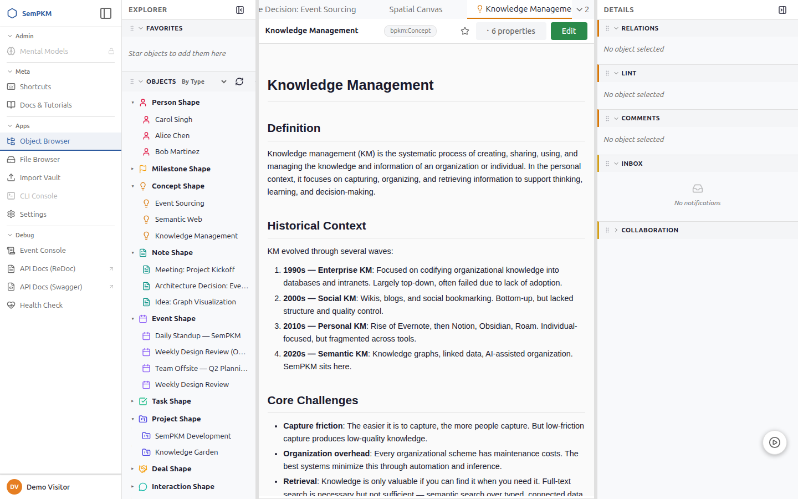
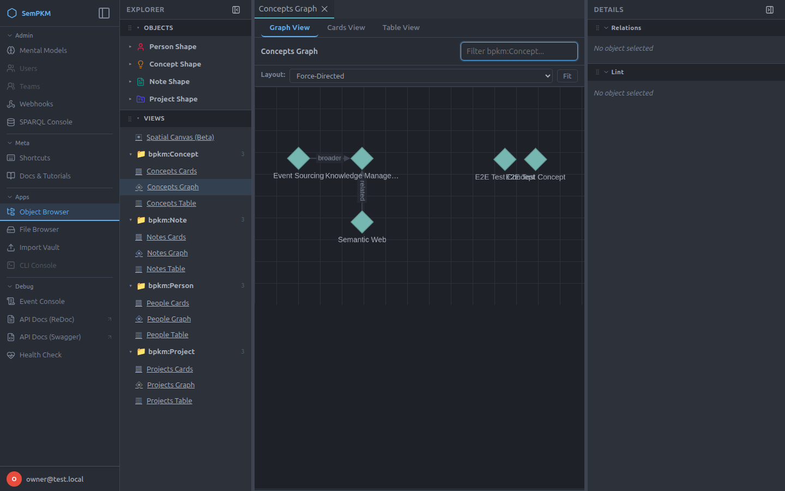
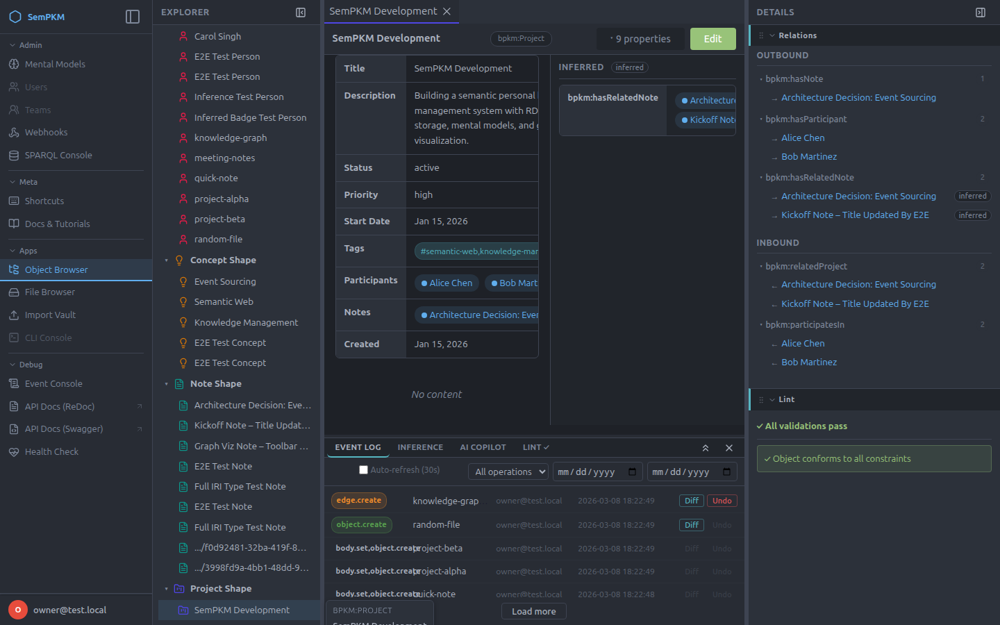
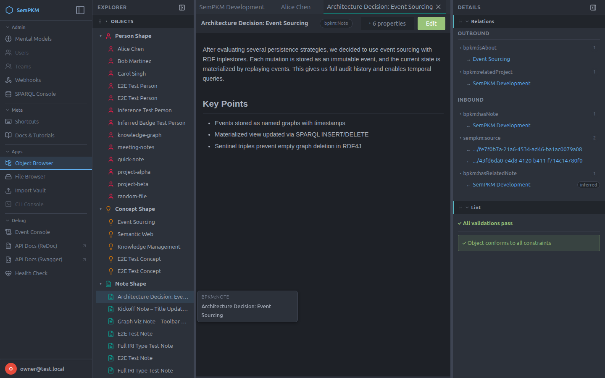
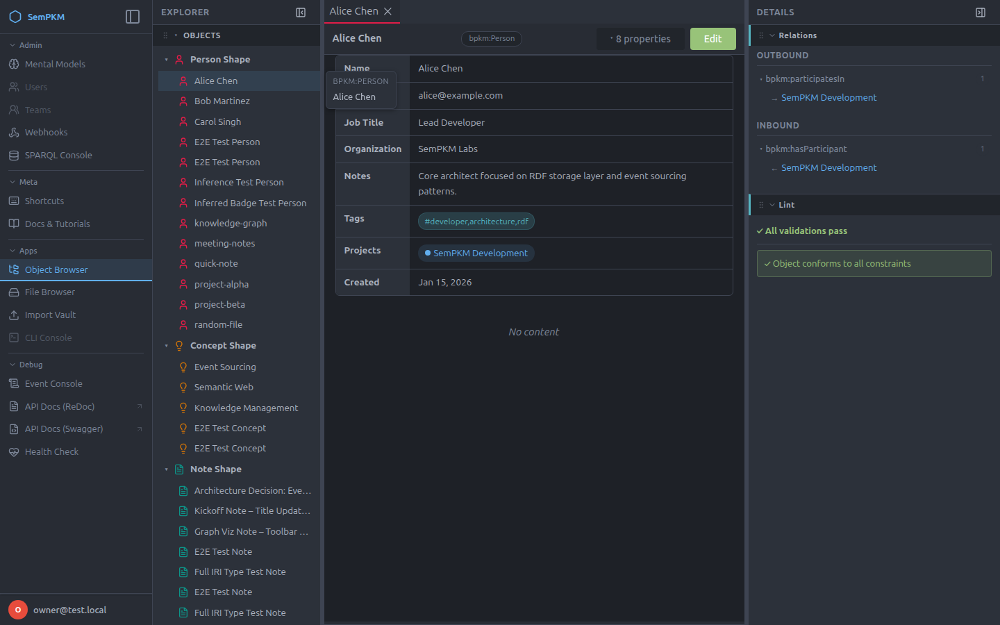

<div align="center">

# SemPKM

**Semantics-native Personal Knowledge Management.**
Structured like a knowledge graph. Feels like Notion.

[](docker-compose.yml)
[](backend/pyproject.toml)
[](backend/)
[](https://rdf4j.org/)
[](frontend/)

[What is SemPKM?](docs/guide/01-what-is-sempkm.md) ·
[User Guide](docs/guide/README.md) ·
[Installation](docs/guide/03-installation-and-setup.md) ·
[CLAUDE.md](CLAUDE.md)

</div>

---

## Why SemPKM

Free-form tools (Obsidian, Notion, Roam) give you speed but shallow structure — a `[[wiki-link]]` doesn't say *how* two things relate. Academic RDF tools (Protégé, TopBraid) give you real structure but demand you think in triples and namespace IRIs.

SemPKM bridges the two: it stores everything as real RDF — validated with SHACL, queryable with SPARQL — but the UI is auto-generated from that schema, so you get forms, tables, cards, and graphs instead of triples. You get the rigor of a knowledge graph without ever needing to know it's one.

<div align="center">


</div>

## Highlights

| | |
|---|---|
| 🧩 **Mental Models** | Installable packages that bundle ontology, SHACL shapes, views, dashboards, and seed data into an instant PKM domain — install from the bundled catalog or the remote marketplace (with version checks and one-click updates). Ships with `basic-pkm`, `zettelkasten`, `research`, `crm`, `business-planning`, `ppv`, and more |
| 🔗 **Typed relationships** | Every edge has a meaning (`hasParticipant`, `isAbout`) — not just an implied link |
| 🕘 **Full history** | Every change is an immutable, attributed event — browse the event log, diff any change, and undo it |
| ✅ **Assistive validation** | SHACL-powered lint panel flags issues without blocking your work |
| 🗂️ **11 view renderers** | Table, cards, kanban, graph (2D/3D), calendar, timeline, map, OKR, BMC, quadrant, decision matrix |
| 🗺️ **Canvas & ontology viewer** | Freeform spatial canvas for exploring your graph, plus an interactive TBox class-hierarchy graph with per-model filtering and user-created classes |
| 📊 **Dashboards & workflows** | Drag-and-drop GridStack dashboards mixing views, forms, markdown, stats, and SPARQL blocks; step-by-step guided workflows |
| ⌨️ **IDE-style workspace** | Dockview tabs, command palette, keyboard-first navigation, deep-linkable tabs with browser back/forward, closed-tab recovery (`Ctrl+Shift+T`), switchable workspace personas |
| 🔎 **Full-text search** | Lucene-backed keyword search across every property and body text, with fuzzy matching |
| 🤖 **AI features** | AI Copilot panel in the workspace, plus LLM-powered claim detection, graph matching, and personalized summaries in the browser extension — bring your own OpenAI-compatible endpoint |
| 🧱 **App platform** | Installable apps with a sandboxed SDK, scheduled tasks, and custom pages — the RSS reader, media scheduler, and all sync apps are first-party apps on it |
| 🔐 **Passwordless auth** | Magic-link login, multi-user with owner/member roles, WebID + IndieAuth support |
| 🌐 **Federation** | Share graphs across SemPKM instances — RDF Patch sync, LDN invitations, and a federation inbox |
| 🔌 **Integrations** | Webhooks, SPARQL endpoint, Obsidian vault / Notion / RDF import, sync apps for Linear, GitHub, Jira, Monday, Asana, Todoist, Google Calendar, Outlook, and CalDAV, a Chrome/Firefox browser extension with context overlay, and a mobile companion app |
| 🐳 **One-command deploy** | `docker compose up` — self-hosted, your data, open formats |

<div align="center">



</div>

## Quick Start

```bash
git clone git@github.com:MetaCoding-io/SemPKM.git
cd SemPKM
docker compose up -d
```

Then open **http://localhost:4000**. First run drops you into the setup wizard; after that, login is passwordless via magic link (see [Installation & Setup](docs/guide/03-installation-and-setup.md)).

## Architecture

- **Backend:** Python 3.12, FastAPI, async SQLAlchemy (SQLite/PostgreSQL) for app state, Eclipse RDF4J for the knowledge graph
- **Frontend:** htmx-driven server rendering + vanilla JS modules (`window.SemPKM` namespace), Dockview for the tabbed workspace, esbuild for bundling — no SPA framework
- **Data model:** RDF triples validated by SHACL shapes, queried via SPARQL; Mental Models package ontology + shapes + views + seed data into `.sempkm-model` archives
- **Companion surfaces:** WebExtension (Chrome/Firefox) in [`extension/`](extension/), Expo/React Native mobile app in [`mobile/`](mobile/), first-party platform apps in [`apps/`](apps/)

See [`CODEBASE.md`](CODEBASE.md) for the full repo map and [`.gsd/PROJECT.md`](.gsd/PROJECT.md) for current architecture notes.

## Docker Stacks

The repo ships several independent Compose stacks for different purposes — all self-contained with their own ports, volumes, and networks, so they can run side by side.

| Stack | File | Frontend | API | Purpose |
|---|---|---|---|---|
| **Dev** | `docker-compose.yml` | `:4000` | `:8001` | Primary development stack — hot-reloaded volume mounts, Jaeger tracing included |
| **Test** | `docker-compose.test.yml` | `:3901` | `:8901` | E2E test target — bundles ~10 mock integration API servers (Linear, GitHub, Jira, Monday, Asana, Google Calendar, Outlook, CalDAV, LLM). `docker-compose.test-ollama.yml` is a variant that swaps the mock LLM for a real Ollama |
| **Demo** | `docker-compose.demo.yml` | `:3902` | `:8902` | Public read-only demo — `DEMO_MODE=true` bypasses auth, nginx blocks all writes at the proxy layer |
| **Cloud** | `docker-compose.cloud.yml` | `:443`/`:80` | — | *Overlay* on the dev stack (`-f docker-compose.yml -f docker-compose.cloud.yml`) — swaps nginx for Caddy with automatic TLS |
| **Federation test** | `docker-compose.federation-test.yml` | `:3911`/`:3912` | `:8911`/`:8912` | Two full stacks (A + B) side by side on a shared network for cross-instance federation E2E |

```bash
# Dev
docker compose up -d

# E2E test stack
docker compose -f docker-compose.test.yml up -d --build

# Read-only demo
docker compose -f docker-compose.demo.yml up -d --build

# Cloud deploy (requires .env with SEMPKM_DOMAIN)
docker compose -f docker-compose.yml -f docker-compose.cloud.yml up -d

# Federation A/B testing
docker compose -f docker-compose.federation-test.yml up -d --build
```

## Documentation

- 📘 [User Guide](docs/guide/README.md) — 50 chapters, from installation through sync apps, AI features, and advanced SPARQL
- 🗺️ [CODEBASE.md](CODEBASE.md) — repository structure map
- 🧭 [TOUR.md](TOUR.md) — feature tour and manual test checklist
- 🤖 [CLAUDE.md](CLAUDE.md) — coding conventions for AI-assisted development on this repo

## Screenshots

<div align="center">



</div>
