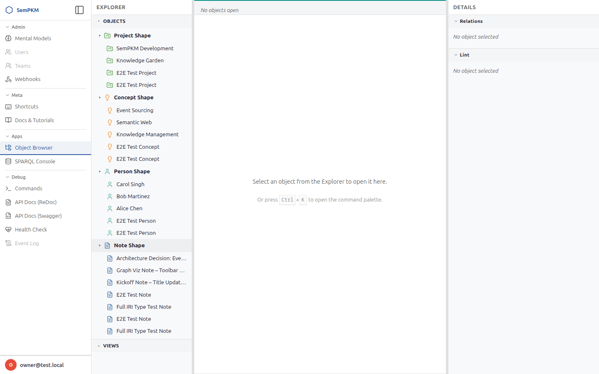
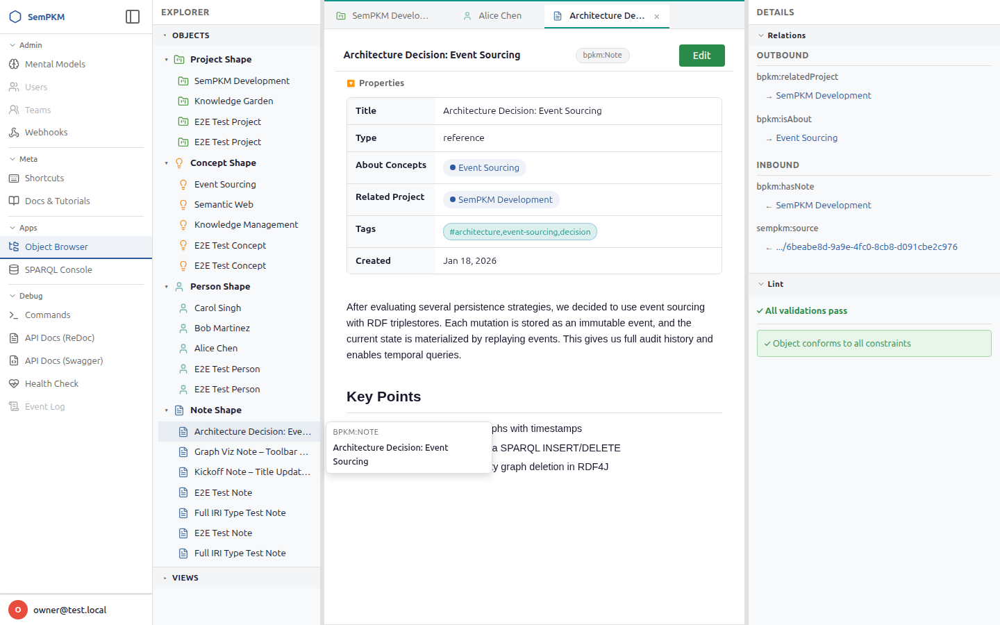
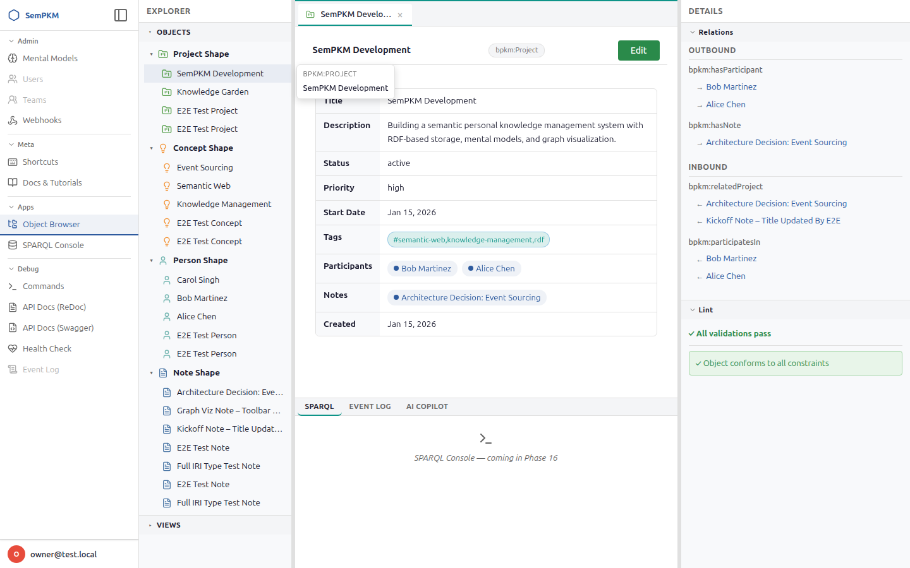

# Chapter 4: The Workspace Interface

SemPKM's workspace is an IDE-style environment designed for navigating, reading, and editing semantic objects. It uses a three-column resizable layout built on Split.js, with a sidebar for global navigation, an explorer for browsing objects and views, a tabbed editor area with split pane support, and a details panel for relationships and validation results.

This chapter walks through every region of the workspace so you know where things are and how they behave.

---

## Overall Layout

When you open the **Object Browser** (from the sidebar under Apps), the workspace loads with three resizable columns:

| Column | Default Width | Purpose |
|--------|--------------|---------|
| **Explorer** (left) | 20% | Object tree and views tree |
| **Editor Area** (center) | 50% | Tabbed object viewer/editor, plus bottom panel |
| **Details** (right) | 30% | Relations and lint (validation) panels |

You can drag the vertical gutters between columns to resize them. Your sizing preferences are saved automatically to local storage and restored on your next visit.

> **Tip:** If you need more room in the editor, hide the Explorer with `Ctrl+[` or the Details panel with `Ctrl+]`. Both are toggles -- press the same shortcut again to bring the panel back.

---

## The Sidebar

The **Sidebar** is the narrow vertical bar on the far left of the screen, outside the three-column workspace. It provides global navigation across the entire SemPKM application.

### Navigation Sections

The sidebar organizes links into collapsible groups:

- **Admin** -- Mental Models management, Users, Teams, and Webhooks configuration
- **Meta** -- Keyboard Shortcuts reference and Docs/Tutorials
- **Apps** -- The Object Browser (your main workspace) and SPARQL Console
- **Debug** -- Commands interface, API Docs (ReDoc and Swagger), Health Check, and Event Log

Click a group header to collapse or expand its links. The collapsed/expanded state of each group is saved to local storage so your preferred arrangement persists across sessions.

### Collapsing to Icon Rail

When the sidebar is expanded, it shows both icons and text labels for each link. Press `Ctrl+B` (or click the toggle button next to the SemPKM brand logo) to collapse the sidebar into a narrow **icon rail** that shows only the Lucide icons. This gives more horizontal space to the workspace columns.

Press `Ctrl+B` again to expand the sidebar back to full width.

### User Menu

At the bottom of the sidebar sits the **User Area**, displaying your avatar (an auto-generated circle with your initials in a deterministic color) and your display name. Click it to open the **User Popover**, which provides:

- **Settings** -- opens a Settings tab in the editor area
- **Theme switcher** -- buttons for Light, System, and Dark themes
- **Log out** -- ends your session

---

## The Explorer Panel (Left Column)

The left column of the workspace is titled **Explorer** and contains two collapsible sections: Objects and Views.

### The Objects Section

The **OBJECTS** section displays a tree view of all objects in your knowledge base, organized by type. Each type from your installed Mental Models appears as a top-level tree node with a type-specific icon and color (defined in the model's icon manifest).

**How the tree works:**

1. **Expand a type node** by clicking it. The first time you expand a type, SemPKM queries the triplestore for all instances of that type and loads them as child leaf nodes beneath the type header.
2. **Each leaf node** shows the object's resolved label (not its raw IRI). Click any leaf to open that object in a new editor tab.
3. **Collapse a type node** by clicking the type header again. The chevron rotates to indicate the expanded/collapsed state.

The tree uses lazy loading: child objects are only fetched from the server when you first expand a type node. This keeps initial page load fast, even with thousands of objects.

> **Note:** When you create a new object, the tree does not automatically refresh. Collapse and re-expand the relevant type node to see newly created objects, or use the command palette to open them directly.

### The Views Section

The **VIEWS** section lists all available views from your installed Mental Models, organized by the type they apply to. Each group header shows the type label and a count of available views.

Views come in three renderer types, each with a distinctive icon:

- Table views -- tabular display of objects and their properties
- Card views -- visual card grid layout
- Graph views -- interactive node-and-edge graph visualization

Click any view leaf node to open it as a tab in the editor area. View tabs are visually distinguished from object tabs with a small icon prefix indicating the view type.

**Expanding and collapsing view groups** works the same way as the Objects tree: click the group header to toggle.

---

## The Editor Area (Center Column)

The center column is where you do most of your work. It contains a tabbed editor with support for multiple **editor groups** arranged side-by-side.

### Tabs

Every object, view, or settings page you open appears as a **tab** in the tab bar at the top of an editor group. Tabs show:

- A **type icon** (for object tabs, using the Lucide icon and color defined in the model's icon manifest)
- A **view type icon** (for view tabs: a small glyph indicating table, card, or graph)
- The **label** of the object or view
- A **dirty indicator** -- a small colored dot that appears when you have unsaved changes
- A **close button** that appears on hover or when the tab is active

**Tab interactions:**

- **Click** a tab to switch to it
- **Click the close button** (or press `Ctrl+W`) to close the active tab
- **Right-click** a tab to open a context menu with options: Close, Close Others, Split Right, and (when multiple groups exist) Move to Group
- **Drag and drop** tabs to reorder them within a tab bar, move them between groups, or drag to the right edge of the editor area to create a new split group

When no tabs are open, the editor area shows a helpful empty state:

> Select an object from the Explorer to open it here.
> Or press Ctrl+K to open the command palette.

### Split Panes (Editor Groups)

You can split the editor area into up to **4 side-by-side editor groups**, each with its own tab bar and content area. This is useful for comparing objects, referencing one note while editing another, or keeping a graph view visible alongside an object editor.

**How to split:**

- Press `Ctrl+\` to split right from the currently active group. The active tab is duplicated in the new group.
- Use the command palette (`Ctrl+K`) and choose "Split Right."
- Right-click a tab and select "Split Right."
- Drag a tab to the right edge drop zone of the editor area to create a new group with that tab.

**Managing groups:**

- Press `Ctrl+1` through `Ctrl+4` to focus a specific editor group by position.
- Click anywhere inside a group to make it the active group. The active group is indicated by an accent-colored top border on its tab bar.
- Close a group by right-clicking a tab and choosing "Close Group" from the command palette, or by closing all tabs in a group (the empty group is automatically removed unless it is the last one).
- When a group is removed, its remaining tabs are redistributed to its left neighbor.

Groups are separated by thin draggable gutters. Drag these to resize the relative widths of your editor groups.

> **Tip:** Your editor group layout, including which tabs are open in each group and their sizes, is persisted in session storage and restored when you return to the workspace.

---

## The Details Panel (Right Column)

The right column is titled **Details** and contains two collapsible sections that update automatically when you select an object in the editor.

### Relations Section

The **Relations** section shows all edges connected to the currently active object, split into two subsections:

- **Outbound** -- edges where the current object is the source (e.g., a Note's "authored by" link pointing to a Person)
- **Inbound** -- edges where the current object is the target (e.g., a Project that references this Concept)

Edges are grouped by predicate label (e.g., "authored by", "related to"). Each related object is shown as a clickable link. Click any related object to open it in a new tab.

For a deeper dive into relationships, see [Edges and Relationships](06-edges-and-relationships.md).

### Lint Section

The **Lint** section displays SHACL validation results for the current object. After you save an object, validation runs asynchronously and results appear here. The panel auto-refreshes every 10 seconds to pick up the latest validation report.

Results are categorized into three severity levels:

- **Violations** (red) -- constraint violations that block export
- **Warnings** (amber) -- advisory issues that do not block operations
- **Info** (blue) -- informational notes

Click any violation or warning to jump directly to the offending field in the edit form. The field is scrolled into view, highlighted briefly, and its input is focused.

When all validations pass, a green confirmation message appears: "Object conforms to all constraints."

For details on validation behavior, see the validation section in [Working with Objects](05-working-with-objects.md).

### Moving Sidebar Panels

Panels in the right sidebar (Relations, Lint) can be moved to the left sidebar (Explorer pane) and back:

1. Hover over a panel header — a grip icon appears on the left edge of the header
2. Drag the panel header to the left sidebar (Explorer pane) to move it there
3. Drag it back to the right sidebar to restore the default position

Panel positions are remembered across page reloads. This is useful if you prefer to keep the Relations panel visible alongside the object tree while keeping the editor area wider.

---

## The Bottom Panel

The bottom panel sits beneath the editor groups within the center column. It is **collapsed by default** (zero height) and can be toggled open with `Ctrl+J`.

### Toggling and Resizing

- Press `Ctrl+J` to toggle the bottom panel open or closed
- Drag the resize handle at the top of the panel to adjust its height
- Click the **maximize button** (chevrons-up icon) in the panel header to expand the panel to fill the entire editor column, hiding the editor groups. Click again to restore.
- Click the **close button** (X icon) in the panel header to collapse the panel

The panel's open/closed state, height, active tab, and maximized state are all saved to local storage.

### Panel Tabs

The bottom panel has three tabs:

| Tab | Description |
|-----|-------------|
| **SPARQL** | SPARQL Console for running ad-hoc queries against your triplestore |
| **EVENT LOG** | Timeline of all create, edit, and delete operations with diff views and undo support |
| **AI COPILOT** | AI-assisted knowledge management (planned for a future release) |

Click a tab label to switch between them. The **Event Log** tab lazy-loads its content the first time you activate it, so there is no performance cost until you actually need it.

The Event Log provides a filterable timeline of every operation performed on your data. Each event row shows the operation type (color-coded badge), affected objects, the user who performed it, and a timestamp. You can expand events to see property-level diffs and use the **Undo** button to create compensating events that reverse a change.

---

## The Command Palette

The **Command Palette** is a quick-access overlay for searching and executing workspace actions. Open it with `Ctrl+K`.

The palette is powered by the `ninja-keys` web component and supports fuzzy search across all available actions. Commands are organized into sections:

| Section | Commands |
|---------|----------|
| **Objects** | New Object (`Ctrl+N`), Toggle Edit Mode (`Ctrl+E`), and recently opened objects |
| **Tools** | Run Validation (`Ctrl+Shift+V`) |
| **View** | Split Right (`Ctrl+\`), Toggle Panel (`Ctrl+J`), Maximize Panel, Toggle Explorer Panel (`Ctrl+[`), Toggle Details Panel (`Ctrl+]`), Close Group |
| **Views** | Browse any available view (dynamically loaded from installed Mental Models) |
| **Appearance** | Theme: Light, Theme: Dark, Theme: System Default |

The palette dynamically grows as you use the workspace: every object you open and every view available in your installed models is added as a searchable command. This means you can quickly jump to any object by pressing `Ctrl+K` and typing part of its name.

> **Tip:** The command palette shows keyboard shortcuts next to applicable commands, making it a convenient way to discover shortcuts you might not know about yet.

---

## Keyboard Shortcut Summary

Here is a quick reference for all workspace-level shortcuts discussed in this chapter:

| Shortcut | Action |
|----------|--------|
| `Ctrl+B` | Toggle sidebar collapse |
| `Ctrl+K` | Open command palette |
| `Ctrl+J` | Toggle bottom panel |
| `Ctrl+\` | Split editor right |
| `Ctrl+[` | Toggle Explorer panel |
| `Ctrl+]` | Toggle Details panel |
| `Ctrl+W` | Close active tab |
| `Ctrl+S` | Save current object |
| `Ctrl+E` | Toggle read/edit mode |
| `Ctrl+,` | Open Settings tab |
| `Ctrl+1` to `Ctrl+4` | Focus editor group 1-4 |

> **Note:** On macOS, use `Cmd` in place of `Ctrl` for all shortcuts.

---

**Previous:** [Chapter 3: Installation and Setup](03-installation-and-setup.md) | **Next:** [Chapter 5: Working with Objects](05-working-with-objects.md)
