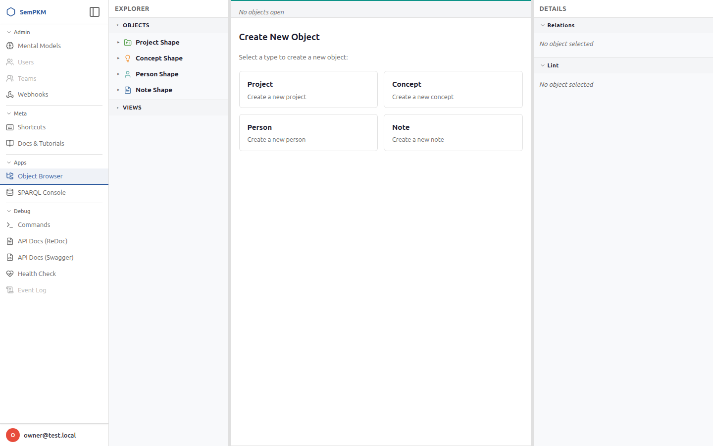
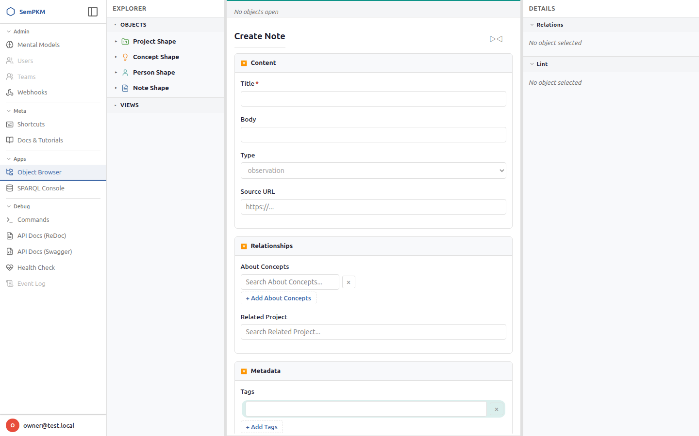
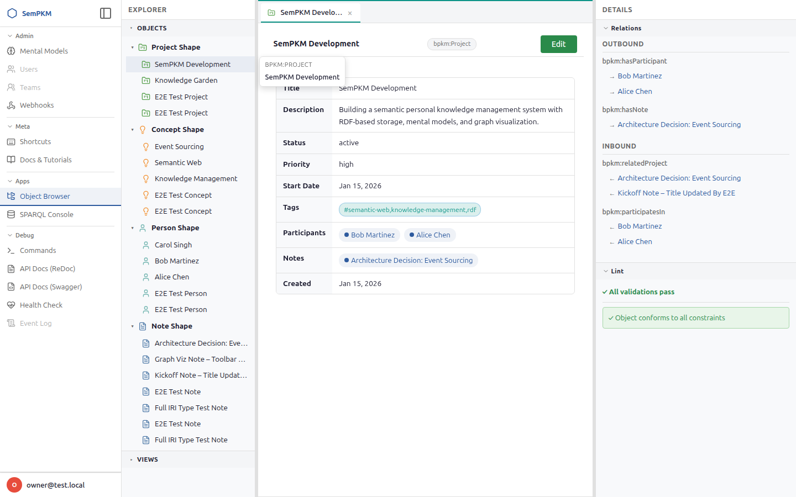
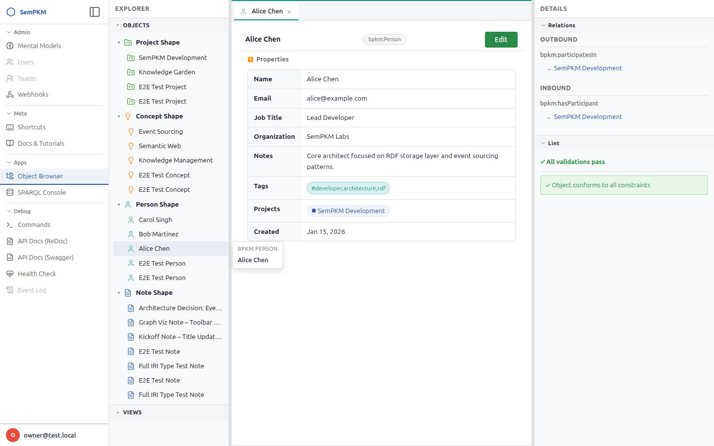
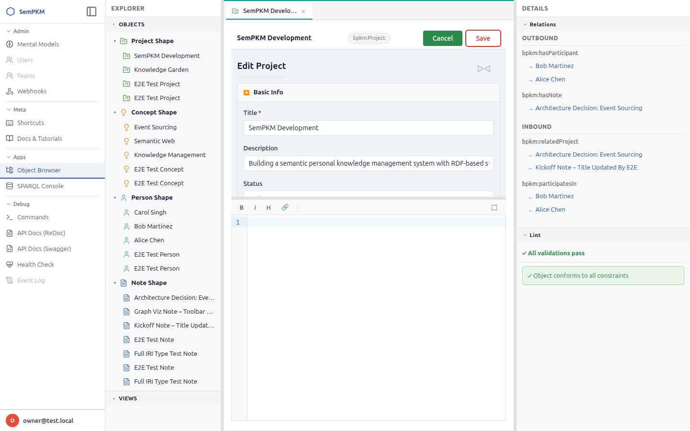
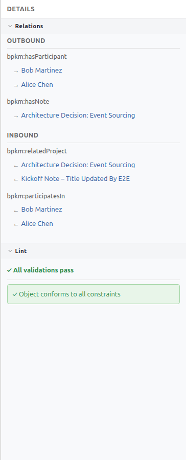

# Chapter 5: Working with Objects

Objects are the fundamental units of knowledge in SemPKM. A Note, a Concept, a Person, a Project -- each is an object with a type, a set of structured properties defined by its Mental Model's SHACL shapes, and an optional Markdown body for free-form content. This chapter covers the full lifecycle: creating, reading, editing, saving, and understanding validation.

---

## Creating an Object

### Step 1: Open the Type Picker

To create a new object, use any of these methods:

- Press `Alt+K` to open the command palette, then select **New Object**
- Use the keyboard shortcut `Alt+N`

The **Type Picker** loads in the editor area, presenting a grid of cards for each available object type from your installed Mental Models. Each card shows the type name (e.g., "Note", "Person", "Project", "Concept") and a brief description.

> **Note:** The types available in the type picker come from the SHACL NodeShapes defined in your installed Mental Models. If you see "No object types available," you need to install a Mental Model first. See [Managing Mental Models](10-managing-mental-models.md).

### Step 2: Select a Type

Click a type card to load the **Create Form** for that type. The form is automatically generated from the SHACL shape definition associated with the type.

### Step 3: Fill in the Form

The create form is organized into sections:

1. **Required fields** appear first at the top of the form, outside of any collapsible group. Required fields are marked with a red asterisk (*) next to their label. For example, a Note in the Basic PKM model might require a "Title" field.

2. **Grouped fields** appear in collapsible sections defined by the Mental Model. Click the section header to expand or collapse a group. Use the expand/collapse toggle button in the form title row to open or close all sections at once.

3. **Advanced fields** (optional, ungrouped properties) are collected into a collapsible "Advanced" section at the bottom of the form. These typically include fields like description, tags, or other metadata that are not required for creation.

**Field types are determined by the SHACL shape definition:**

| SHACL Constraint | Form Widget | Example |
|-----------------|-------------|---------|
| `xsd:string` (or no datatype) | Text input | Title, Name |
| `xsd:date` | Date picker | Birth Date |
| `xsd:dateTime` | Datetime picker | Created, Modified |
| `xsd:boolean` | Yes/No dropdown | Is Active |
| `xsd:integer` | Number input (step 1) | Priority |
| `xsd:decimal` / `xsd:float` | Number input (step 0.01) | Score |
| `xsd:anyURI` | URL input | Website |
| `sh:in [...]` | Dropdown select | Status (Draft, Published) |
| `sh:class` (reference) | Search-as-you-type | Author (references a Person) |
| Multi-valued (`sh:maxCount` > 1 or unset) | List with Add/Remove buttons | Tags, Contributors |

**Reference fields** deserve special attention. When a property has a `sh:class` constraint (e.g., "Author" references a Person), the form renders a search field instead of a plain text input. As you type, SemPKM queries the triplestore for matching instances of the target type and displays them in a dropdown. Select a suggestion to set the reference. The actual IRI is stored in a hidden field while the search input shows the human-readable label.

> **Tip:** If the object you want to reference does not exist yet, you will need to create it first, then return to this form. Reference search filters by the target type defined in the SHACL shape.

### Step 4: Submit

Click the **Create** button at the bottom of the form. SemPKM dispatches an `object.create` command through the Event Store, which:

1. Mints a new IRI for the object based on its type and a UUID
2. Creates RDF triples for the type assertion and all property values
3. Records the creation as an immutable event in the event log
4. Triggers asynchronous SHACL validation

After successful creation, the form reloads in **edit mode** with a success message, and the new object opens in its own editor tab. The tab shows the object's resolved label.

---

## Reading an Object (Read Mode)

When you open an object from the Explorer tree, the command palette, or a reference link, it loads in **read mode** by default. Read mode presents the object in a markdown-first layout optimized for reading.

### The Object Toolbar

At the top of every object tab is a toolbar showing:

- The **object label** (resolved from the object's `rdfs:label` or equivalent property)
- A **type badge** showing the object type (e.g., "Note"). Click the badge to copy the object's IRI to your clipboard.
- An **Edit button** to switch to edit mode
- A **Save button** (hidden in read mode, visible in edit mode)

### Markdown Body (Primary Content)

The read view is **markdown-first**: the object's Markdown body content is rendered prominently as styled HTML at the top of the view. This puts your free-form writing front and center. The rendering supports full Markdown syntax including:

- Headings, paragraphs, bold, italic
- Code blocks with syntax highlighting
- Block quotes, tables, images
- Ordered and unordered lists
- Links (rendered as clickable)

The body section is only displayed when the object has body content. If there is no body, the view leads with the property table instead.

> **Tip:** The body is stored using a configurable predicate. The Basic PKM model uses a dedicated body property, but SemPKM also supports the canonical `urn:sempkm:body` predicate. This is handled transparently -- you don't need to worry about the underlying predicate.

### Property Table

Below the body (or at the top if there is no body), a collapsible **Properties** section displays the object's structured data in a two-column grid layout (property name on the left, value on the right). The property table uses type-aware formatting:

- **Text values** are displayed as plain text
- **Dates** are formatted as human-readable strings (e.g., "Feb 23, 2026")
- **Booleans** show a green checkmark for true or a red X for false
- **URIs** are rendered as clickable links that open in a new browser tab
- **References** appear as colored **pill badges**. Each pill shows the referenced object's label and a colored dot. Click a pill to open the referenced object in a new tab. Hover over a pill to see a popover preview showing the referenced object's type, label, and first few properties.

You can collapse the Properties section by clicking the "Properties" toggle header.

> **Tags:** If an object has tags (via `schema:keywords`), they appear as colored pills below the object properties. Each tag is clickable and filters the explorer to show other objects with the same tag.

Here is another example showing a Person object:

---

## Editing an Object (Edit Mode)

### Entering Edit Mode

Switch from read mode to edit mode using any of these methods:

- Click the **Edit** button in the object toolbar
- Press `Alt+E`
- Use the command palette (`Alt+K`) and select **Toggle Edit Mode**

The transition uses a crossfade animation: the read-only view fades out and the edit form fades in over 0.25 seconds. The toolbar button changes from "Edit" to "Done", and the **Save** button becomes visible.

### The Edit Layout

Edit mode splits the object tab into two vertically resizable sections:

1. **Form section** (top) -- the SHACL-driven property form, identical in structure to the create form but pre-populated with the object's current values
2. **Body editor section** (bottom) -- a CodeMirror 6 Markdown editor for the object's free-form content

A horizontal gutter between the two sections lets you drag to adjust their relative heights. The default split is 40% form / 60% editor.

### SHACL Helptext

Edit forms can display **contextual help text** to guide you through each field:

- **Form-level guide:** If the Mental Model defines a helptext description on the SHACL NodeShape, a collapsible **Form Guide** section appears at the top of the edit form (marked with a help-circle icon). Click it to expand and read guidance about how to fill out the form. The guide content supports Markdown formatting.

- **Field-level help:** Individual properties can also have help text (defined via `sh:description` or a custom helptext predicate in the SHACL shape). When a field has help text, a small help icon button appears next to the field label. Click it to toggle an inline help panel below the field that explains what the field is for, what values are expected, or provides examples.

Helptext is automatic -- it appears whenever the Mental Model's SHACL shapes include descriptions. Model authors can add descriptions to any property shape to improve the editing experience for their users.

### Editing Properties

The property form in edit mode works the same as the create form described above. Fields use the same type-aware widgets (text inputs, date pickers, dropdowns, reference search). Changes are tracked: modifying any field marks the tab as **dirty**, indicated by a colored dot on the tab.

Required fields validate on blur: if you leave a required field empty, a red error message appears below it immediately. This is client-side feedback; full SHACL validation runs asynchronously after saving.

### The Markdown Editor

The body editor is built on **CodeMirror 6** with Markdown syntax highlighting and a formatting toolbar. The toolbar provides quick-access buttons for:

- **Bold** (`Ctrl+B` within the editor)
- **Italic** (`Ctrl+I` within the editor)
- **Heading** -- wraps selected text in `## ` prefix
- **Link** -- wraps selected text in `[text](url)` syntax

A **maximize button** in the toolbar expands the editor to fill the entire edit area, collapsing the form section to zero height. Click it again to restore the split layout.

The editor supports both **dark and light themes**, automatically matching the workspace theme. It includes line numbers, active line highlighting, and standard CodeMirror keybindings.

> **Note:** If CodeMirror fails to load (e.g., due to a network issue with the ESM module), the editor falls back to a plain `<textarea>` with a notice. Your content is never lost -- the fallback editor supports the same save workflow.

### Saving

Save your changes using any of these methods:

- Press `Alt+S` (works from anywhere in the workspace)
- Click the **Save** button in the object toolbar

When you save, two operations happen in parallel:

1. **Property save** -- the form data is submitted via htmx to the `/browser/objects/{iri}/save` endpoint, which dispatches an `object.patch` command. Only changed properties are updated. The `dcterms:modified` timestamp is automatically set to the current time.

2. **Body save** -- the Markdown content is sent as `text/plain` to the `/browser/objects/{iri}/body` endpoint, which dispatches a `body.set` command.

Both operations create immutable events in the event log. After a successful save:

- The tab's dirty indicator is cleared
- A brief "Saved" status appears in the editor toolbar
- Asynchronous SHACL validation is triggered (results appear in the Lint panel after approximately 2 seconds)

### Exiting Edit Mode

To return to read mode:

- Click the **Done** button (which replaced "Edit" during edit mode)
- Press `Alt+E` again

If you have unsaved changes, a confirmation dialog asks: "Discard unsaved changes?" Choose OK to discard and return to read mode, or Cancel to stay in edit mode and continue working.

When you return to read mode, the read view refreshes from the server to show the latest saved data, including any re-rendered Markdown body.

---

## Understanding Validation

SemPKM validates objects against their SHACL shape constraints after every save. Validation is **asynchronous** -- it does not block the save operation itself. Instead, results appear in the **Lint** section of the Details panel.

### How Validation Works

1. You save an object (properties, body, or both)
2. The save operation commits to the triplestore and records an event
3. The event triggers the **AsyncValidationQueue**, which schedules a validation pass
4. The validation engine evaluates all SHACL shapes against the current state graph
5. Results are written to a validation report graph in the triplestore
6. The Lint panel fetches results for the active object and displays them

The Lint panel auto-refreshes every 10 seconds, so results appear shortly after saving even without manual action.

### Severity Levels

Validation results use three severity levels from the SHACL specification:

| Severity | Icon | Meaning |
|----------|------|---------|
| **Violation** | Red circle | A `sh:Violation` -- the object fails a mandatory constraint. Violations block export. |
| **Warning** | Amber triangle | A `sh:Warning` -- an advisory issue. Warnings do not block any operations. |
| **Info** | Blue circle | A `sh:Info` -- informational feedback for best practices. |

### The Lint Panel

The Lint panel displays:

- A **summary line** with counts of violations and warnings
- A **conformance notice**: either a red "Export blocked" message (if violations exist) or a green "Object conforms to all constraints" confirmation
- A **results list** where each item shows the validation message and the property path that triggered it

**Clicking a result** in the lint panel jumps you directly to the offending field in the edit form:

1. The field scrolls into view with smooth scrolling
2. A yellow highlight flashes on the field for 2 seconds
3. The input within the field receives focus
4. If the field has a validation message slot, it shows "Constraint violation on this field"

This makes it fast to find and fix validation issues without manually searching through the form.

### Guidance, Not Enforcement

An important design principle: validation provides **guidance, not enforcement**. You can always save an object, even if it has violations. The lint panel tells you what needs attention, but it does not prevent you from working. Only export operations check conformance status.

> **Warning:** While saving always succeeds regardless of validation results, objects with violations are flagged as non-conforming. If your workflow includes data export or integration with external systems, resolve violations before exporting.

---

## Quick Reference

| Task | How |
|------|-----|
| Create an object | `Alt+K` then "New Object", or `Alt+N` |
| Open an object | Click in Explorer tree, or `Alt+K` and search by name |
| Switch to edit mode | `Alt+E` or click Edit button |
| Save changes | `Alt+S` or click Save button |
| Return to read mode | `Alt+E` or click Done button |
| Close an object tab | `Alt+W` or click the tab close button |
| Run validation | Save the object (validation runs automatically) |
| Jump to a lint result | Click the result in the Lint panel |

---

**Previous:** [Chapter 4: The Workspace Interface](04-workspace-interface.md) | **Next:** [Chapter 6: Edges and Relationships](06-edges-and-relationships.md)
