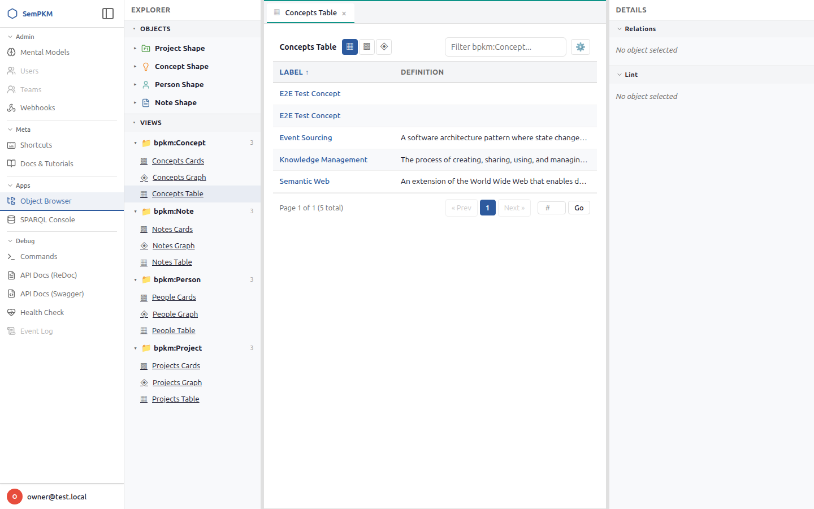
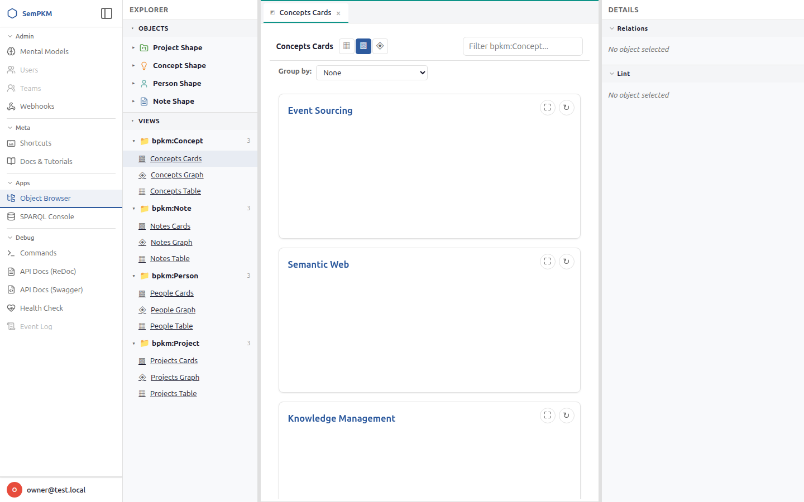
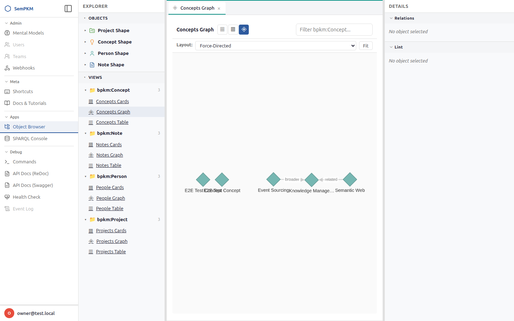

# Chapter 7: Browsing and Visualizing Data

SemPKM provides three distinct ways to browse your knowledge base: **Table View** for structured scanning and sorting, **Card View** for visual overviews, and **Graph View** for exploring how objects connect. Each view is defined by a view specification shipped with a Mental Model, so the views you see depend on which models you have installed. The Basic PKM model includes table, card, and graph views for all four types -- Notes, Concepts, Projects, and People.

This chapter covers how to open views, what each renderer offers, and how to switch between views using the carousel navigation bar.

## Opening Views

There are three ways to open a view in SemPKM.

### From the Views Explorer Sidebar

The left sidebar contains a **Views Explorer** section that lists all available views grouped by renderer type (table, card, graph). Click any view name to open it as a new tab in the editor area.

The explorer groups views in a fixed order: tables first, then cards, then graphs. Within each group, views are sorted alphabetically by name.

### From the View Menu

Open the full **View Menu** by using the command palette (`Alt+K`) and selecting "Open View Menu", or by clicking the view menu button in the toolbar. The View Menu shows all views from all installed models, grouped by their source model. Each entry displays the view label, its target type, and a renderer type indicator.

### From the Command Palette

Press `Alt+K` to open the command palette. All available views are registered as palette commands with the format "Browse: Table: Projects Table" or "Browse: Graph: People Graph". Start typing the view name to filter, then press Enter to open it.

> **Tip:** The command palette is the fastest way to switch between views. Press `Alt+K`, type a few letters of the view name, and hit Enter.

### View Tabs

Each view opens as a tab in the editor area, just like object tabs. You can have multiple views open simultaneously, switch between them by clicking their tabs, and close them with the tab close button or `Alt+W`. View tabs persist across sessions alongside your object tabs.

## Carousel View Navigation

When you open a view for a particular type, the view page displays a **carousel tab bar** at the top. This bar shows all available views for that type as clickable tabs -- for example, when viewing Notes, the carousel might show tabs for "Notes Table", "Notes Cards", and "Notes Graph".

### Switching Views with the Carousel

Click any tab in the carousel bar to switch to that view. The view content area below the bar updates to show the selected view while the carousel bar itself remains fixed at the top. The active tab is highlighted with an underline accent.

The carousel remembers your last-selected view per type in local storage. When you return to a type's view page later, it automatically loads the view you were last using for that type.

### How the Carousel Differs from Opening New Tabs

The carousel switches views **in place** within the same editor tab -- it does not open a new tab for each view. This keeps your tab bar clean when you are exploring different renderings of the same data set. If you want separate tabs for different views, open them individually from the command palette or the Views Explorer sidebar.

## Table View

Table View renders your objects as sortable, filterable rows with configurable columns. It is best suited for scanning large collections, comparing properties across objects, and finding specific items.

### Sorting

Click any column header to sort the table by that column. Click the same header again to toggle between ascending and descending order. The current sort column and direction are indicated visually in the header.

Each table view has a default sort column defined by the view specification. For example, the **Projects Table** sorts by title by default, while the **Notes Table** sorts by creation date. If you do not click any column header, the default sort is applied automatically.

### Filtering

Use the **filter text box** in the view toolbar to search within the table. Filtering performs a case-insensitive regex match against the first column of the view (typically the title or name). As you type, the table updates to show only matching rows.

For example, in the Notes Table, typing "architecture" in the filter box shows only notes whose title contains "architecture". In the People Table, typing "chen" matches "Alice Chen".

> **Note:** Filtering works against the first column defined in the view specification. For the Projects Table, that is the "title" column. For the People Table, it is the "name" column.

### Pagination

Tables are paginated to keep the interface responsive. The default page size is 25 rows. Navigation controls at the bottom of the table let you move between pages and see the total number of results.

You can adjust the page size using the page size selector if available, with options ranging from 1 to 100 rows per page.

### Column Preferences

Not every column is relevant all the time. SemPKM lets you customize which columns are visible and their display order through the **Column Preferences** panel.

1. Click the gear icon in the view toolbar to open the **Column Visibility** dropdown.
2. Each column is listed with a checkbox. Uncheck a column to hide it; check it to show it.
3. Use the up/down arrow buttons next to each column name to reorder columns.
4. Changes take effect immediately and are saved to your browser's local storage, so your preferences persist across sessions.

Column preferences are saved per type, so your preferences for the Projects Table are independent of your preferences for the People Table.

> **Tip:** If you have hidden columns and want to reset, open the Column Preferences dropdown and re-check all columns.

### Clicking Rows

Each row in a table view is clickable. Click the first column (the object's title or name) to open that object in a new tab in the editor area. This lets you quickly drill into an item from a table scan.

## Card View

Card View presents your objects as visual cards arranged in a responsive grid layout. Each card shows a title, a subtitle, and a content snippet on its front face, with full property details and relationship links available on the back face via a flip animation.

### When to Use Cards Over Tables

Card View works well when:

- You want a visual overview of a collection rather than a dense table.
- Body content or descriptions are important -- cards show text snippets that tables would truncate.
- You are working with a smaller set of objects (up to a few dozen) where spatial arrangement helps.
- You want to see relationships alongside properties at a glance.

Table View is better when you have many objects (50+) and need to sort, compare, or scan a specific property across all of them.

### Card Anatomy

**Front face:**
- **Title** -- the object's primary label (e.g., a Person's name, a Note's title).
- **Subtitle** -- a secondary property defined by the view specification (e.g., a Person's job title, a Note's type).
- **Snippet** -- a truncated body or description, showing up to 300 characters with an ellipsis if longer.

**Back face** (revealed by clicking or hovering to flip):
- **Properties** -- all literal properties of the object with human-readable labels.
- **Outbound relationships** -- links from this object to others (e.g., a Project's participants).
- **Inbound relationships** -- links from other objects to this one (e.g., notes related to a Project).

Each relationship is a clickable link that opens the related object in a new tab.

### Filtering and Pagination

Card View supports the same filter text box as Table View. Type in the filter to narrow the displayed cards by a case-insensitive match on the first column (typically title or name).

Cards are paginated with a default page size of 12 cards per page. Page navigation controls appear at the bottom of the view.

### Grouping

Card View supports optional **grouping** by any property. When grouping is active, cards are organized under group headers based on the selected property's values. For example, grouping People Cards by "Organization" places all people from "SemPKM Labs" under one header and those from "Knowledge Institute" under another.

If an object has no value for the grouping property, it appears under a "(No value)" group.

## Graph View

Graph View provides an interactive 2D visualization of objects and their relationships, powered by Cytoscape.js. It shows nodes for objects and directed edges for relationships, making it the ideal view for exploring the network structure of your knowledge base.

### Node Colors by Type

Each object type is assigned a distinct color so you can quickly identify what you are looking at:

| Type | Color | Node Shape |
|------|-------|------------|
| Note | Blue (#4e79a7) | Rectangle |
| Concept | Orange (#f28e2b) | Diamond |
| Project | Green (#59a14f) | Rounded Rectangle |
| Person | Teal (#76b7b2) | Ellipse |

These colors are defined in the Basic PKM model's manifest and can be customized by Mental Model authors. If a type does not have an explicitly defined color, SemPKM auto-assigns one from the Tableau 10 palette based on the type's identifier.

### Edge Styles

Edges are drawn as bezier curves with directional arrows pointing from the source to the target. Each edge displays a short label derived from the relationship type (e.g., "hasParticipant", "isAbout", "relatedProject"). Edge labels rotate to follow the curve direction for readability, and their text background is semi-transparent to avoid overlapping with other elements.

### Interacting with the Graph

**Panning and zooming:**
- Click and drag on empty space to pan.
- Scroll the mouse wheel to zoom in and out. Zoom is capped between 0.1x and 5x.

**Selecting nodes:**
- Click a node to select it. The selected node gets a thicker border highlight (blue in light theme, teal in dark theme).
- Selecting a node also loads its relations and lint status in the right panel.

**Node popovers:**
- Hover over a node for 250 milliseconds to see a rich popover showing:
  - The node's label and type.
  - All literal properties with their values (truncated at 120 characters).
  - An **Open** button that opens the object in a new editor tab.
- The popover stays visible while your mouse is over it, and disappears when you move away.

**Edge popovers:**
- Hover over an edge to see a tooltip showing the relationship label and the full predicate IRI.

**Expanding nodes:**
- Double-click any node to **expand** it -- this fetches all of the node's neighbors (both outbound and inbound relationships) from the triplestore and adds them to the graph. New nodes appear near the expanded node with an animated layout.
- Expansion is additive: nodes and edges already present in the graph are not duplicated.

> **Tip:** Start with a focused view like the "Projects Graph", then double-click a project node to see its participants and notes. Double-click a participant to see their other projects. This progressive exploration is one of the most powerful ways to discover connections in your knowledge base.

### Layout Algorithms

The graph toolbar includes a **layout selector** with three built-in layout algorithms:

- **Force-Directed** (fcose) -- the default. Positions nodes by simulating physical forces, where connected nodes attract and unconnected nodes repel. Produces organic, readable layouts for most graphs.
- **Hierarchical** (dagre) -- arranges nodes in a top-to-bottom tree structure based on edge direction. Useful when your data has a natural hierarchy (e.g., Concepts with broader/narrower relationships).
- **Radial** (concentric) -- arranges nodes in concentric circles. Useful for seeing the centrality of nodes.

Select a layout from the dropdown and the graph animates to the new arrangement over 500 milliseconds.

Mental Models can also contribute custom layout configurations, which appear alongside the built-in options.

### Filtering the Graph

Use the filter text box in the graph toolbar to filter nodes by label. Nodes whose labels do not match the filter text are faded to near-invisibility (8% opacity) and become non-interactive. Edges connected to filtered-out nodes are also faded. Clear the filter to restore all elements.

### Theme Support

Graph View adapts to light and dark themes automatically. When you switch themes, the graph updates its color scheme -- node borders, edge colors, label colors, and backgrounds all adjust without losing your current graph state or layout positions.

## View Specifications

Each view you see in SemPKM is backed by a **view specification** stored as part of a Mental Model. A view specification defines:

- **Target class** -- what type of object the view displays (e.g., `bpkm:Project`).
- **Renderer type** -- how to render the data: `table`, `card`, or `graph`.
- **SPARQL query** -- the query used to fetch data. Table and card views use SELECT queries; graph views use CONSTRUCT queries.
- **Columns** -- for table views, the ordered list of SPARQL variables to display as columns.
- **Sort default** -- for table views, which column to sort by initially.
- **Card title/subtitle** -- for card views, which properties map to the card's title and subtitle.

You do not need to write view specifications yourself -- they come pre-packaged with Mental Models. The Basic PKM model includes 12 view specifications: a table, card, and graph view for each of its four types (Note, Concept, Project, Person).

For a deeper look at what Mental Models contain and how they shape your experience, see [Understanding Mental Models](09-understanding-mental-models.md).

---

**Previous:** [Chapter 6: Edges and Relationships](06-edges-and-relationships.md) | **Next:** [Chapter 8: Keyboard Shortcuts and Command Palette](08-keyboard-shortcuts.md)
