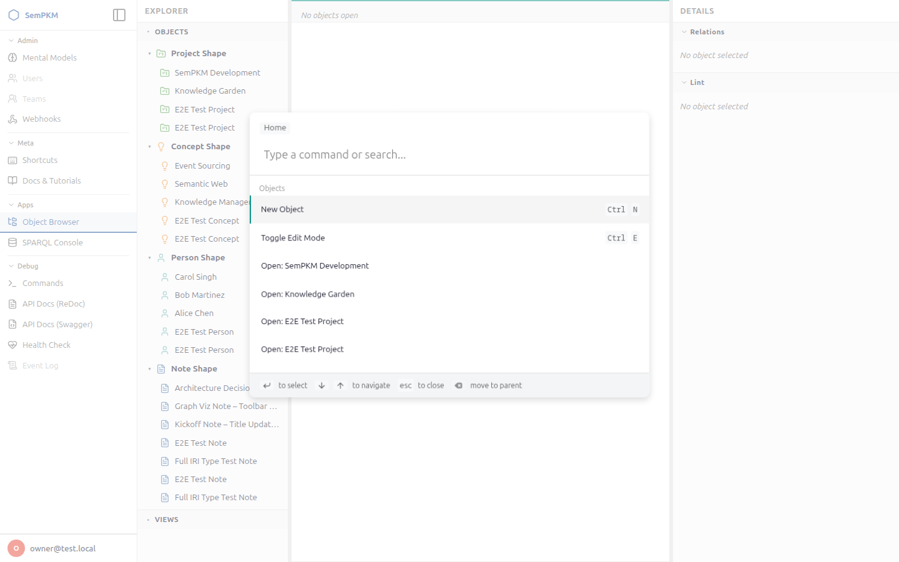

# Chapter 8: Keyboard Shortcuts and Command Palette

SemPKM's workspace is built for keyboard-driven productivity. Every frequent action has a shortcut, and the command palette gives you instant access to every command in the system. This chapter documents all available shortcuts and the full list of command palette actions.

> **Note:** SemPKM uses the platform-standard modifier key. On macOS, use `Cmd` wherever this chapter shows `Ctrl`. The shortcuts are automatically mapped to the correct modifier for your operating system.

## Global Keyboard Shortcuts

These shortcuts work anywhere in the workspace, regardless of which pane or panel is focused.

### Navigation and Panels

| Shortcut | Action | Description |
|----------|--------|-------------|
| `Ctrl+K` | Open Command Palette | Opens the searchable command palette. Start typing to filter commands, then press Enter to execute. |
| `Ctrl+B` | Toggle Sidebar | Shows or hides the left navigation sidebar. |
| `Ctrl+J` | Toggle Bottom Panel | Shows or hides the bottom panel (SPARQL console, Event Log). |
| `Ctrl+[` | Toggle Explorer Pane | Collapses or expands the left explorer pane in the three-column layout. |
| `Ctrl+]` | Toggle Details Pane | Collapses or expands the right details pane (Relations, Lint). |
| `Ctrl+,` | Open Settings | Opens the Settings tab in the editor area. |

### Editor and Tabs

| Shortcut | Action | Description |
|----------|--------|-------------|
| `Ctrl+S` | Save | Saves the current object -- both form properties and body content. If a CodeMirror editor is active, saves the body text. If a form is active, submits the form. After saving, the lint panel refreshes automatically. |
| `Ctrl+E` | Toggle Edit Mode | Switches the current object between read mode and edit mode. In read mode, you see rendered properties and formatted markdown. In edit mode, you get the editable form and the code editor. A flip animation shows the transition. |
| `Ctrl+W` | Close Tab | Closes the currently active tab. If the tab has unsaved changes, you are not prompted (dirty state is tracked but closure is immediate). |
| `Ctrl+\` | Split Right | Creates a new editor group to the right of the current one, splitting the editor area. Useful for viewing two objects or views side by side. |
| `Ctrl+1` through `Ctrl+4` | Focus Editor Group | Switches keyboard focus to editor group 1, 2, 3, or 4 (if that many groups exist). |

### Objects

| Shortcut | Action | Description |
|----------|--------|-------------|
| `Ctrl+N` | New Object | Opens the type picker, letting you choose which type of object to create. Available via the command palette. |
| `Ctrl+Shift+V` | Run Validation | Saves the current object and triggers SHACL validation. The lint panel in the right sidebar updates with any constraint violations after a short delay. |

## The Command Palette

The **command palette** is a searchable overlay that gives you access to every action in SemPKM. Press `Ctrl+K` to open it. It uses the ninja-keys web component, providing a familiar experience similar to VS Code's Command Palette or Spotlight on macOS.

### How to Use the Palette

1. Press `Ctrl+K` to open the palette.
2. Start typing to filter commands. The palette matches against command titles using fuzzy search.
3. Use the arrow keys to navigate the results list.
4. Press Enter to execute the selected command.
5. Press Escape to close the palette without executing anything.

### Full Command List

The command palette organizes commands into sections. Here is the complete list of built-in commands:

**Objects**

| Command | Shortcut | Description |
|---------|----------|-------------|
| New Object | `Ctrl+N` | Opens the type picker to create a new object. |
| Toggle Edit Mode | `Ctrl+E` | Switches the active object between read and edit mode. |

**Tools**

| Command | Shortcut | Description |
|---------|----------|-------------|
| Run Validation | `Ctrl+Shift+V` | Saves and validates the current object against SHACL shapes. |

**View**

| Command | Shortcut | Description |
|---------|----------|-------------|
| Split Right | `Ctrl+\` | Splits the editor area by adding a new group to the right. |
| Close Group | -- | Closes the current editor group (only available if more than one group exists). |
| Toggle Panel | `Ctrl+J` | Shows or hides the bottom panel. |
| Maximize Panel | -- | Toggles the bottom panel between normal and maximized height. |
| Toggle Explorer Panel | `Ctrl+[` | Collapses or expands the left explorer pane. |
| Toggle Details Panel | `Ctrl+]` | Collapses or expands the right details pane. |

**Views**

| Command | Description |
|---------|-------------|
| Open View Menu | Opens the full view menu showing all available views grouped by source model. |

In addition to the static commands above, the command palette dynamically registers entries for:

- **All available views** -- each installed view specification appears as a "Browse:" command (e.g., "Browse: Table: Projects Table", "Browse: Cards: People Cards", "Browse: Graph: Notes Graph"). Selecting one opens the view in a new tab.
- **Recently opened objects** -- as you open objects from the explorer tree, they are added to the palette as "Open:" commands for quick re-access.

**Appearance**

| Command | Description |
|---------|-------------|
| Theme: Light | Switches to the light color theme. |
| Theme: Dark | Switches to the dark color theme. |
| Theme: System Default | Uses your operating system's preferred color scheme. |

## Tips for Keyboard-First Workflows

Here are some practical patterns for working efficiently with keyboard shortcuts.

### Quick Object Creation

1. Press `Ctrl+K` to open the palette.
2. Type "new" and select "New Object".
3. Choose a type from the picker (e.g., Note).
4. The new object opens directly in edit mode. Fill in the form fields.
5. Press `Ctrl+S` to save.

### Switching Between Views and Objects

1. Press `Ctrl+K` and type part of a view name (e.g., "proj table") to find "Browse: Table: Projects Table".
2. Press Enter to open the view.
3. Click a row in the table to open an object.
4. Press `Ctrl+K` and type part of the object's name to switch back to it later.

### Side-by-Side Comparison

1. Open the first object you want to compare.
2. Press `Ctrl+\` to split the editor.
3. The new editor group becomes active. Press `Ctrl+K` and open the second object.
4. Use `Ctrl+1` and `Ctrl+2` to switch focus between the two groups.

### Quick Validation Workflow

1. Open an object and press `Ctrl+E` to enter edit mode.
2. Make your changes.
3. Press `Ctrl+S` to save.
4. Press `Ctrl+Shift+V` to run validation.
5. Check the right panel's Lint section for any issues.
6. If a lint issue points to a specific field, click it to jump directly to that field in the form.

### Managing Screen Space

- Press `Ctrl+[` to hide the explorer when you do not need the navigation tree.
- Press `Ctrl+]` to hide the details pane when you do not need relations or lint.
- Press `Ctrl+J` to toggle the bottom panel for SPARQL queries or the event log.
- These shortcuts let you maximize the editor area on smaller screens and restore the panels when needed.

> **Tip:** All pane sizes are remembered across sessions. When you drag a pane boundary to resize it, or toggle a panel open or closed, SemPKM saves the layout to your browser's local storage and restores it on your next visit.

## Customization

Keyboard shortcuts in SemPKM are currently fixed and cannot be remapped through the UI. The shortcut bindings are designed to match conventions from VS Code and other IDE-style applications:

- `Ctrl+K` for command palette (same as VS Code)
- `Ctrl+S` for save (universal)
- `Ctrl+E` for edit mode toggle
- `Ctrl+J` for bottom panel toggle (same as VS Code terminal)
- `Ctrl+,` for settings (same as VS Code)
- `Ctrl+\` for split editor (same as VS Code)

This consistency means that if you are already comfortable with VS Code shortcuts, you will feel at home in SemPKM immediately.

---

**Previous:** [Chapter 7: Browsing and Visualizing Data](07-browsing-and-visualizing.md) | **Next:** [Chapter 9: Understanding Mental Models](09-understanding-mental-models.md)
