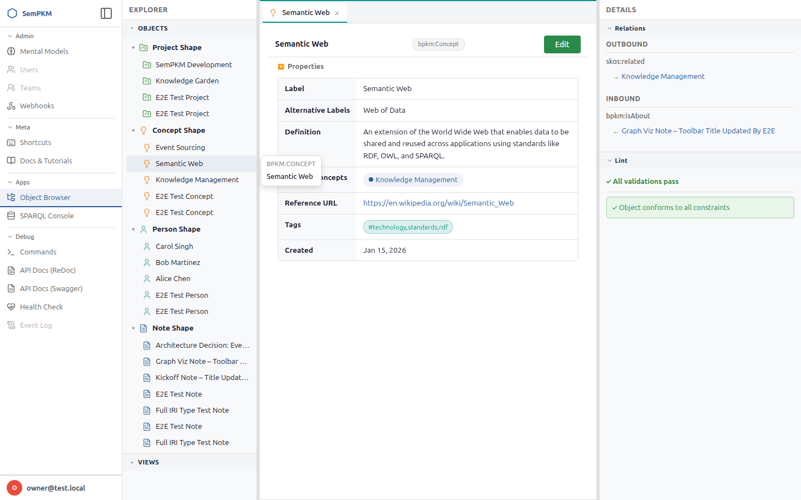

# Chapter 9: Understanding Mental Models

A **Mental Model** is a self-contained package that tells SemPKM what types of knowledge objects exist, what properties they have, how they relate to each other, how they should be validated, and how they should be displayed. Mental Models are the bridge between the raw flexibility of RDF and the structured, guided experience you see in the SemPKM workspace.

When you create a Note, fill in a Project form with a status dropdown, or view a graph of People connected to Projects, all of that behavior is driven by the installed Mental Model. Without a Mental Model, SemPKM is an empty canvas. With one installed, it becomes a purpose-built tool for a specific knowledge domain.

## What a Mental Model Contains

Every Mental Model is a directory on the filesystem with a `manifest.yaml` file and a set of JSON-LD files. Here is what each part provides.

### Manifest (`manifest.yaml`)

The manifest is the identity card of the model. It declares:

- **modelId** -- a lowercase, hyphenated identifier (e.g., `basic-pkm`). This ID is used throughout the system to namespace the model's artifacts.
- **version** -- a semantic version string (e.g., `1.0.0`).
- **name** -- a human-readable display name (e.g., "Basic PKM").
- **description** -- a paragraph explaining what the model provides.
- **namespace** -- the IRI namespace for the model's types and properties, following the pattern `urn:sempkm:model:{modelId}:`.
- **prefixes** -- short prefix mappings for the model's namespace (e.g., `bpkm: urn:sempkm:model:basic-pkm:`).
- **entrypoints** -- file paths to the model's JSON-LD artifacts (ontology, shapes, views, seed data).
- **icons** -- icon and color definitions for each type, used in the explorer tree, editor tabs, and graph nodes.
- **settings** -- optional user-configurable settings contributed by the model.

### Ontology (`ontology/*.jsonld`)

The ontology defines the **types** (classes) and **properties** that the model introduces. It uses OWL (Web Ontology Language) expressed as JSON-LD. Each class declaration includes:

- A unique IRI (e.g., `urn:sempkm:model:basic-pkm:Project`)
- A human-readable label (e.g., "Project")
- A description of what the type represents
- Datatype properties (string, date, URI values)
- Object properties (relationships to other types), including domain, range, and inverse declarations

The ontology is what makes SemPKM understand that a "Project" exists as a concept, that it can have a "status" property, and that it can be linked to "Person" objects via a "hasParticipant" relationship.

### Shapes (`shapes/*.jsonld`)

Shapes use SHACL (Shapes Constraint Language) to define **validation rules** and **form layout** for each type. A shape specifies:

- **Property constraints** -- required fields (`sh:minCount`), maximum cardinality (`sh:maxCount`), allowed values (`sh:in`), data types (`sh:datatype`), and default values (`sh:defaultValue`).
- **Property groups** -- logical groupings of fields displayed as sections in the form (e.g., "Basic Info", "Dates", "Relationships", "Metadata").
- **Display order** -- the sequence in which fields appear within their groups (`sh:order`).
- **Relationship targets** -- for object properties, the expected target type (`sh:class`).

SemPKM reads these shapes at runtime to auto-generate edit forms. A shape that declares `sh:in ["active", "completed", "on-hold", "cancelled"]` for the status property results in a dropdown select field in the UI. A shape that declares `sh:minCount 1` for the title produces a required field with a visual indicator.

### Views (`views/*.jsonld`)

View specifications define **how to browse collections** of objects. Each view spec includes:

- **Target class** -- which type the view applies to.
- **Renderer type** -- `table`, `card`, or `graph`.
- **SPARQL query** -- the query that fetches the data. Table and card views use SELECT queries with named variables; graph views use CONSTRUCT queries that return triples.
- **Columns** -- for table views, the ordered list of SPARQL variables to display.
- **Sort default** -- which column to sort by initially.
- **Card title/subtitle** -- for card views, which properties map to the card's front face.

Views are what populate the Views Explorer sidebar and the command palette's "Browse:" entries.

### Seed Data (`seed/*.jsonld`)

Seed data is a collection of **example objects** that are loaded when the model is installed. Seed data serves two purposes:

1. **Immediate usability** -- a fresh SemPKM instance with the Basic PKM model comes pre-populated with example projects, people, notes, and concepts, so you can start exploring immediately.
2. **Documentation by example** -- the seed objects demonstrate the intended usage of each type, showing realistic property values and inter-object relationships.

Seed data is materialized through the event store during installation, which means it appears in the event log and can be undone or modified like any other data.

### Icons

Icon definitions in the manifest assign **visual identifiers** to each type. Each icon definition specifies:

- A **Lucide icon name** (e.g., `file-text`, `lightbulb`, `folder-kanban`, `user`).
- A **color** (hex value) for the icon.
- Per-context overrides for the **tree** (sidebar explorer), **tab** (editor tabs), and **graph** (Cytoscape nodes) contexts, each with optional size adjustments.

Icons make types instantly recognizable across the entire interface.

## The Basic PKM Mental Model

The Basic PKM model ships with SemPKM and is automatically installed on a fresh instance if no other models are present. It provides a general-purpose personal knowledge management system built around four types.

### Types and Their Properties

**Note** -- a note, observation, or piece of knowledge.

| Property | Type | Required | Notes |
|----------|------|----------|-------|
| Title | string | Yes | The note's headline |
| Body | string | No | Markdown content |
| Type | string (enum) | No | One of: observation, idea, reference, meeting-note, journal. Defaults to "observation". |
| Source URL | URI | No | External reference link |
| Tags | string | No | Comma-separated tags |
| About Concepts | relation to Concept | No | Concepts this note discusses |
| Related Project | relation to Project | No | Project context for the note |
| Created / Modified | dateTime | No | Automatic timestamps |

Icon: file-text (blue, #4e79a7)

**Concept** -- an abstract concept, topic, or domain area.

| Property | Type | Required | Notes |
|----------|------|----------|-------|
| Label | string | Yes | The concept's preferred name (uses SKOS prefLabel) |
| Alternative Labels | string | No | Synonyms or alternate names (uses SKOS altLabel) |
| Definition | string | No | What this concept means |
| Broader Concepts | relation to Concept | No | Parent concepts in a hierarchy |
| Narrower Concepts | relation to Concept | No | Child concepts in a hierarchy |
| Related Concepts | relation to Concept | No | Peer concepts with associative relationships |
| Reference URL | URI | No | External reference link |
| Tags | string | No | Comma-separated tags |
| Created / Modified | dateTime | No | Automatic timestamps |

Icon: lightbulb (orange, #f28e2b)

**Project** -- a project or initiative being tracked.

| Property | Type | Required | Notes |
|----------|------|----------|-------|
| Title | string | Yes | The project name |
| Description | string | No | What this project is about |
| Status | string (enum) | No | One of: active, completed, on-hold, cancelled. Defaults to "active". |
| Priority | string (enum) | No | One of: low, medium, high, critical. Defaults to "medium". |
| Start Date | date | No | When the project began |
| End Date | date | No | When the project ends or ended |
| Tags | string | No | Comma-separated tags |
| Participants | relation to Person | No | People involved in the project |
| Notes | relation to Note | No | Notes related to the project |
| Created / Modified | dateTime | No | Automatic timestamps |

Icon: folder-kanban (green, #59a14f)

**Person** -- a person known to the user.

| Property | Type | Required | Notes |
|----------|------|----------|-------|
| Name | string | Yes | Full name (uses FOAF name) |
| Email | string | No | Email address |
| Job Title | string | No | Professional title |
| Organization | string | No | Where they work |
| Phone | string | No | Phone number |
| URL | URI | No | Personal or professional website |
| Notes | string | No | Free-text notes about this person |
| Tags | string | No | Comma-separated tags |
| Projects | relation to Project | No | Projects this person participates in (inverse of hasParticipant) |
| Created / Modified | dateTime | No | Automatic timestamps |

Icon: user (teal, #76b7b2)

### Form Groups

Each type's form is organized into logical groups that appear as collapsible sections in the editor:

- **Note**: Content, Relationships, Metadata
- **Concept**: Definition, Hierarchy, Metadata
- **Project**: Basic Info, Dates, Relationships, Metadata
- **Person**: Basic Info, Contact, Relationships, Metadata

These groups keep the form organized and scannable, even for types with many properties.

### Views Included

The Basic PKM model ships with 12 view specifications -- a table, card, and graph view for each type:

| View | Renderer | Columns / Focus |
|------|----------|----------------|
| Notes Table | table | title, noteType, created |
| Notes Cards | card | Title with noteType subtitle, body snippet |
| Notes Graph | graph | Notes linked to Concepts and Projects |
| Concepts Table | table | label, definition |
| Concepts Cards | card | Label with definition subtitle |
| Concepts Graph | graph | Concept hierarchy (broader, narrower, related) |
| Projects Table | table | title, status, priority, startDate |
| Projects Cards | card | Title with status subtitle, description snippet |
| Projects Graph | graph | Projects linked to Participants and Notes |
| People Table | table | name, jobTitle, org, email |
| People Cards | card | Name with jobTitle subtitle |
| People Graph | graph | People linked to their Projects |

### Seed Data

The Basic PKM model includes seed data with realistic examples:

**Projects:**
- "SemPKM Development" -- an active, high-priority project with participants Alice Chen and Bob Martinez.
- "Knowledge Garden" -- an active, medium-priority project with participant Carol Singh.

**People:**
- Alice Chen -- Lead Developer at SemPKM Labs.
- Bob Martinez -- Product Designer at SemPKM Labs.
- Carol Singh -- Domain Expert at Knowledge Institute.

**Notes:**
- "Architecture Decision: Event Sourcing" -- a reference note about the architecture, linked to the Event Sourcing concept and the SemPKM Development project.
- "Meeting: Project Kickoff" -- a meeting note linked to the SemPKM Development project.
- "Idea: Graph Visualization" -- an idea note about using Cytoscape.js, linked to the Semantic Web concept.

**Concepts:**
- Knowledge Management -- a core concept with alternative label "KM".
- Semantic Web -- related to Knowledge Management, with alternative label "Web of Data".
- Event Sourcing -- a narrower concept under Knowledge Management.

These objects are interconnected: projects reference people and notes, notes reference concepts and projects, concepts reference each other via broader/narrower/related hierarchies, and people reference their projects. This web of connections demonstrates the power of semantic relationships and gives you real data to explore in graph views immediately after installation.

## How Mental Models Shape Your Experience

Here is a concrete walkthrough of what happens when the Basic PKM model is installed and how it transforms the empty SemPKM platform into a usable tool.

### 1. Types Appear in the Explorer

After installation, the left sidebar's explorer tree populates with type categories -- Note, Concept, Project, Person -- each with its own icon and color. Expanding a type shows all objects of that type.

### 2. Forms Are Generated from Shapes

When you create a new Project, SemPKM reads the ProjectShape and generates a form with:
- A required "Title" text field (because `sh:minCount` is 1).
- A "Status" dropdown with options: active, completed, on-hold, cancelled (from `sh:in`), defaulting to "active" (from `sh:defaultValue`).
- A "Priority" dropdown with options: low, medium, high, critical, defaulting to "medium".
- Date picker fields for Start Date and End Date.
- Relationship fields for Participants (Person) and Notes (Note).
- All fields organized under group headings: Basic Info, Dates, Relationships, Metadata.

You never design this form yourself -- it emerges from the shape definition.

### 3. Views Are Pre-Configured

The Views Explorer immediately lists all 12 views. Open "Projects Table" and you see a sortable, filterable table of all projects with columns for title, status, priority, and start date. Open "Projects Graph" and you see projects as green rounded rectangles connected to teal person ellipses and blue note rectangles.

### 4. Validation Guides Your Work

If you save a Note without a title, the lint panel flags a SHACL constraint violation: the NoteShape requires at least one `dcterms:title`. Click the violation to jump to the title field. Fill it in, save again, and the violation disappears.

### 5. Icons Give Visual Identity

In the explorer tree, notes appear with a blue file-text icon, concepts with an orange lightbulb, projects with a green folder-kanban, and people with a teal user icon. The same icons appear in editor tabs, so you can identify the type of each open tab at a glance. In graph views, the icon definitions determine node shapes: diamonds for concepts, rectangles for notes, ellipses for people, and rounded rectangles for projects.

## Beyond Basic PKM

The Basic PKM model is a starting point. SemPKM's architecture supports installing multiple Mental Models alongside each other. You might install a "Research" model that adds Paper, Dataset, and Experiment types, or a "CRM" model that adds Company, Deal, and Interaction types. Each model operates in its own namespace, so there are no conflicts between types from different models.

For instructions on installing and removing models, see [Managing Mental Models](10-managing-mental-models.md).

## What is Next

Now that you understand what Mental Models are and how the Basic PKM model structures your experience, the next chapter covers the practical operations of installing, removing, and managing models through the Admin Portal.

[Managing Mental Models](10-managing-mental-models.md)
