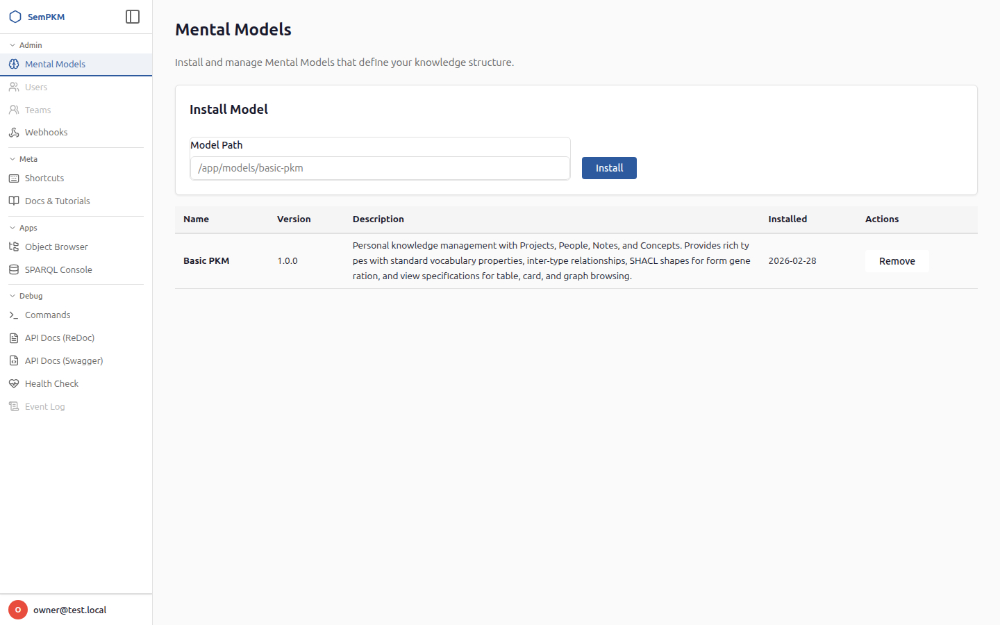

# Chapter 10: Managing Mental Models

This chapter covers the practical side of Mental Model management: accessing the admin interface, installing new models, removing models you no longer need, and running multiple models alongside each other.

> **Note:** Mental Model management requires the **owner** role. If you are logged in as a member, you can use models that are already installed but cannot install or remove them. See your instance administrator if you need model management access.

## The Admin Portal

The **Admin Portal** is a separate section of SemPKM dedicated to system configuration tasks, including model management and webhook setup.

### Accessing the Admin Portal

1. Click your user avatar or name in the bottom-left corner of the sidebar to open the user menu.
2. Select **Admin** from the menu. This navigates to the admin portal at `/admin/`.
3. The admin landing page shows links to the available management sections: **Models** and **Webhooks**.



> **Warning:** The Admin Portal is restricted to users with the owner role. If you do not see the Admin option in your user menu, contact your instance administrator.

### The Models Management Page

Click **Models** on the admin landing page (or navigate directly to `/admin/models`) to reach the model management interface. This page shows:

- A table listing all currently installed models, with columns for model ID, version, name, description, and installation date.
- An **Install Model** form for adding new models.
- **Remove** buttons next to each installed model.


## Installing a Mental Model

### What Happens During Installation

When you install a Mental Model, SemPKM performs a multi-step pipeline:

1. **Manifest validation** -- the `manifest.yaml` file is parsed and validated against the schema. The model ID must be lowercase alphanumeric with hyphens, the version must be valid semver, and the namespace must match the pattern `urn:sempkm:model:{modelId}:`.

2. **Duplicate check** -- SemPKM verifies that no model with the same ID is already installed. If one exists, installation is blocked with an error. You must remove the existing model first to reinstall it.

3. **Archive loading** -- the JSON-LD files referenced by the manifest's entrypoints (ontology, shapes, views, and optionally seed data) are loaded and parsed into RDF graphs.

4. **Archive validation** -- the loaded archive is checked for structural correctness, ensuring that required triples are present and well-formed.

5. **Transactional graph writes** -- all model artifacts are written to the triplestore within a single transaction:
   - The ontology is stored in a named graph: `urn:sempkm:model:{modelId}:ontology`
   - The shapes are stored in: `urn:sempkm:model:{modelId}:shapes`
   - The views are stored in: `urn:sempkm:model:{modelId}:views`
   - The model's metadata (ID, version, name, description, installation timestamp) is registered in the system models graph.

   If any step fails, the entire transaction is rolled back, leaving the triplestore unchanged.

6. **Seed data materialization** -- if the model includes seed data, it is loaded through the event store. This means seed data appears in the event log and follows the same audit trail as user-created data. Seed materialization happens outside the model graph transaction, so if seed loading fails, the model is still installed (with a warning) but without sample data.

7. **Prefix registration** -- the model's namespace prefixes are registered for use in SPARQL queries and IRI display.

### Installing from the Admin Portal

1. Navigate to the **Models** page in the Admin Portal.
2. In the **Install Model** form, enter the absolute filesystem path to the model's directory (the directory containing `manifest.yaml`).
3. Click **Install**.
4. If successful, the model appears in the installed models table and a success message is displayed. Any warnings (such as seed data issues) are shown alongside the success message.
5. If installation fails, an error message explains what went wrong (e.g., manifest validation error, duplicate model, archive validation error).


> **Tip:** The Basic PKM model is located at `models/basic-pkm/` relative to the SemPKM project root. If you ever need to reinstall it, use the full absolute path to this directory.

### Installing via the API

You can also install models programmatically using the REST API:

```
POST /api/models/install
Content-Type: application/json

{
  "path": "/absolute/path/to/model-directory"
}
```

A successful response (HTTP 201) returns:

```json
{
  "model_id": "basic-pkm",
  "message": "Model 'basic-pkm' installed successfully",
  "warnings": []
}
```

A failed response (HTTP 400) returns:

```json
{
  "errors": ["Manifest error: ..."]
}
```

### Auto-Install on Fresh Instances

When SemPKM starts and detects that no Mental Models are installed, it automatically installs the Basic PKM model from the built-in `models/basic-pkm/` directory. This ensures that a fresh instance is immediately usable with the default types, views, and seed data.

If you remove the Basic PKM model and restart SemPKM, it will be re-installed automatically. To prevent auto-installation, ensure at least one other model is installed.

## Removing a Mental Model

### What Removal Does

Removing a model unloads its artifacts from the triplestore:

- The model's **ontology graph** (`urn:sempkm:model:{modelId}:ontology`) is cleared.
- The model's **shapes graph** (`urn:sempkm:model:{modelId}:shapes`) is cleared.
- The model's **views graph** (`urn:sempkm:model:{modelId}:views`) is cleared.
- The model's **metadata** is removed from the system registry.

After removal:

- Types defined by the model no longer appear in the type picker.
- Forms for those types are no longer generated (because the shapes are gone).
- Views defined by the model disappear from the Views Explorer and command palette.
- SHACL validation for those types stops running (because the shapes are gone).

### What Removal Does NOT Do

Removing a model does **not** delete existing objects. Any Notes, Concepts, Projects, or People you created while the model was installed remain in the triplestore's current state graph. The data is preserved because it lives in a separate graph (`urn:sempkm:current`) from the model's artifacts.

However, without the model installed:

- Those objects will have no associated shapes, so their forms will not be auto-generated.
- Their type IRIs will still be stored, but the system will not know how to display them with rich forms.
- Views that referenced those types will no longer be available.

> **Warning:** While removing a model preserves your data, it does remove the context that makes that data usable. Before removing a model, consider whether you still need the objects created with it. If you plan to reinstall the model later, your existing data will be fully accessible again once the model is back.

### Data Protection

SemPKM checks for existing user data before allowing removal. If any objects of the model's types exist in the current state graph, removal is blocked with a 409 Conflict error. The error message lists which types have existing instances.

To remove a model that has associated data, you must first delete all objects of the model's types. This is a deliberate safety measure to prevent accidental data orphaning.

### Removing from the Admin Portal

1. Navigate to the **Models** page in the Admin Portal.
2. Find the model you want to remove in the installed models table.
3. Click the **Remove** button next to the model.
4. If no user data exists for the model's types, the model is removed immediately and a success message is displayed.
5. If user data exists, an error message explains which types have instances that must be deleted first.

### Removing via the API

```
DELETE /api/models/{model_id}
```

A successful response (HTTP 200) returns:

```json
{
  "model_id": "basic-pkm",
  "message": "Model 'basic-pkm' removed successfully"
}
```

If user data blocks removal (HTTP 409):

```json
{
  "errors": ["Cannot remove model 'basic-pkm': user data exists for types: Project, Person, Note, Concept. Delete all instances first."]
}
```

If the model is not installed (HTTP 404):

```json
{
  "errors": ["Model 'basic-pkm' is not installed."]
}
```

## Running Multiple Mental Models

SemPKM is designed to support multiple Mental Models installed simultaneously. Each model operates in its own namespace, preventing type and property collisions.

### How Coexistence Works

Every Mental Model declares a unique namespace following the pattern `urn:sempkm:model:{modelId}:`. The Basic PKM model uses `urn:sempkm:model:basic-pkm:`, so its types have IRIs like `urn:sempkm:model:basic-pkm:Project`. A hypothetical "Research" model would use `urn:sempkm:model:research:`, with types like `urn:sempkm:model:research:Paper`.

This namespace isolation means:

- **No type conflicts** -- two models can both define a type called "Note" without collision, because they have different full IRIs.
- **Independent shapes** -- each model's validation rules apply only to its own types.
- **Merged views** -- views from all installed models appear together in the Views Explorer and command palette, grouped by their source model.
- **Separate ontology and shapes graphs** -- each model's artifacts are stored in dedicated named graphs, so installing or removing one model does not affect another.

### Practical Example

Imagine you have Basic PKM installed and you add a "Research" model:

- The explorer tree now shows types from both models: Note, Concept, Project, Person (from Basic PKM) and Paper, Dataset, Experiment (from Research).
- The Views Explorer lists views from both models, with the View Menu grouping them by source model name.
- Creating a new object shows all available types from all installed models in the type picker.
- Graph views from one model may show connections to objects from another model if cross-model relationships are defined.

### Cross-Model Relationships

While each model defines its own types, objects from different models can be linked through generic RDF properties or through explicit cross-model object properties. For example, a Research model's "Paper" type could have a relationship property pointing to Basic PKM's "Concept" type. The graph view would display these connections naturally, since Cytoscape.js renders all nodes and edges regardless of which model defined them.

### Listing Installed Models

To see which models are currently installed, visit the **Models** page in the Admin Portal or query the API:

```
GET /api/models
```

Response:

```json
{
  "models": [
    {
      "model_id": "basic-pkm",
      "version": "1.0.0",
      "name": "Basic PKM",
      "description": "Personal knowledge management with Projects, People, Notes, and Concepts.",
      "installed_at": "2026-01-15T09:00:00Z"
    }
  ],
  "count": 1
}
```

## Model File Structure Reference

For reference, here is the directory structure of a Mental Model archive:

```
my-model/
  manifest.yaml           # Model identity, prefixes, entrypoints, icons
  ontology/
    my-model.jsonld       # OWL classes and properties
  shapes/
    my-model.jsonld       # SHACL NodeShapes for form generation and validation
  views/
    my-model.jsonld       # ViewSpec definitions for table, card, and graph views
  seed/
    my-model.jsonld       # (Optional) Example objects loaded on install
```

The filenames default to `{modelId}.jsonld` but can be customized via the entrypoints section of the manifest. All JSON-LD files must include a `@context` with the model's prefix mappings and use the `@graph` array pattern for multiple resource definitions.

## Summary

| Operation | Admin Portal | API | Effect |
|-----------|-------------|-----|--------|
| Install | Models page form | `POST /api/models/install` | Loads ontology, shapes, views, seed data; registers model |
| Remove | Models page button | `DELETE /api/models/{id}` | Clears ontology, shapes, views graphs; unregisters model; preserves user data |
| List | Models page table | `GET /api/models` | Shows all installed models with metadata |
| Auto-install | Automatic on startup | Automatic on startup | Basic PKM installed if no models present |

## The Ontology Viewer

The **Ontology Viewer** provides a visual exploration tool for browsing all classes, properties, and relationships defined by your installed Mental Models and the gist upper ontology. Open it from the command palette (`F1` → "Open: Ontology Viewer").

### TBox — Class Hierarchy

The **TBox** (terminological box) tab shows all classes organized as an expandable tree. Root classes appear at the top level, with subclasses nested beneath their parents.

Each tree node shows:
- The class label (e.g., "Event", "Task", "Project")
- A colored **source badge** — "gist" (blue) for upper ontology classes, model name (orange) for installed model classes, "user" (green) for classes you created

Click any class to see its detail panel on the right:
- **Description** — the class definition (from `rdfs:comment` or `skos:definition`)
- **Examples** — usage examples (from gist annotations)
- **Notes** — additional context and clarifications
- **Hierarchy** — parent classes and subclass count
- **Instances** — count of objects of this type in your knowledge base

**Hide gist filter:** Check the "Hide gist" checkbox above the tree to show only your model classes grouped under their gist parent classes. This gives a focused view of just the types you work with directly.

### RBox — Property Legend

The **RBox** (relational box) tab shows all properties (relationships and attributes) defined across your models, organized into two sections:

- **Object Properties** — relationships between objects (e.g., "is about", "has author")
- **Datatype Properties** — attributes with literal values (e.g., "title", "created date")

Properties are displayed in a table with three columns reading left to right: **Domain → Property → Range** (e.g., "Note → is about → Concept"). Properties are grouped by their source model with collapsible section headers.

### Creating Custom Classes

Click the **+ Create Class** button in the TBox tab to open the class creation modal:

1. **Identity** — Enter a display name, description (`rdfs:comment`), and optional usage example (`skos:example`)
2. **Appearance** — Choose a Lucide icon and color for the class
3. **Hierarchy** — Optionally select a parent class (defaults to `owl:Thing`)
4. **Instance Properties** — Define which fields objects of this class will have. Each property maps to an RDF predicate (e.g., `rdfs:comment`, `dcterms:title`). A default "Description" property is pre-populated.

The new class is stored in the user types graph and immediately appears in the TBox tree with a "user" badge. You can then create objects of this type from the Object Browser.

### Creating Properties

Click the **+ Create Property** button in the RBox tab header to open the property creation modal:

1. **Name** — Enter a display name for the property (e.g., "has deadline", "relates to").
2. **Type** — Select **Object Property** (links between objects) or **Datatype Property** (a literal value like text, date, or number). This choice is permanent and cannot be changed after creation.
3. **Domain** — Choose which class this property belongs to. The domain class determines which object forms will include this property. Use the search field to find a class from any source (gist, model, or user-created).
4. **Range** — For object properties, select the target class that this relationship points to. For datatype properties, select the value type (e.g., `xsd:string`, `xsd:dateTime`, `xsd:integer`).
5. **Description** — Optionally add a description explaining the property's purpose.
6. Click **Create Property** to save.

The new property is stored in the user types graph and immediately appears in the RBox table under the "user" group with a green **user** badge. The table displays the property in **Domain → Property → Range** format.

> **Tip:** Use object properties to model relationships between your objects (e.g., "Project → has deadline → xsd:dateTime" as a datatype property, or "Paper → cites → Paper" as an object property). Use datatype properties for simple attributes like titles, dates, and descriptions.

### Editing Classes

You can edit any user-created class directly from the TBox tree:

1. Hover over a user-created class node (marked with a green **user** badge) in the TBox tree to reveal the action buttons.
2. Click the **pencil icon** (edit button) to open the edit form.
3. The edit form loads pre-populated with the class's current values:
   - **Name** — Update the display name.
   - **Description** — Change or add the class definition.
   - **Example** — Update usage examples.
   - **Appearance** — Change the Lucide icon and color.
   - **Hierarchy** — Reparent the class by selecting a different parent class.
   - **Instance Properties** — Add or remove properties that define the fields on objects of this class.
4. Click **Save Changes** to apply.

Changes take effect immediately — the TBox tree refreshes to show the updated name, icon, and hierarchy position. Any object forms for this class will reflect the new properties on next load.

> **Note:** Only classes with a green **user** badge can be edited. Classes from installed Mental Models (orange badge) and gist upper ontology classes (blue badge) are read-only.

### Editing Properties

You can edit any user-created property from the RBox tab or the Custom section on the Mental Models page:

1. Hover over a user-created property row in the RBox table (under the "user" group) to reveal the action buttons.
2. Click the **pencil icon** (edit button) to open the property edit form.
3. The edit form loads pre-populated with the property's current values:
   - **Name** — Update the display name.
   - **Type** — Shown as read-only (Object Property or Datatype Property). The property type cannot be changed after creation — if you need a different type, delete the property and create a new one.
   - **Domain** — Change which class this property belongs to.
   - **Range** — Change the target class (for object properties) or value type (for datatype properties).
   - **Description** — Update the description.
4. Click **Save Changes** to apply.

The RBox table refreshes to show the updated property details.

> **Warning:** Changing a property's domain or range does not automatically update SHACL shapes that reference the property. Existing objects will retain their current values, but form validation may behave differently if the range changes.

### Deleting Classes

Deleting a user-created class permanently removes its definition and SHACL shape from the system. Because this can affect existing data, SemPKM uses a two-step confirmation process:

1. Hover over a user-created class node in the TBox tree and click the **trash icon** (delete button).
2. A confirmation dialog appears showing:
   - **The class name** you are about to delete.
   - **Instance count** — the number of objects of this type currently in your knowledge base (shown in red if greater than zero).
   - **Subclass count** — the number of child classes that inherit from this class (shown in amber if greater than zero).
3. Review the counts carefully:
   - If instances exist, deleting the class removes its type definition and forms — existing objects will remain in the knowledge base but will no longer have associated shapes for form generation.
   - If subclasses exist, they will lose their parent class relationship.
4. Click **Confirm Delete** to proceed, or **Cancel** to abort.

On confirmation, the class and its SHACL shape are removed from the user types graph. The TBox tree refreshes automatically and the class disappears.

> **Warning:** Deletion is permanent. If objects of this type exist, they will still be in your knowledge base but will not have forms or validation. Consider whether you need to delete or migrate those objects first.

### Deleting Properties

Deleting a user-created property is simpler than deleting a class, since properties do not have instances of their own:

1. Hover over a user-created property row in the RBox table to reveal the action buttons.
2. Click the **trash icon** (delete button).
3. A browser confirmation dialog asks you to confirm the deletion.
4. Click **OK** to delete, or **Cancel** to abort.

The property is removed from the user types graph and the RBox table refreshes automatically.

### Custom Section on Mental Models

The **Mental Models** admin page (`/admin/models`) includes a **Custom** section that provides an overview of all your user-created types and properties in one place.

The Custom section displays three groups:

- **Classes** — All user-created classes with their icon, name, and available actions.
- **Object Properties** — All user-created object properties showing Domain → Property → Range.
- **Datatype Properties** — All user-created datatype properties showing Domain → Property → Range.

Each item has inline **Edit** and **Delete** action buttons, providing the same functionality as the TBox and RBox tabs in the Ontology Viewer but from a centralized management view.

> **Tip:** Use the Custom section for a quick inventory of everything you've created. It's especially useful when you have multiple custom classes and properties and want to manage them without switching between TBox and RBox tabs.

---

**Previous:** [Chapter 9: Understanding Mental Models](09-understanding-mental-models.md) | **Next:** [Chapter 11: User Management](11-user-management.md)
