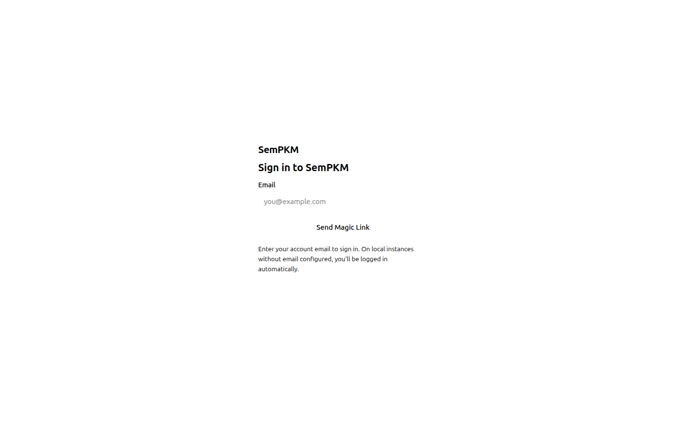

# Chapter 11: User Management

SemPKM is designed for personal or small-team use, and its authentication model reflects that. There are no passwords to remember, no OAuth provider to configure, and no sign-up form to build. Instead, SemPKM uses a **passwordless authentication** system based on magic link tokens and session cookies.

This chapter covers how authentication works, what the different user roles mean, how to invite others to your instance, and how to manage their access once they are on board.

## How Authentication Works

### Passwordless Design

The User model in SemPKM has no password column. Authentication is entirely token-based:



1. **Setup wizard** -- On first launch, SemPKM generates a one-time **setup token** and prints it to the server log. You use this token to claim the instance and become the owner.
2. **Magic links** -- After the owner exists, any user logs in by requesting a magic link token for their email address. If SMTP is configured, this token is emailed as a clickable link. If SMTP is not configured (the default for local instances), the token is returned directly in the browser and logged to the terminal.
3. **Session cookies** -- Once a token is verified, SemPKM creates an opaque session token (a 32-byte random string, not a JWT), stores it in the database, and sets it as an `httpOnly` cookie named `sempkm_session`. The cookie is not accessible from JavaScript, protecting against XSS attacks.

### Session Lifecycle

Sessions have a configurable duration, defaulting to **30 days** (controlled by the `SESSION_DURATION_DAYS` environment variable). SemPKM implements a **sliding window** policy: once a session passes the 50% mark of its lifetime (by default, 15 days), every request automatically extends it by another full duration. This means that active users are never forced to re-authenticate, while abandoned sessions expire naturally.

Logging out explicitly revokes the session and deletes the cookie. You can also revoke all sessions for a user from the admin interface, which forces that user to log in again on all their devices.

## First-Time Setup

When SemPKM starts and no owner account exists, it enters **setup mode**. During setup mode:

1. The server generates a random setup token and writes it to `./data/.setup-token`.
2. The token is printed prominently in the server log:

```
============================================================
  FIRST-RUN SETUP
  No owner found. Use this token to claim the instance:

  Setup token: AbC123xYz...

  POST /api/auth/setup with {"token": "<token>"}
============================================================
```

3. You navigate to the SemPKM URL and enter this token along with your email address.
4. The server creates your owner account, starts a session, sets the session cookie, deletes the token file from disk, and exits setup mode permanently.

> **Warning:** The setup token grants full owner access. Do not share it. If you are running SemPKM on a shared server, ensure that only you can read the Docker logs or the `./data/.setup-token` file during initial setup.

If no email is provided during setup, the account defaults to `owner@local`. You can use any email format -- it does not need to be a real deliverable address for local instances.

## Roles

SemPKM uses a simple three-tier role system. Roles are stored as plain strings in the database (not database-level enums), so they work identically across SQLite and PostgreSQL backends.

### Owner

The **owner** role has full control over the SemPKM instance:

- Install and remove Mental Models
- Configure webhooks
- Invite users and assign roles
- Change other users' roles
- Revoke user access and sessions
- Access the Admin Portal
- Create, edit, and delete all objects and edges

There is exactly one owner created during setup. You cannot invite someone directly as an owner, and the owner account cannot be downgraded from the admin interface (to prevent accidental lockout).

### Member

The **member** role is the standard role for collaborators:

- Create, edit, and delete objects and edges
- Browse all views (table, card, graph)
- Use the SPARQL console and debug tools
- Access the Event Log
- Manage their own settings

Members cannot access the Admin Portal, install Mental Models, configure webhooks, or manage other users.

### Guest (Future)

The **guest** role is reserved for future read-only access. When invited with the guest role, the invitation is accepted and the user is created, but the role is intended for view-only permissions in a future release.

> **Note:** Currently, only `member` and `guest` are valid roles for invitations. The invite endpoint validates that the requested role is one of these two values.

## Inviting Users

Only the owner can invite new users. The invitation flow differs depending on whether SMTP is configured.

### With SMTP Configured

When SMTP environment variables (`SMTP_HOST`, `SMTP_USER`, `SMTP_PASSWORD`, `SMTP_FROM_EMAIL`) are set in your `docker-compose.yml`:

1. Open the **Admin Portal** by navigating to `/admin` or clicking **Admin** in the sidebar.
2. Go to the user management section.
3. Enter the email address and select a role (member or guest).
4. Click **Invite**. SemPKM generates a signed invitation token, stores an invitation record in the database, and sends a magic link email to the invitee.
5. The invitee clicks the link, which verifies the token, creates their account with the assigned role, and starts a session.

Invitation tokens expire after **7 days**. Each invitation can only be accepted once -- after acceptance, the `accepted_at` timestamp is set and the token cannot be reused.

### Without SMTP (Local Instances)

For local or development instances where SMTP is not configured:

1. Use the **API endpoint** directly. Send a POST request to `/api/auth/invite` with the owner's session cookie:

```json
{
  "email": "alice@example.com",
  "role": "member"
}
```

2. The response includes a confirmation message and the invitation ID.
3. Have the invitee request a magic link at `/api/auth/magic-link` with their email address. When SMTP is not configured, the response includes the token directly:

```json
{
  "message": "No email configured. Use the token below to log in.",
  "token": "eyJhbGciOi..."
}
```

The token is also logged to the server terminal for convenience.

4. The invitee uses this token at `/api/auth/verify` to create their session.

> **Tip:** You can check your SMTP configuration status on the **Health** page at `/health/`. It shows whether SMTP is configured and displays the configured host, port, user, and from-email address.

### How Invitation Tokens Work

Invitation tokens are cryptographically signed using `itsdangerous` with the instance's secret key. The token encodes both the email address and the assigned role, so:

- Tokens cannot be forged without the secret key.
- The role embedded in the token matches what the owner specified -- a user cannot escalate their role by modifying the token.
- Tokens expire after 7 days (604,800 seconds).

## Managing Users

### Viewing Users

The owner can view all registered users through the Admin Portal. The user list shows:

- **Email** -- The user's email address
- **Display name** -- An optional name the user can set
- **Role** -- owner, member, or guest
- **Created** -- When the account was created


### Changing Roles

The owner can change a user's role between member and guest. Role changes take effect immediately -- the user does not need to log out and back in, because role checks happen on every request by querying the database.

> **Warning:** Be cautious when changing roles. A member who is downgraded to guest will immediately lose the ability to create or edit objects on their next request.

### Revoking Access

To remove a user's access to your instance:

1. **Revoke all sessions** -- This invalidates every active session for that user, forcing them to log out on all devices. The user account still exists, so they could request a new magic link.
2. **Delete the user** -- This removes the user account entirely. Any invitation tokens for that email become invalid because the invitation record's `accepted_at` flag is already set.

Session revocation is done by deleting all `sessions` rows for the target user ID. The system returns the count of deleted sessions so you can confirm the operation.

## Authentication Endpoints Reference

| Endpoint | Method | Auth Required | Description |
|---|---|---|---|
| `/api/auth/status` | GET | No | Check if setup is complete and setup mode is active |
| `/api/auth/setup` | POST | No (requires setup token) | Claim the instance and create the owner account |
| `/api/auth/magic-link` | POST | No | Request a magic link token for an email |
| `/api/auth/verify` | POST | No | Verify a magic link or invitation token, create session |
| `/api/auth/me` | GET | Yes | Get the current authenticated user's info |
| `/api/auth/logout` | POST | Yes | Revoke current session and clear cookie |
| `/api/auth/invite` | POST | Owner only | Invite a user with a specified email and role |

## Session Cookie Details

The session cookie has the following properties:

| Property | Value |
|---|---|
| Cookie name | `sempkm_session` |
| HttpOnly | `true` (not accessible from JavaScript) |
| SameSite | `lax` (sent with same-site requests and top-level navigation) |
| Max-Age | 30 days by default (matches `SESSION_DURATION_DAYS`) |
| Secure | `false` by default (set to `true` for production HTTPS deployments) |

> **Tip:** For production deployments behind HTTPS, you should configure the Secure flag to `true` to prevent the cookie from being transmitted over unencrypted connections. See [Production Deployment](20-production-deployment.md) for details.

## What is Next

With users set up and authenticated, you may want to configure webhooks to notify external services when data changes in your instance. The next chapter covers webhook configuration.

[Webhooks](12-webhooks.md)
