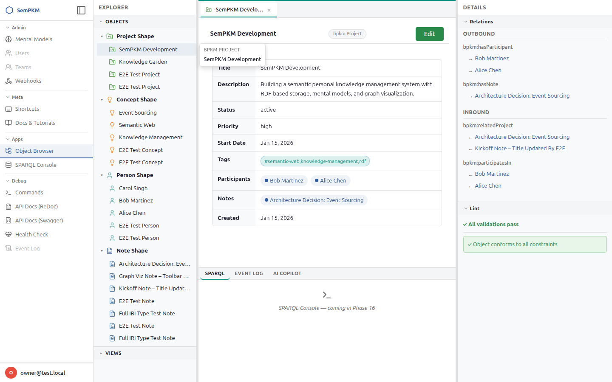

# Chapter 15: Understanding the Event Log

Every change you make in SemPKM -- creating a Note, editing a Concept's properties,
linking a Person to a Project -- is recorded as an immutable event. The **Event Log**
gives you a complete, searchable timeline of everything that has happened in your
workspace. You can browse changes, view diffs to see exactly what changed, and even
undo operations you want to reverse.

This chapter explains what gets logged, how to browse and filter the timeline, how
to inspect diffs, and how to use the Undo feature.

---

## What Gets Logged

Every write operation that flows through SemPKM produces an event. Each event is
stored as an immutable named graph in the triplestore and cannot be altered after
creation. The event records:

| Metadata field    | Description                                                       | Example                              |
|-------------------|-------------------------------------------------------------------|--------------------------------------|
| Operation type    | The command that produced this event                              | `object.create`, `body.set`          |
| Affected objects  | The IRI(s) of every object touched by this operation              | `https://example.org/data/Note/standup-notes` |
| Timestamp         | UTC ISO 8601 datetime of when the event was committed             | `2026-02-24T14:32:07Z`               |
| Description       | Human-readable summary of what happened                           | "Created Note: standup-notes"        |
| Performer         | The user who performed the action (IRI)                           | `urn:sempkm:user:abc-123`            |
| Performer role    | The user's role at the time of the action                         | `owner`, `member`                    |
| Data triples      | The actual RDF triples that were created or changed               | (stored in the event named graph)    |

The five operation types that appear in the log are:

- **`object.create`** -- A new object was created (e.g., a new Note or Person).
- **`object.patch`** -- One or more properties on an existing object were updated.
- **`body.set`** -- An object's Markdown body content was created or replaced.
- **`body.diff`** -- An existing body was edited and the changes were stored as a unified diff (see [Body Diff Events](#body-diff-events) below).
- **`edge.create`** -- A new relationship was created between two objects.
- **`edge.patch`** -- Annotation properties on an existing edge were updated.

System operations (such as Mental Model auto-installation) are also logged. These
appear with "system" as the performer instead of a user name.

---

## Browsing the Timeline

To open the Event Log, click the **Event Log** tab in the bottom panel of the
workspace.

The timeline displays events in **reverse chronological order** (newest first).
Each row in the timeline shows:

1. An **operation type badge** -- color-coded by operation (e.g., `object.create`,
   `body.set`).
2. The **affected object** -- displayed as a human-readable label. If the event
   touched multiple objects (common with `edge.create`, which affects the edge,
   the source, and the target), only the first is shown with a "+N more"
   indicator.
3. The **user** who performed the action.
4. The **timestamp** in `YYYY-MM-DD HH:MM:SS` format.
5. Action buttons: **Diff** and **Undo** (where applicable).

### Pagination

The Event Log loads 50 events at a time. When more events are available, a
**Load more** button appears at the bottom of the timeline. Clicking it
appends the next page of events below the current list. Pagination uses cursor-based
navigation (keyed on timestamps) rather than page numbers, so the list remains
consistent even as new events arrive.

---

## Predicate Labels

When you expand an event's detail view (by clicking the **Diff** button), the
properties listed in the diff are shown with **human-readable labels** rather than
raw IRI predicates.

For example, instead of seeing `dcterms:title`, you see **Title**. Instead of
`schema:email`, you see **Email**. This makes it much easier to understand what
changed without needing to know the underlying RDF vocabulary.

Labels are resolved from SHACL shape annotations in the following order:

1. If the object's shape defines `sh:name` for that property, the shape name is
   used (e.g., "Job Title" for `schema:jobTitle`).
2. Otherwise, the **local name** of the IRI is extracted (the part after the last
   `#` or `/`), giving you a reasonable fallback like `jobTitle`.

This label resolution happens automatically — you do not need to configure anything.
Labels update immediately when you install or update a Mental Model that provides
`sh:name` annotations for its properties.

---

## Helptext Tooltips

Some predicate labels in the event detail view show a **dotted underline**. This
indicates that additional context is available. Hover over the label to see a
**tooltip** with a description of what the property means.

Tooltip text is drawn from SHACL shape annotations:

- `sh:description` — the standard SHACL description for the property constraint.
- `sempkm:editHelpText` — a SemPKM-specific annotation that provides editing
  guidance (the same text shown in form field help icons).

If both are present, `sh:description` is preferred. Properties without any
annotation simply display the label without a dotted underline or tooltip.

This is especially helpful when reviewing changes to objects from Mental Models you
are less familiar with — the tooltip explains what each property represents without
leaving the Event Log.

---

## Autocomplete Filters

The Event Log filter area provides three **autocomplete inputs** that make it easy
to find specific events:

| Filter input    | What it searches                                | Example values                        |
|-----------------|-------------------------------------------------|---------------------------------------|
| Operation Type  | The type of operation that produced the event   | `object.create`, `body.diff`          |
| Predicate       | The property that was changed                   | `dcterms:title`, `schema:email`       |
| Object          | The object that was affected                    | `Meeting Notes`, `Alice Chen`         |

### How autocomplete works

1. **Click or type** in any filter input to open a dropdown of suggestions.
2. Suggestions are drawn from **actual event data** in your workspace — you only
   see operation types, predicates, and objects that exist in your event history.
3. As you type, the dropdown narrows to matching suggestions.
4. **Select a suggestion** to apply it as a filter. The timeline immediately
   updates to show only matching events.
5. Active filters appear as **removable chips** above the timeline (same as other
   filter types). Click the **×** on any chip to remove that filter.

You can combine autocomplete filters with date range filters and user filters for
precise queries like "show all `object.patch` events that changed `dcterms:title`
in the last week."

---

## Body Diff Events

When you edit an existing object's Markdown body, SemPKM does not store the entire
new body as a replacement. Instead, it computes a **unified diff** — a compact
representation of only the lines that were added, removed, or changed — and stores
that as a `body.diff` event.

### How body.diff differs from body.set

| Scenario                                  | Operation type | What is stored                     |
|-------------------------------------------|----------------|------------------------------------|
| Setting a body for the first time         | `body.set`     | The complete body text             |
| Editing an existing body                  | `body.diff`    | Only the unified diff (changes)    |

This distinction keeps event storage efficient. A small edit to a long document
produces a small `body.diff` event rather than a full copy of the entire body.

### Viewing body.diff in the Event Log

Click the **Diff** button on a `body.diff` event to see the changes rendered with
color-coded highlighting:

- **Green lines** — text that was added.
- **Red lines** — text that was removed.
- **Context lines** — unchanged lines surrounding the changes (for orientation).

This is the same unified diff format used by tools like `git diff`. It shows you
exactly what was changed in the body without needing to compare two full copies
side by side.

> **Tip:** The `body.set` event type still shows a full-body diff as before (all
> lines appear as additions if it was the first body, or a before/after diff if
> the body was replaced entirely via the API).

---

## Filtering the Event Log

You can narrow the timeline using several filters. All filters are combinable --
apply an operation filter and a date range together, for example.

### By Operation Type

Use the **operation type dropdown** at the top of the Event Log. Select any of the
five operation types to show only events of that kind:

- All operations (default)
- `object.create`
- `object.patch`
- `body.set`
- `edge.create`
- `edge.patch`

<!-- Screenshot: Operation type filter dropdown expanded -->

### By Date Range

Use the **From** and **To** date pickers to restrict the timeline to a specific
period. You can set just one end of the range (e.g., only a "From" date to see
everything after a certain day).

### By Affected Object

Click any **object link** in the timeline to filter by that object. For example,
clicking "Meeting Notes" in an event row filters the log to show only events that
affected the Meeting Notes object. This is a fast way to see the complete change
history for a single item.

### By User

Click a **user name** in the timeline to filter by that user. This shows only events
performed by that person -- useful in shared workspaces to review a collaborator's
recent changes.

### Filter Chips

Active filters appear as **filter chips** above the timeline. Each chip shows what
filter is active (e.g., "op: object.patch" or "object: Meeting Notes"). Click the
**X** button on any chip to remove that filter. You can remove filters individually
without clearing them all.

<!-- Screenshot: Event Log with two active filter chips -->

---

## Viewing Diffs

To inspect what actually changed in an event, click the **Diff** button on any
event row. An inline diff panel expands below the event.

The Diff button is available for all five operation types:

- `object.create` and `edge.create` -- shows the triples that were added.
- `object.patch` and `edge.patch` -- shows property-level before/after values.
- `body.set` -- shows a line-by-line diff of the Markdown body.
- `body.diff` -- shows a color-coded unified diff of the body changes (additions in green, deletions in red).

### Property Diffs

For `object.patch` and `edge.patch` events, the diff panel shows each changed
property as a before/after pair. The system queries earlier events to reconstruct
what the previous value was, then displays both side by side.

For example, if you changed a Project's `rdfs:label` from "Q1 Planning" to
"Q1 Planning 2026", the diff would show:

| Property     | Before          | After               |
|--------------|-----------------|---------------------|
| `rdfs:label` | Q1 Planning     | Q1 Planning 2026    |

### Body Diffs

For `body.set` events, the diff panel shows a unified line-by-line diff of the
Markdown content. Lines are highlighted by type:

- **Added lines** -- new content that was inserted.
- **Removed lines** -- content that was deleted.
- **Context lines** -- unchanged lines surrounding the changes (for orientation).

This is similar to a `git diff` display. If the body was set for the first time
(no previous content), only added lines are shown.

> **Tip:** Use the Diff panel to review exactly what changed before deciding
> whether to Undo an event.

---

## Undoing Changes

SemPKM supports undoing most event types. The **Undo** button appears on event
rows for the following operation types:

| Operation type   | Reversible? | What Undo does                                                |
|------------------|-------------|---------------------------------------------------------------|
| `object.patch`   | Yes         | Restores the previous property values                         |
| `body.set`       | Yes         | Restores the previous body content                            |
| `edge.create`    | Yes         | Removes all triples that were added for the edge              |
| `edge.patch`     | Yes         | Restores the previous annotation property values              |
| `object.create`  | No          | Not reversible (objects may have edges and bodies referencing them) |

### How Undo Works

SemPKM uses **compensating events** for undo. When you click **Undo**, the system
does not delete or modify the original event (events are immutable). Instead, it
creates a new event that reverses the effect:

1. For patch operations (`object.patch`, `edge.patch`), the system looks up the
   previous values from earlier events and writes them back.
2. For `body.set`, the system restores the body content that existed before the
   event.
3. For `edge.create`, the system deletes the triples that were added (removing the
   edge from the current state).

The undo event itself appears in the Event Log with a description like
"Undo object.patch: urn:sempkm:event:abc-123", giving you a complete audit trail.

### Confirmation

When you click **Undo**, a confirmation dialog appears. The undo is only executed
if you confirm. If the system cannot reverse the event (e.g., because the before
values are unavailable), you will see an error message explaining why.

> **Warning:** Undo creates a new compensating event -- it does not "erase" the
> original event. Both the original and the undo event remain in the log
> permanently. This preserves the complete audit trail.

> **Note:** Only users with the `owner` or `member` role can perform undo
> operations, the same permission level required for making edits.

---

## Provenance: Who Did What

Every event records the **performer** (user IRI) and their **role** at the time
of the action. This is useful in multi-user workspaces:

- Click a user name in the timeline to filter by that person.
- The role is recorded as it was at the time of the event. If a user's role
  changes later (e.g., from "member" to "owner"), earlier events still show the
  role they had when they performed the action.
- System-initiated operations (e.g., automatic Mental Model installation) show
  "system" as the performer.

Provenance data is stored using the `sempkm:performedBy` and
`sempkm:performedByRole` predicates in the event named graph.

---

---

**Previous:** [Chapter 14: System Health and Debugging](14-system-health-and-debugging.md) | **Next:** [Chapter 16: The Data Model](16-data-model.md)
