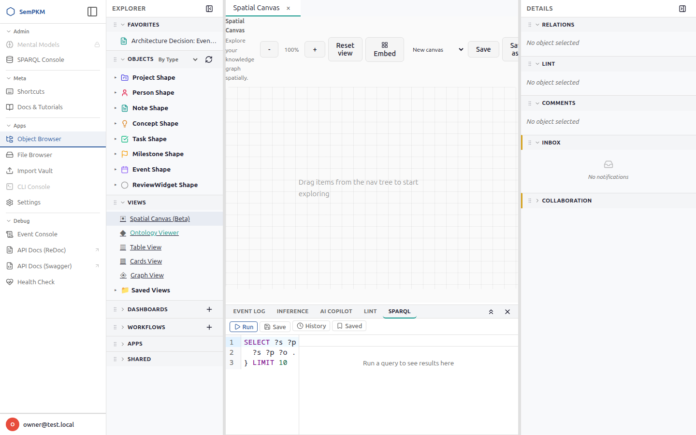

# Chapter 27: Spatial Canvas

The **Spatial Canvas** is an interactive, freeform workspace for exploring your knowledge graph visually. Unlike the graph view (which auto-layouts all objects of a type), the canvas starts empty and lets you build a custom map by dragging objects from the navigation tree, expanding their neighborhoods, and arranging everything by hand. Named sessions let you save and switch between different explorations.

## Opening the Canvas

Open the command palette (`Alt+K`) and type **Spatial Canvas**, then press Enter. The canvas opens as a tab in the editor area, alongside your object and view tabs.

When you first open the canvas, it shows a centered hint: *"Drag items from the nav tree to start exploring."* The toolbar at the top provides zoom controls and session management.

## The Toolbar

The toolbar runs across the top of the canvas:

| Control | Action |
|---------|--------|
| **-** | Zoom out (minimum 30%) |
| **100%** | Current zoom level (read-only) |
| **+** | Zoom in (maximum 250%) |
| **Reset view** | Center the viewport and zoom to fit all nodes |
| **Session dropdown** | Switch between saved sessions or start a new canvas |
| **Save** | Save the current canvas to the active session |
| **Save as...** | Create a new named session from the current canvas |
| **Embed** | Open the embed picker to place a View, Dashboard, or SPARQL result on the canvas |

## Adding Nodes

### Drag-and-Drop from the Navigation Tree

The primary way to add objects to the canvas is by dragging them from the Explorer sidebar:

1. Expand a type node in the Explorer (e.g., Notes, Projects, Concepts).
2. Click and drag an individual object from the tree onto the canvas.
3. A dashed blue border appears on the canvas as a drop zone indicator.
4. Release to place the node where you dropped it.

The status bar at the bottom confirms: *"Added: [object name]"*. The hint text disappears once you have at least one node.

> **Note:** Only individual objects (leaf nodes) are draggable. Type headers like "Notes" or "Projects" cannot be dragged. If you drop an object that already exists on the canvas, you see *"Already on canvas"* and no duplicate is created.

## Node Anatomy

Each node on the canvas is a card with a header row and an expandable body:

**Header controls (left to right):**

- **Chevron** -- Click to expand or collapse the node body. The chevron rotates 90 degrees when the body is open.
- **Title** -- The object's label. Click it to open the object in a separate editor tab (the canvas is not affected).
- **Expand (+)** -- Loads 1-hop neighbors from the knowledge graph and places them in a circle around this node. The button turns blue when neighbors are loaded.
- **Flip** -- Toggle between the object's Markdown body and a property table showing SHACL-derived metadata. The button turns accent blue when properties are shown.
- **Delete (x)** -- Removes this node and its edges from the canvas. This only affects the canvas view -- the object is not deleted from your knowledge base.

**Body (when expanded):**

- The object's IRI displayed in a small monospace font.
- The object's Markdown body content, fully rendered (headings, lists, bold, code blocks, etc.).

**Resize handles:**

Invisible resize handles appear on the right edge, bottom edge, and bottom-right corner when hovering a node. Drag any handle to resize the node. See [Resizing Nodes](#resizing-nodes) below.

## Pan and Zoom

**Pan:** Click and drag on empty canvas space to move the viewport. The cursor changes to a grabbing hand while panning.

**Zoom:** Scroll the mouse wheel to zoom in or out, centered on the cursor position. Alternatively, use the **+** and **-** toolbar buttons. Zoom ranges from 30% to 250%.

**Reset view:** Click the toolbar button to center the viewport and zoom to fit all nodes. On an empty canvas, this resets to the default position.

## Dragging Nodes

Click and drag any node to reposition it on the canvas. Edges connected to the node follow automatically. Nodes do not snap to the grid -- you have full freeform placement.

## Expanding Neighborhoods

The **expand (+)** button on each node lets you discover related objects:

1. Click **(+)** on a node.
2. The canvas fetches all objects one hop away (both outbound and inbound relationships).
3. New neighbor nodes appear in a circle around the expanded node.
4. Edges are drawn with directional arrows and relationship labels (e.g., "authored by", "related to").
5. The **(+)** button turns accent blue to indicate the node has loaded neighbors.

**Collapsing:** Click **(+)** again to remove the neighbors that were loaded by that specific expand. The canvas tracks expand provenance -- if two expands share a neighbor, collapsing one does not remove the shared node.

> **Tip:** Use progressive expansion to explore your graph. Start with one object, expand it, then expand an interesting neighbor, and so on. This is one of the most powerful ways to discover unexpected connections in your knowledge base.

## Edges

Edges between nodes represent relationships from your knowledge graph:

- An **arrow** at the end of each edge indicates the relationship direction.
- A **label** above the midpoint shows the relationship type (e.g., "references", "mentions").
- Edges update automatically when you expand nodes or drag them to new positions.

## Named Sessions

Named sessions let you save and switch between different canvas explorations.

### Saving

**First save (no active session):** Click **Save** -- a dialog prompts you for a session name. Enter a name (e.g., "Project A exploration", "Research map") and confirm. The session is created and becomes active.

**Subsequent saves:** Click **Save** -- the current state is saved to the active session instantly. No dialog is shown.

**Save as...:** Click **Save as...** at any time to create a new session from the current canvas. The previous session's data is not affected.

### What Gets Saved

Each session preserves:

- All nodes with their positions, collapsed/expanded state, and body content
- All edges with their labels and directions
- The viewport state (pan position and zoom level)
- Expand provenance (which nodes came from which expand operation)
- Node dimensions (width and height) for resized nodes
- Property flip state (which nodes show the property table)
- Embed configurations (content type, URL, and label for each embed node)

### Switching Sessions

Open the **session dropdown** in the toolbar to see all saved sessions. Select one to load it -- the canvas clears and restores the saved state. Select **"New canvas"** to start fresh with an empty canvas.

### Auto-Restore

When you reopen the canvas (or reload the page), your last active session loads automatically. You pick up exactly where you left off.

> **Note:** The canvas does **not** auto-save. If you navigate away without clicking Save, unsaved changes are lost. Save frequently, especially after rearranging nodes or expanding neighborhoods.

## Resizing Nodes

Every node on the canvas can be resized by dragging its edges or corner:

- **Right edge** -- Drag the right edge horizontally to change width.
- **Bottom edge** -- Drag the bottom edge vertically to change height.
- **Bottom-right corner** -- Drag the corner diagonally to change both width and height at once. A small triangular indicator appears in the corner on hover.

All three handles are invisible until you hover over the node, keeping the canvas visually clean.

**Grid snapping:** Dimensions snap to a 24-pixel grid as you drag, producing consistent alignment between nodes.

**Minimum size:** Nodes cannot be smaller than 160 pixels wide or 80 pixels tall.

**Default size:** Nodes that have never been resized display at 260 pixels wide with automatic height. Once you resize a node, its explicit dimensions are stored and used from that point on.

**Persistence:** Resized dimensions are saved with the session. When you reload a session, resized nodes restore at their saved size. Sessions saved before resizing was available load normally -- all nodes appear at the default 260-pixel width.

## Property Flip

The **Flip** button in a node's header (between Expand and Delete) toggles between the object's Markdown body and a compact property table.

**Property table contents:**

- A **type label** header (e.g., "Note", "Project") at the top of the table.
- **Property rows** showing each property's name and value, derived from the object's SHACL shapes.
- **Multi-value properties** displayed as individual pills side by side.
- **Boolean values** rendered as ✓ (true) or ✗ (false).
- **Inferred properties** from SHACL-AF rules are included alongside explicitly set properties.
- Properties with no value show a dash (—).

Click **Flip** again to return to the Markdown body.

**Persistence:** Flip state is saved with the session. When you reload, nodes that were showing the property table restore in that state and re-fetch their property data from the knowledge base.

> **Tip:** Use property flip to quickly inspect an object's metadata without leaving the canvas. This is especially useful for reviewing SHACL-derived fields like type hierarchies or inferred relationships.

## Live Embeds

**Embed nodes** display live, interactive content from other parts of SemPKM rendered inside the canvas as iframes. Unlike regular object nodes, embeds show full views, dashboards, or query results -- not just a single object's body.

### Embed Types

| Type | What It Shows |
|------|---------------|
| **View** | A table, card, or graph view (the same views from Chapter 7) |
| **Dashboard** | A full dashboard layout (the same dashboards from Chapter 28) |
| **SPARQL Query Result** | The output of a saved SPARQL query rendered as a table |
| **Object Read View** | A read-only view of a single object with its type label, properties, and Markdown body |

### Adding Embeds — Toolbar Picker

1. Click **Embed** in the toolbar.
2. A tabbed dropdown appears with three tabs: **Views**, **Dashboards**, and **Queries**.
3. Each tab lists the available items fetched from your knowledge base.
4. Click an item to place it as an embed node at the center of your current viewport.
5. The status bar confirms: *"Embed added: [item label]"*.

### Adding Embeds — Explorer Drag

You can also drag items from the Explorer sidebar directly onto the canvas:

- Drag a **view** from the Views section of the Explorer.
- Drag a **dashboard** from the Dashboards section of the Explorer.
- Drag a **saved query** from the Queries section of the Explorer.

Drop the item onto the canvas to place it as an embed node at the drop position.

### Embed Limits and Behavior

- A maximum of **8 simultaneous embeds** is enforced per canvas for performance. Attempting to add a 9th shows a notification: *"Maximum of 8 embeds reached."*
- Embed nodes default to 400 × 300 pixels but are **resizable** using the same drag handles as regular nodes.
- Embeds are **live** -- they reflect the current state of your data, not a snapshot. If you update an object that appears in an embedded view, the embed reflects the change.

> **Tip:** Combine a Table View embed filtered to one type with an Object Read embed to build a mini research dashboard right on your canvas.

## Practical Workflows

### Mapping a Project's Context

1. Drag a Project from the nav tree onto an empty canvas.
2. Click **(+)** to expand it -- participants, related concepts, and linked notes appear.
3. Expand a participant to see their other projects and contributions.
4. Drag nodes to cluster related items together.
5. Save the session as "Project X map".

### Tracing an Idea

1. Start with a Concept or Note.
2. Expand to see what references it and what it references.
3. Follow the chain: expand neighbors to go deeper.
4. Collapse dead ends by clicking **(+)** again on nodes that did not lead anywhere useful.

### Comparing Two Topics

1. Drag two unrelated Concepts onto the canvas, spaced apart.
2. Expand both. Look for shared neighbors -- objects that connect to both concepts.
3. Shared nodes with edges to both starting points reveal hidden bridges in your knowledge base.

### Building a Research Dashboard on Canvas

1. Click **Embed** in the toolbar and select a **Table View** filtered to Notes from the Views tab.
2. Click **Embed** again and select a **Graph View** from the Views tab. Drag it next to the table.
3. Click **Embed** once more and select a saved SPARQL query showing recent changes from the Queries tab.
4. Resize each embed to fit your screen — drag the corner handles to adjust width and height.
5. Save the session as "Research Dashboard".

You now have a live multi-view workspace that updates as your data changes, all on a single canvas.

## Canvas vs. Graph View

| | Graph View (Ch 7) | Spatial Canvas |
|---|---|---|
| **Starting state** | Shows all objects of a type | Starts empty |
| **Layout** | Auto-arranged by algorithm | Manual freeform placement |
| **Scope** | Fixed to one view definition | Build your own exploration |
| **Persistence** | No save (regenerated each time) | Named sessions with save/restore |
| **Best for** | Overview of a type's instances | Focused exploration and mapping |
| **Embeds** | No | Views, dashboards, SPARQL results, and objects as live iframes |

---

**Previous:** [Chapter 26: IndieAuth](26-indieauth.md) | **Next:** [Chapter 28: Dashboards and Workflows](28-dashboards-and-workflows.md)
